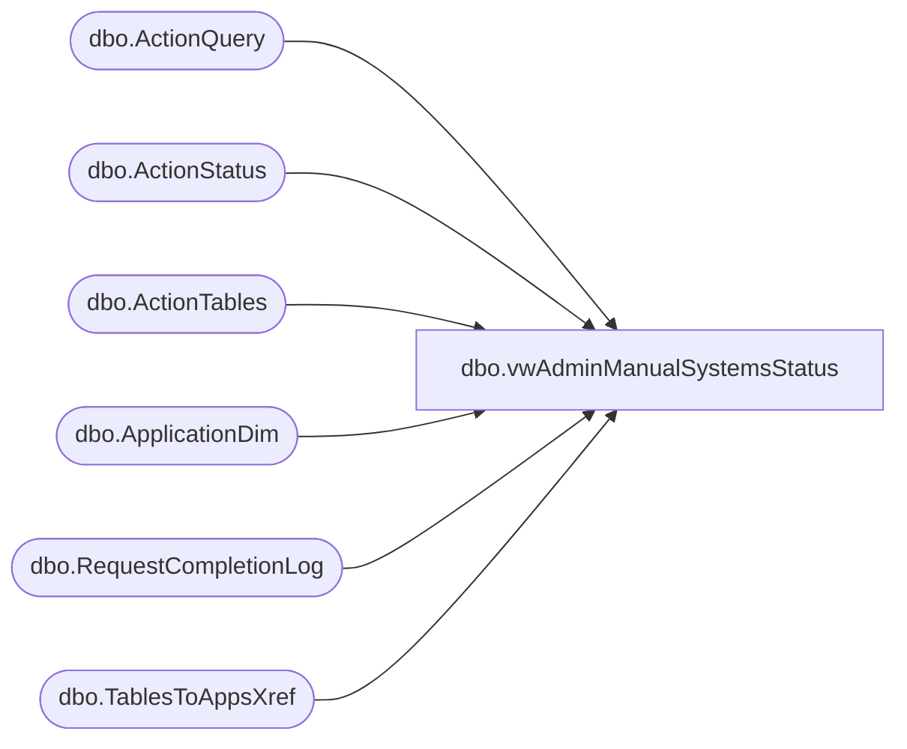

# dbo.vwAdminManualSystemsStatus

**Database:** BABWForgetMe_Restore  
**Server:** bearcluster01  

## Architecture Diagram



## Table Dependencies

| Referenced Table |
|---|
| dbo.ActionQuery |
| dbo.ActionStatus |
| dbo.ActionTables |
| dbo.ApplicationDim |
| dbo.RequestCompletionLog |
| dbo.TablesToAppsXref |

## View Code

```sql
CREATE VIEW [dbo].[vwAdminManualSystemsStatus]
AS
WITH manualApps(ActionTableKey, AppKey)
AS
(
  SELECT actt.ATKey, ad.AppKey
  FROM ActionTables actt
  LEFT JOIN TablesToAppsXref xref ON actt.ATKey = xref.ATKey
  LEFT JOIN ApplicationDim ad ON xref.AppKey = ad.AppKey
  WHERE ad.ManualProcess = 1
)
SELECT ROW_NUMBER() OVER(ORDER BY ast.RecordKey) AS rowID
      ,ad.AppKey
	  ,ad.AppName
	  ,ad.AppTeam
	  ,aq.AQKey
	  ,CASE 
	    WHEN rcl.AQKey IS NULL THEN 0
		ELSE 1
	   END AS 'Completed'
	  ,ast.RecordKey 
  FROM ActionStatus ast
  CROSS JOIN ActionQuery aq
LEFT JOIN RequestCompletionLog rcl ON aq.AQKey = rcl.AQKey AND rcl.RecordKey = ast.RecordKey

RIGHT JOIN manualApps ma ON ma.ActionTableKey = aq.ATKey
LEFT JOIN ApplicationDim ad ON ad.AppKey = ma.AppKey
```

