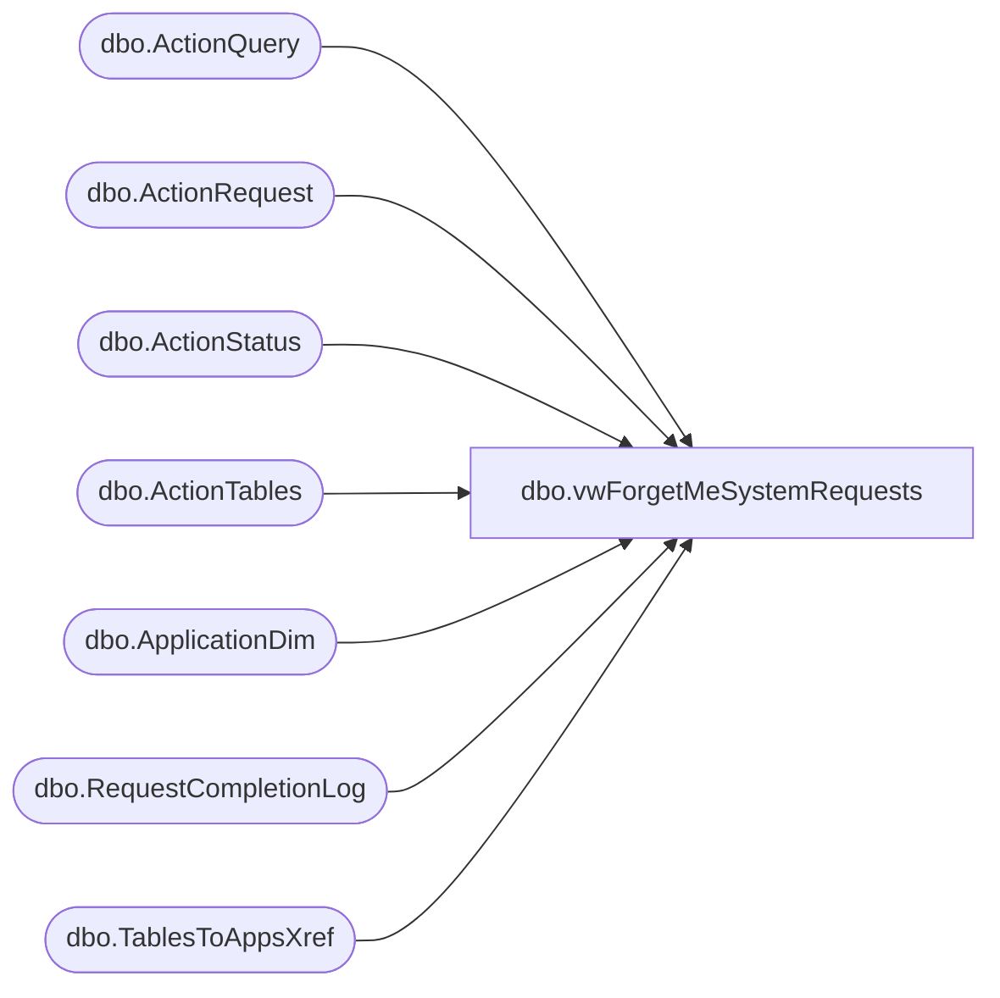

# dbo.vwForgetMeSystemRequests

**Database:** BABWForgetMe_Restore  
**Server:** bearcluster01  

## Architecture Diagram



## Table Dependencies

| Referenced Table |
|---|
| dbo.ActionQuery |
| dbo.ActionRequest |
| dbo.ActionStatus |
| dbo.ActionTables |
| dbo.ApplicationDim |
| dbo.RequestCompletionLog |
| dbo.TablesToAppsXref |

## View Code

```sql
CREATE VIEW [dbo].[vwForgetMeSystemRequests]
AS
WITH RequestsNeedingManualData(RecordKey, ATKey) AS (SELECT        s.RecordKey, Q.ATKey
                                                                                                                                  FROM            dbo.ActionStatus AS s CROSS JOIN
                                                                                                                                                           dbo.ActionQuery AS Q LEFT OUTER JOIN
                                                                                                                                                           dbo.RequestCompletionLog AS L ON s.RecordKey = L.RecordKey AND Q.AQKey = L.AQKey
                                                                                                                                  WHERE        (s.ValidationDate IS NOT NULL) AND (s.RecordsFlaggedDate IS NOT NULL) AND (s.CompletionDate IS NULL) AND (L.RequestLogID IS NULL) AND 
                                                                                                                                                           (Q.FindRecordQuery = 'Manual') AND (Q.AQKey <> '112'))
    SELECT        ROW_NUMBER() OVER(ORDER BY ast.ValidationDate ASC) AS ID, r.RecordKey, ast.EmailAddress, ast.FirstName, ast.LastName, apd.AppName, apd.AppTeam, apd.TeamEmailAddress, ar.ActionRequestName, aq.AQKey, ast.ValidationDate
     FROM            RequestsNeedingManualData AS r LEFT OUTER JOIN
                              dbo.ActionTables AS at ON r.ATKey = at.ATKey LEFT OUTER JOIN
                              dbo.TablesToAppsXref AS xref ON at.ATKey = xref.ATKey LEFT OUTER JOIN
                              dbo.ApplicationDim AS apd ON xref.AppKey = apd.AppKey LEFT OUTER JOIN
                              dbo.ActionStatus AS ast ON r.RecordKey = ast.RecordKey LEFT OUTER JOIN
                              dbo.ActionRequest AS ar ON ast.ActionRequestID = ar.ActionRequestID LEFT OUTER JOIN
							  dbo.ActionQuery AS aq ON aq.ATKey = at.ATKey
```

