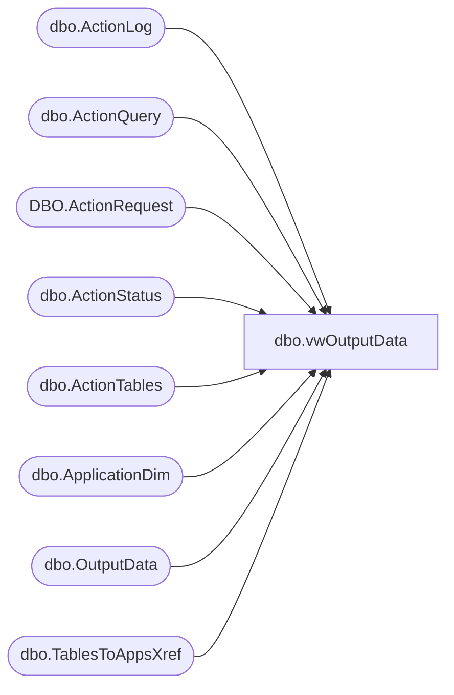

# dbo.vwOutputData

**Database:** BABWForgetMe_Restore  
**Server:** bearcluster01  

## Architecture Diagram



## Table Dependencies

| Referenced Table |
|---|
| dbo.ActionLog |
| dbo.ActionQuery |
| DBO.ActionRequest |
| dbo.ActionStatus |
| dbo.ActionTables |
| dbo.ApplicationDim |
| dbo.OutputData |
| dbo.TablesToAppsXref |

## View Code

```sql
CREATE VIEW [dbo].[vwOutputData]
AS
SELECT        s.RecordKey, OD.FirstName, OD.LastName, OD.Phone1, OD.Phone2, OD.EmailAddress, OD.Address1, OD.Address2, OD.Address3, OD.City, OD.State, OD.PostalCode, OD.Country, A.AppName, OD.OuputKey, OD.Notes
FROM            dbo.OutputData AS OD INNER JOIN
                         dbo.ActionStatus AS s ON OD.RecordKey = s.RecordKey INNER JOIN
                         dbo.ActionQuery AS Q ON OD.AQKey = Q.AQKey INNER JOIN
                         dbo.ActionTables AS T ON Q.ATKey = T.ATKey INNER JOIN
                         dbo.TablesToAppsXref AS X ON T.ATKey = X.ATKey INNER JOIN
                         dbo.ApplicationDim AS A ON X.AppKey = A.AppKey INNER JOIN
						 DBO.ActionRequest as R on S.ActionRequestID = r.ActionRequestID left join 
						 ActionLog L on OD.LogKey = L.LogKey 
						 where r.ActionRequestName = 'RetrieveMe' and (RemoveData = 1 or L.LogKey IS NULL)
```

