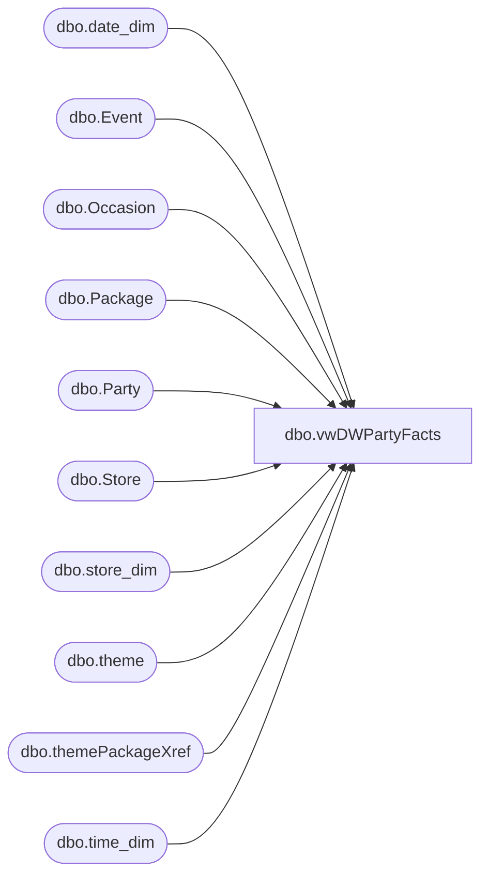

# dbo.vwDWPartyFacts

**Database:** BABWPartyPlanner  
**Server:** bearcluster01  

## Architecture Diagram



## Table Dependencies

| Referenced Table |
|---|
| dbo.date_dim |
| dbo.Event |
| dbo.Occasion |
| dbo.Package |
| dbo.Party |
| dbo.Store |
| dbo.store_dim |
| dbo.theme |
| dbo.themePackageXref |
| dbo.time_dim |

## View Code

```sql
CREATE VIEW [dbo].[vwDWPartyFacts]
AS

WITH 
Themes as 
	(
		select 
			t.ThemeName,
			t.ThemeID,
			tpx.PackageID
		from theme t with (nolock)
		join themePackageXref tpx with (nolock) on t.themeID=tpx.ThemeID
	)
SELECT 
	p.PartyID,
	o.OccasionName,
	pa.PackageName,
	p.TotalGuests,
	--c.CustomerNumber,  --Potentially useless
	p.GOHAge,
	p.GuestAvgAge,
	CASE
		WHEN p.PartyStateID = 2 THEN 1
		ELSE 0
	END as IsCancelled,
	CASE
		WHEN POID IS NOT NULL THEN 1
		ELSE 0
	END as IsPOParty,
	dd.date_key as CreatedDateKey,
	dd2.date_key as ExecuteDateKey,
	td.time_key as ExecuteTimeKey,
	e.CreatedBy,
	CASE WHEN e.CreatedBy = 'guest' THEN 'WEB'
		WHEN e.CreatedBy LIKE 'store%' THEN 'POS'
	ELSE 'BSR'
	END AS BookingMethod,
	sd.store_key,
	cast(t.ThemeName as nvarchar) as ThemeName
FROM Party p
	LEFT JOIN Event e
		ON p.EventID = e.EventID
	LEFT JOIN Occasion o
		ON p.OccasionID = o.OccasionID
	--LEFT JOIN Customer c
	--	ON p.CustomerID = c.CustomerID
	LEFT JOIN Package pa
		ON p.PackageID = pa.PackageID
	LEFT JOIN Store s
		ON e.StoreID = s.StoreID
	LEFT JOIN Papamart.dw.dbo.store_dim sd
		ON s.StoreNumber = sd.store_id
	LEFT JOIN Papamart.dw.dbo.date_dim dd
		ON CAST(e.CreatedDate as Date) = dd.actual_date
	LEFT JOIN Papamart.dw.dbo.date_dim dd2
		ON CAST(e.EventStart as Date) = dd2.actual_date
	LEFT JOIN Papamart.dw.dbo.time_dim td
		ON DATEPART(hour, EventStart) = td.hour AND DATEPART(minute, EventStart) = td.minute
	LEFT JOIN Themes t 
		on p.ThemeID=t.ThemeID
		and pa.PackageID=t.PackageID
WHERE e.EventType = 1


dbo,vwEventIDsByStoreGroupID,CREATE VIEW dbo.vwEventIDsByStoreGroupID
AS
SELECT        e.EventID, s.StoreGroupID, e.EventStart, e.EventEnd, e.EventType, e.StoreID, s.StoreNumber, e.Active
FROM            dbo.Event AS e LEFT OUTER JOIN
                         dbo.Store AS s ON e.StoreID = s.StoreID
```

