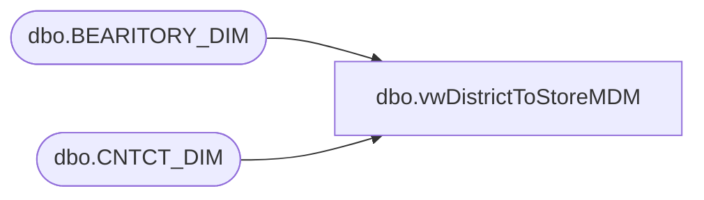

# dbo.vwDistrictToStoreMDM

**Database:** BABWPartyPlanner  
**Server:** bearcluster01  

## Architecture Diagram



## Table Dependencies

| Referenced Table |
|---|
| dbo.BEARITORY_DIM |
| dbo.CNTCT_DIM |

## View Code

```sql
CREATE VIEW [dbo].[vwDistrictToStoreMDM]
AS

SELECT [NM]
      ,cd.EMAIL
	  ,bd.RGN_ID
  FROM Kodiak.[BABWMstrData].[dbo].[BEARITORY_DIM] bd
  LEFT JOIN Kodiak.[BABWMstrData].[dbo].[CNTCT_DIM] cd ON bd.CNTCT_ID = cd.CNTCT_ID
  WHERE cd.EMAIL <> 'jenniferp@buildabear.co.uk'
```

