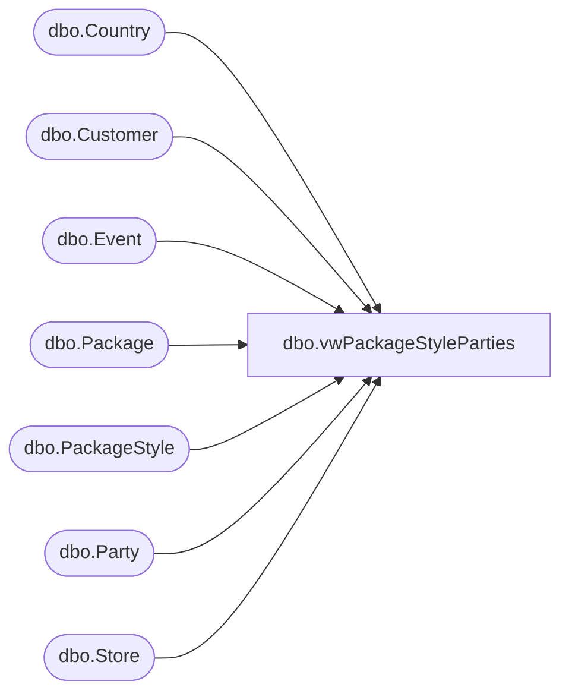

# dbo.vwPackageStyleParties

**Database:** BABWPartyPlanner  
**Server:** bearcluster01  

## Architecture Diagram



## Table Dependencies

| Referenced Table |
|---|
| dbo.Country |
| dbo.Customer |
| dbo.Event |
| dbo.Package |
| dbo.PackageStyle |
| dbo.Party |
| dbo.Store |

## View Code

```sql
CREATE VIEW [dbo].[vwPackageStyleParties]
AS
SELECT        TOP (100) PERCENT p.PartyID AS 'PMREventID'
                               ,e.EventStart, cust.LastName AS 'GuestLastName'
							   ,e.CreatedBy AS 'SubmittedBy'
							   ,1 AS 'PartyStatusID'
							   --,GETDATE() AS 'DateCreated'
							   --,GETDATE() AS 'DateUpdated'
							   ,e.CreatedDate AS 'DateCreated'
							   ,CASE
							      WHEN e.LastUpdated IS NULL THEN e.CreatedDate
								  ELSE e.LastUpdated
								END AS 'DateUpdated'
							   ,s.StoreNumber
							   ,c.CountryAbbr
							   ,pkg.PackageShortDesc
							   ,p.TotalGuests
							   ,ps.StartDate AS 'PackageStyleStartDate'
							   ,ps.EndDate AS 'PackageStyleEndDate'
							   ,ps.PackageStyleID
FROM            dbo.Event AS e 
                LEFT JOIN dbo.Party AS p ON e.EventID = p.EventID 
				LEFT JOIN dbo.Store AS s ON e.StoreID = s.StoreID 
				LEFT JOIN dbo.Package AS pkg ON p.PackageID = pkg.PackageID AND pkg.Enabled = 1 
				LEFT JOIN dbo.Customer AS cust ON p.CustomerID = cust.CustomerID
				LEFT JOIN dbo.Country AS c ON s.CountryID = c.CountryID
				LEFT JOIN dbo.PackageStyle AS ps ON pkg.PackageID = ps.PackageID
WHERE        ps.PackageID IS NOT NULL
```

