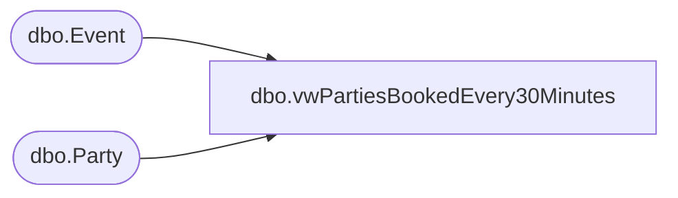

# dbo.vwPartiesBookedEvery30Minutes

**Database:** BABWPartyPlanner  
**Server:** bearcluster01  

## Architecture Diagram



## Table Dependencies

| Referenced Table |
|---|
| dbo.Event |
| dbo.Party |

## View Code

```sql
CREATE view [dbo].[vwPartiesBookedEvery30Minutes] 

--===================================================================================================================
--	Dan Tweedie	2019-04-03	Created view for inclusion in data load to StoreForce, along with POS sales data rollups
--===================================================================================================================

as


With 
PartyStage as
	(
		SELECT 
			case 
				when cast(e.StoreID as int) < 2000 
					then 1000 + cast(e.StoreID as int)
				else cast(e.StoreID as int)
			end as StoreID,
			e.StoreID as StoreIDRaw,
			convert(varchar, CreatedDate, 103) as PartyBookDate,
			--format(CreatedDate,'d/M/yyyy') as PartyBookDate,
			cast(CreatedDate as date) PartyBookDateRaw,
			right(cast('00' as varchar) + cast(datepart(hh, CreatedDate) as varchar),2) as PartyBookHour,
			right(cast('00' as varchar) + cast(datepart(mi, CreatedDate) as varchar),2) as PartyBookMinute,
			count(distinct p.PartyID) as PartiesBooked
		FROM Party p with (nolock)
		JOIN Event e with (nolock)
			ON p.EventID = e.EventID
		WHERE e.EventType = 1
		and datediff(dd, e.createdDate, getdate()) <= 750
		and e.StoreID <4000
		group by 
			e.StoreID,
			convert(varchar, CreatedDate, 103),
			--format(CreatedDate,'d/M/yyyy'),
			cast(CreatedDate as date),
			right(cast('00' as varchar) + cast(datepart(hh, CreatedDate) as varchar),2),
			right(cast('00' as varchar) + cast(datepart(mi, CreatedDate) as varchar),2)	
	)
select 
	StoreID,
	PartyBookDate, 
	PartyBookHour + ':' + case when PartyBookMinute < 30 then '00' else '30' end as Slot,
	sum(PartiesBooked) as PartiesBooked,
	StoreIDRaw,
	PartyBookDateRaw
from PartyStage
group by 
	StoreID,
	StoreIDRaw,
	PartyBookDate, 
	PartyBookDateRaw,
	PartyBookHour + ':' + case when PartyBookMinute < 30 then '00' else '30' end
```

