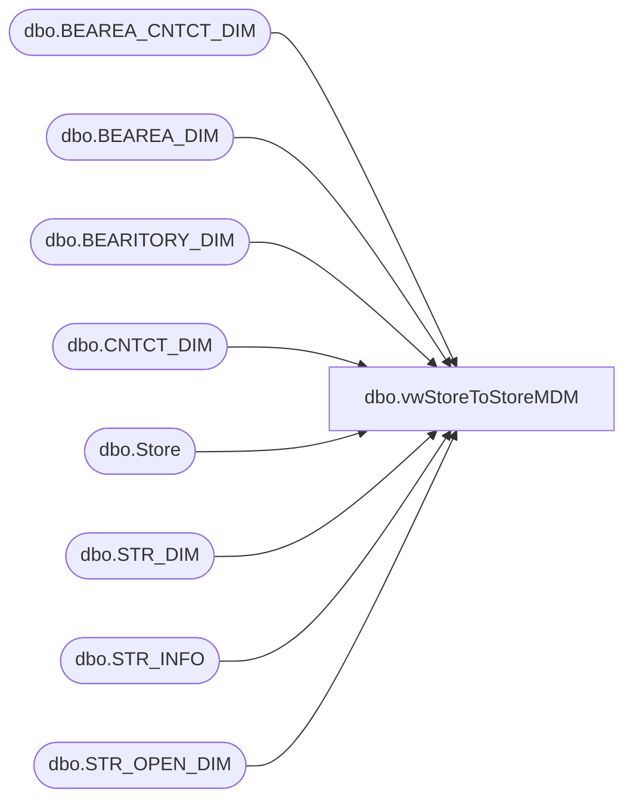

# dbo.vwStoreToStoreMDM

**Database:** BABWPartyPlanner  
**Server:** bearcluster01  

## Architecture Diagram



## Table Dependencies

| Referenced Table |
|---|
| dbo.BEAREA_CNTCT_DIM |
| dbo.BEAREA_DIM |
| dbo.BEARITORY_DIM |
| dbo.CNTCT_DIM |
| dbo.Store |
| dbo.STR_DIM |
| dbo.STR_INFO |
| dbo.STR_OPEN_DIM |

## View Code

```sql
CREATE VIEW [dbo].[vwStoreToStoreMDM]
AS
--WITH AreaManagers AS
--(
--	SELECT SD.STR_ID,
--		   cd.EMAIL
--	FROM KODIAK.BABWMstrData.dbo.STR_DIM sd
--	LEFT JOIN KODIAK.BABWMstrData.dbo.BEAREA_DIM bd
--		ON sd.BEAREA_ID = bd.BEAREA_ID
--	LEFT JOIN KODIAK.BABWMstrData.dbo.BEAREA_CNTCT_DIM bcd 
--		ON bd.BEAREA_ID = bcd.BEAREA_ID
--	LEFT JOIN KODIAK.BABWMstrData.dbo.CNTCT_DIM cd
--		ON bcd.CNTCT_ID = cd.CNTCT_ID
--	WHERE sd.BEAREA_ID <> -1
--		AND (sd.STR_CLOSE_DT IS NULL OR sd.STR_CLOSE_DT < GETDATE())
--		AND cd.EMAIL IS NOT NULL
--)

WITH AreaManagers AS
(
	SELECT SD.STR_ID,
		   cd.EMAIL
	FROM KODIAK.BABWMstrData.dbo.STR_DIM sd
	LEFT JOIN KODIAK.BABWMstrData.dbo.BEAREA_DIM bd
		ON sd.BEAREA_ID = bd.BEAREA_ID
	LEFT JOIN KODIAK.BABWMstrData.dbo.BEAREA_CNTCT_DIM bcd 
		ON bd.BEAREA_ID = bcd.BEAREA_ID
	LEFT JOIN KODIAK.BABWMstrData.dbo.CNTCT_DIM cd
		ON bcd.CNTCT_ID = cd.CNTCT_ID
	WHERE sd.BEAREA_ID <> -1
		AND (sd.STR_CLOSE_DT IS NULL OR sd.STR_CLOSE_DT < GETDATE())
		AND cd.EMAIL IS NOT NULL AND bcd.END_DT = '12/31/2399'
)
SELECT       DISTINCT ps.StoreID, ps.MinutesBetweenParties, ps.BookingParties, ps.WebMessage, ps.BSRMessage, ps.ParentStore, ps.CancellationHours, ps.ModificationDays, 
							ps.MinGuests, ps.MaxGuests, ps.StoreKey, sd.STR_NUM as StoreNumber, ps.DefaultStartOffset, ps.DefaultEndOffset, ps.StoreGroupID, ps.CountryID, SD.NM_FULL AS StoreName,
							SD.NM_ABBRV AS StoreAbbr, SD.NM_ABBRV AS Bearitory, BD.NM AS territory, SI.Address AS address, SI.CTY_NM AS city, SI.ST_NM AS state, 
							SI.CNTRY_NM AS country, SI.PSTL_CD AS postalcode, SI.PHN_NBR AS phonenumber, SI.FAX_NBR AS FaxNumber, SD.EMAIL AS email, 
							SD.STR_OPEN_DT AS STR_OPEN_DTe, SD.LATITUDE AS latitude, SD.LONGITUDE AS longitude, SD.CNTRY_ID, CD.EMAIL as 'DistrictManager'
FROM            dbo.Store AS ps RIGHT JOIN
							KODIAK.BABWMstrData.dbo.STR_DIM AS SD WITH (NOLOCK) ON ps.StoreID = SD.STR_NUM LEFT OUTER JOIN
							KODIAK.BABWMstrData.dbo.BEARITORY_DIM AS BD WITH (NOLOCK) ON SD.BEARITORY_ID = BD.BEARITORY_ID LEFT OUTER JOIN
							KODIAK.BABWMstrData.dbo.STR_INFO AS SI WITH (NOLOCK) ON SD.STR_ID = SI.STR_ID LEFT OUTER JOIN 
							KODIAK.BABWMstrData.dbo.BEARITORY_DIM AS BI WITH (NOLOCK) ON SD.BEARITORY_ID = BI.BEARITORY_ID LEFT OUTER JOIN
							KODIAK.BABWMstrData.dbo.CNTCT_DIM AS CD WITH (NOLOCK) ON BI.CNTCT_ID = CD.CNTCT_ID LEFT OUTER JOIN
							KODIAK.BABWMstrData.dbo.STR_OPEN_DIM AS SOD WITH (NOLOCK) ON SD.STR_ID = SOD.STR_KEY
WHERE        (sod.OPEN_DT < DATEADD(month,2,GETDATE()) AND sod.CLOSE_DT > GETDATE())
AND SD.STR_NUM NOT IN (13,2013) AND StoreID IS NOT NULL
UNION ALL
SELECT        ps.StoreID, ps.MinutesBetweenParties, ps.BookingParties, ps.WebMessage, ps.BSRMessage, ps.ParentStore, ps.CancellationHours, ps.ModificationDays, 
							ps.MinGuests, ps.MaxGuests, ps.StoreKey, ps.StoreNumber, ps.DefaultStartOffset, ps.DefaultEndOffset, ps.StoreGroupID, ps.CountryID, SD.NM_FULL AS StoreName,
							SD.NM_ABBRV AS StoreAbbr, SD.NM_ABBRV AS Bearitory, BD.NM AS territory, SI.Address AS address, SI.CTY_NM AS city, SI.ST_NM AS state, 
							SI.CNTRY_NM AS country, SI.PSTL_CD AS postalcode, SI.PHN_NBR AS phonenumber, SI.FAX_NBR AS FaxNumber, SD.EMAIL AS email, 
							SD.STR_OPEN_DT AS STR_OPEN_DTe, SD.LATITUDE AS latitude, SD.LONGITUDE AS longitude, SD.CNTRY_ID, AM.EMAIL as 'DistrictManager'
FROM            dbo.Store AS ps INNER JOIN
							KODIAK.BABWMstrData.dbo.STR_DIM AS SD WITH (NOLOCK) ON ps.StoreNumber = SD.STR_NUM LEFT OUTER JOIN
							KODIAK.BABWMstrData.dbo.BEARITORY_DIM AS BD WITH (NOLOCK) ON SD.BEARITORY_ID = BD.BEARITORY_ID LEFT OUTER JOIN
							KODIAK.BABWMstrData.dbo.STR_INFO AS SI WITH (NOLOCK) ON SD.STR_ID = SI.STR_ID LEFT OUTER JOIN 
						KODIAK.BABWMstrData.dbo.BEARITORY_DIM AS BI WITH (NOLOCK) ON SD.BEARITORY_ID = BI.BEARITORY_ID LEFT OUTER JOIN
						KODIAK.BABWMstrData.dbo.CNTCT_DIM AS CD WITH (NOLOCK) ON BI.CNTCT_ID = CD.CNTCT_ID LEFT OUTER JOIN 
						AreaManagers am ON sd.STR_ID = am.STR_ID
WHERE        (sd.STR_CLOSE_DT IS NULL OR sd.STR_CLOSE_DT < GETDATE())
AND	am.EMAIL IS NOT NULL


--Tacking on the list of stores with Area Managers assigned with the A.M. email address mixed in with the DistrictManager email
--this allows the backend admin app to allow Area Managers to configure their stores.
--UNION ALL
--SELECT        ps.StoreID, ps.MinutesBetweenParties, ps.BookingParties, ps.WebMessage, ps.BSRMessage, ps.ParentStore, ps.CancellationHours, ps.ModificationDays, 
--                         ps.MinGuests, ps.MaxGuests, ps.StoreKey, ps.StoreNumber, ps.DefaultStartOffset, ps.DefaultEndOffset, ps.StoreGroupID, ps.CountryID, SD.NM_FULL AS StoreName,
--                          SD.NM_ABBRV AS StoreAbbr, SD.NM_ABBRV AS Bearitory, BD.NM AS territory, SI.Address AS address, SI.CTY_NM AS city, SI.ST_NM AS state, 
--                         SI.CNTRY_NM AS country, SI.PSTL_CD AS postalcode, SI.PHN_NBR AS phonenumber, SI.FAX_NBR AS FaxNumber, SD.EMAIL AS email, 
--                         SD.STR_OPEN_DT AS STR_OPEN_DTe, SD.LATITUDE AS latitude, SD.LONGITUDE AS longitude, SD.CNTRY_ID, AM.EMAIL as 'DistrictManager'
--FROM            dbo.Store AS ps INNER JOIN
--                         KODIAK.BABWMstrData.dbo.STR_DIM AS SD WITH (NOLOCK) ON ps.StoreNumber = SD.STR_NUM LEFT OUTER JOIN
--                         KODIAK.BABWMstrData.dbo.BEARITORY_DIM AS BD WITH (NOLOCK) ON SD.BEARITORY_ID = BD.BEARITORY_ID LEFT OUTER JOIN
--                         KODIAK.BABWMstrData.dbo.STR_INFO AS SI WITH (NOLOCK) ON SD.STR_ID = SI.STR_ID LEFT OUTER JOIN 
--						KODIAK.BABWMstrData.dbo.BEARITORY_DIM AS BI WITH (NOLOCK) ON SD.BEARITORY_ID = BI.BEARITORY_ID LEFT OUTER JOIN
--						KODIAK.BABWMstrData.dbo.CNTCT_DIM AS CD WITH (NOLOCK) ON BI.CNTCT_ID = CD.CNTCT_ID LEFT OUTER JOIN 
--						AreaManagers am ON sd.STR_ID = am.STR_ID
--WHERE        (sd.STR_CLOSE_DT IS NULL OR sd.STR_CLOSE_DT < GETDATE())
--AND	am.EMAIL IS NOT NULL
```

