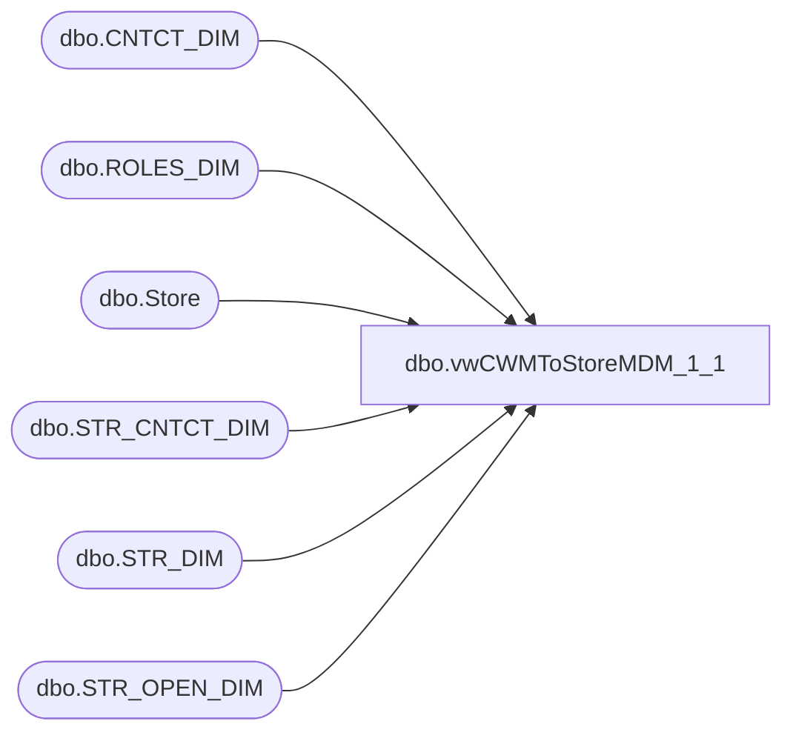

# dbo.vwCWMToStoreMDM_1_1

**Database:** BABWPartyPlanner_Restore  
**Server:** bearcluster01  

## Architecture Diagram



## Table Dependencies

| Referenced Table |
|---|
| dbo.CNTCT_DIM |
| dbo.ROLES_DIM |
| dbo.Store |
| dbo.STR_CNTCT_DIM |
| dbo.STR_DIM |
| dbo.STR_OPEN_DIM |

## View Code

```sql
CREATE VIEW [dbo].[vwCWMToStoreMDM_1_1]
AS

SELECT       DISTINCT ROW_NUMBER() OVER(ORDER BY ps.StoreID) AS RowID
                     ,ps.StoreID
                     ,sd.STR_NUM as StoreNumber
					 ,SD.NM_FULL AS StoreName
					 ,SD.NM_ABBRV AS StoreAbbr
					 ,SD.NM_ABBRV AS Bearitory
					 ,SD.CNTRY_ID
					 ,CD.EMAIL as 'CWM'
FROM            dbo.Store AS ps RIGHT JOIN
							KODIAK.BABWMstrData.dbo.STR_DIM AS SD WITH (NOLOCK) ON ps.StoreID = SD.STR_NUM LEFT OUTER JOIN
							KODIAK.BABWMstrData.dbo.STR_CNTCT_DIM AS SCD WITH (NOLOCK) ON SCD.STR_ID = SD.STR_ID LEFT OUTER JOIN
							KODIAK.BABWMstrData.dbo.CNTCT_DIM AS CD WITH (NOLOCK) ON SCD.CNTCT_ID = CD.CNTCT_ID LEFT OUTER JOIN
							KODIAK.BABWMstrData.dbo.ROLES_DIM AS RD WITH (NOLOCK) ON CD.ROLE_ID = RD.ROLE_ID LEFT OUTER JOIN
							KODIAK.BABWMstrData.dbo.STR_OPEN_DIM AS SOD WITH (NOLOCK) ON SD.STR_ID = SOD.STR_KEY 							

WHERE        (sod.OPEN_DT < DATEADD(month,1,GETDATE()) AND sod.CLOSE_DT > GETDATE()) AND RD.LWSN_CD = 'CWM'
AND SD.STR_NUM NOT IN (13,2013)
```

