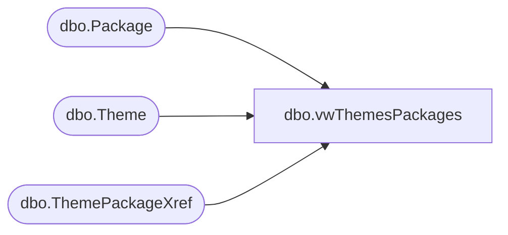

# dbo.vwThemesPackages

**Database:** BABWPartyPlanner_Restore  
**Server:** bearcluster01  

## Architecture Diagram



## Table Dependencies

| Referenced Table |
|---|
| dbo.Package |
| dbo.Theme |
| dbo.ThemePackageXref |

## View Code

```sql
CREATE VIEW [dbo].[vwThemesPackages]
AS
WITH allOptions (ThemeID, PackageID, PackageName, ThemeName)
AS
(
  SELECT ThemeID
        ,PackageID
		,PackageName
		,ThemeName
  FROM
  [BABWPartyPlanner].[dbo].[Theme] t
  CROSS JOIN [BABWPartyPlanner].[dbo].[Package] p
  WHERE t.[Enabled] = 1 AND p.[Enabled] = 1
)
SELECT a.*
      ,xref.ThemeID AS Expr1
	  ,xref.PackageID AS Expr2
      ,CASE
        WHEN xref.ThemeID IS NOT NULL THEN 1
        ELSE 0
      END AS isSelected
FROM allOptions a
FULL OUTER JOIN [BABWPartyPlanner].[dbo].[ThemePackageXref] xref ON a.ThemeID = xref.ThemeID AND a.PackageID = xref.PackageID
WHERE a.ThemeID IS NOT NULL
AND a.PackageID IS NOT NULL
UNION
SELECT ThemeID
      ,NULL AS PackageID
	  ,NULL AS PackageName
	  ,ThemeName
	  ,NULL AS Expr1
	  ,NULL AS Expr2
	  ,0 AS isSelected
FROM [BABWPartyPlanner].[dbo].[Theme] 
WHERE [Enabled] = 1
```

