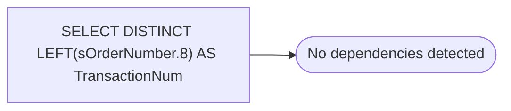

# SELECT DISTINCT LEFT(sOrderNumber.8) AS TransactionNum

**Database:** BABWeCommerce  
**Server:** bearcluster01  

## Architecture Diagram



## Table Dependencies

_No table references detected._

## View Code

```sql
iAWTransID
```

