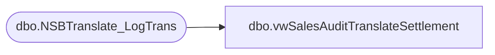

# dbo.vwSalesAuditTranslateSettlement

**Database:** BABWeCommerce  
**Server:** bearcluster01  

## Architecture Diagram



## Table Dependencies

| Referenced Table |
|---|
| dbo.NSBTranslate_LogTrans |

## View Code

```sql
CREATE VIEW dbo.vwSalesAuditTranslateSettlement
```

