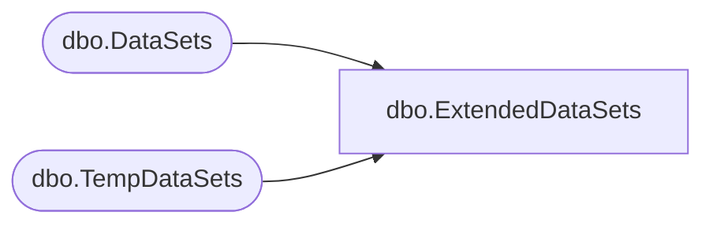

# dbo.ExtendedDataSets

**Database:** ReportServerBIRPT02  
**Server:** bearcluster01  

## Architecture Diagram



## Table Dependencies

| Referenced Table |
|---|
| dbo.DataSets |
| dbo.TempDataSets |

## View Code

```sql
CREATE VIEW [dbo].ExtendedDataSets
AS
SELECT
    ID, LinkID, [Name], ItemID
FROM DataSets
UNION ALL
SELECT
    ID, LinkID, [Name], ItemID
FROM [ReportServerBIRPT02TempDB].dbo.TempDataSets
```

