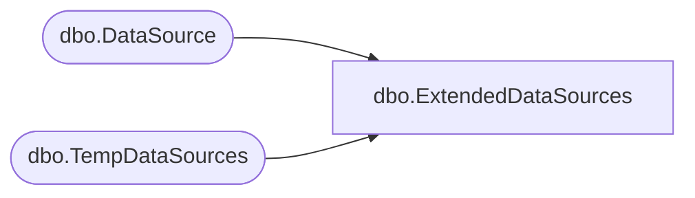

# dbo.ExtendedDataSources

**Database:** ReportServerBIRPT02  
**Server:** bearcluster01  

## Architecture Diagram



## Table Dependencies

| Referenced Table |
|---|
| dbo.DataSource |
| dbo.TempDataSources |

## View Code

```sql
CREATE VIEW [dbo].ExtendedDataSources
AS
SELECT
    DSID, ItemID, SubscriptionID, Name, Extension, Link,
    CredentialRetrieval, Prompt, ConnectionString,
    OriginalConnectionString, OriginalConnectStringExpressionBased,
    UserName, Password, Flags, Version, DSIDNum
FROM DataSource
UNION ALL
SELECT
    DSID, ItemID, NULL as [SubscriptionID], Name, Extension, Link,
    CredentialRetrieval, Prompt, ConnectionString,
    OriginalConnectionString, OriginalConnectStringExpressionBased,
    UserName, Password, Flags, Version, null
FROM [ReportServerBIRPT02TempDB].dbo.TempDataSources
```

