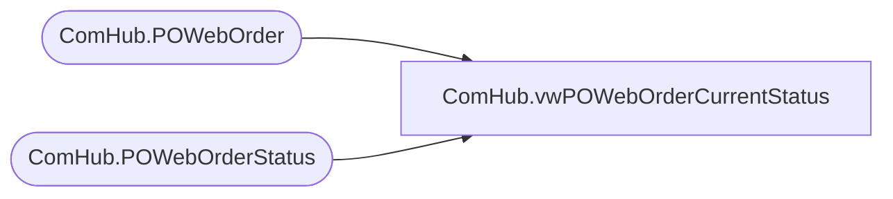

# ComHub.vwPOWebOrderCurrentStatus

**Database:** WebOrderProcessing  
**Server:** bearcluster01  

## Architecture Diagram



## Table Dependencies

| Referenced Table |
|---|
| ComHub.POWebOrder |
| ComHub.POWebOrderStatus |

## View Code

```sql
CREATE VIEW [ComHub].[vwPOWebOrderCurrentStatus]
AS
  SELECT o.POWebOrderId, OrderMessageBatch, TransactionId, PONumber, OrderId, MAX(s.StatusId) 'StatusId', MAX(s.CreatedOn) 'CreatedOn', POjson
  FROM [WebOrderProcessing].[ComHub].[POWebOrder] o
  INNER JOIN [WebOrderProcessing].[ComHub].[POWebOrderStatus] s ON o.POWebOrderId = s.POWebOrderId
  GROUP BY o.POWebOrderId, OrderMessageBatch, TransactionId, PONumber, OrderId, POjson
```

