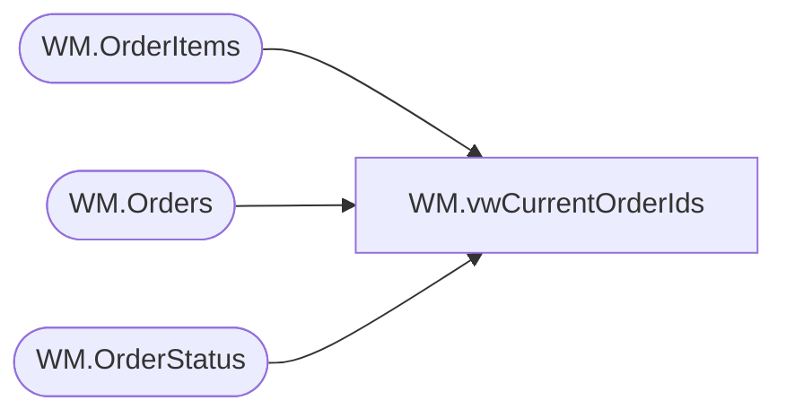

# WM.vwCurrentOrderIds

**Database:** WebOrderProcessing  
**Server:** bearcluster01  

## Architecture Diagram



## Table Dependencies

| Referenced Table |
|---|
| WM.OrderItems |
| WM.Orders |
| WM.OrderStatus |

## View Code

```sql
CREATE VIEW [WM].[vwCurrentOrderIds]
AS
SELECT DISTINCT O1.OrderId
FROM   WM.Orders AS O1 INNER JOIN
             WM.OrderStatus AS s ON O1.OrderId = s.OrderId AND s.CurrentStatus = 1 INNER JOIN
             WM.OrderItems AS oi ON O1.OrderId = oi.OrderId AND LEN(oi.sku) = 6
WHERE (ISNULL(O1.PickTicketFlag, 0) = 0) AND (O1.SourceSite = 'BABW-US') AND (O1.OrderStatus = 'Pending') AND (CHARINDEX('_', O1.OrderNum, 1) > 0) AND (O1.PickupStore <> 13)
WM,vwD365CountryCodes,CREATE VIEW WM.vwD365CountryCodes
AS
SELECT ISNULL(ROW_NUMBER() OVER(ORDER BY [ShortName]), -1) AS [D365CountryCodesID]
      ,[CountryAbbrv]
      ,[D365CountryAbbrv]
      ,[ShortName]
  FROM [WebOrderProcessing].[WM].[D365CountryCodes]
```

