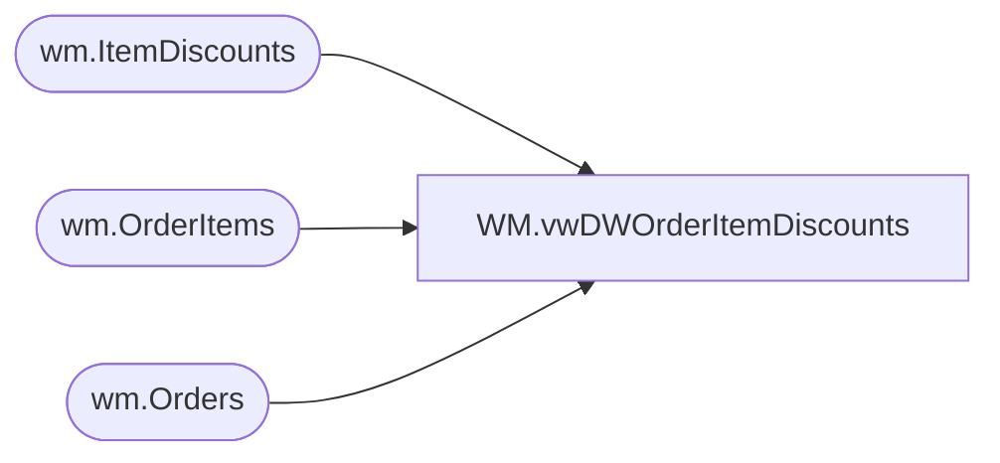

# WM.vwDWOrderItemDiscounts

**Database:** WebOrderProcessing  
**Server:** bearcluster01  

## Architecture Diagram



## Table Dependencies

| Referenced Table |
|---|
| wm.ItemDiscounts |
| wm.OrderItems |
| wm.Orders |

## View Code

```sql
CREATE view [WM].[vwDWOrderItemDiscounts]

as

with ItemDiscounts as
	(
		select
			cast(o.OrderDate as date) as OrderDate,
			o.OrderNumber,
			oi.sku,
			id.PromoCode,
			cast (isnull(id.DiscountAmount,0.00) as decimal (9,2)) as ItemDiscountAmount,
			cast(0 as decimal(9,2)) as OrderDiscountAmount,
			isnull(id.IsOrderDiscount,0) as IsOrderDiscount,
			id.discountname,
			o.SourceSite
		from wm.Orders o
		join wm.OrderItems OI on O.OrderID = OI.OrderID
		left join wm.ItemDiscounts id on id.OrderID=o.OrderId
		and oi.OrderItemID=id.OrderItemID
		where isnull(id.IsOrderDiscount,0) = 0
		group by
			cast(o.OrderDate as date),
			o.OrderNumber,
			oi.sku,
			id.PromoCode,
			isnull(id.IsOrderDiscount,0),
			id.discountname,
			o.SourceSite,
			cast (isnull(id.DiscountAmount,0.00) as decimal (9,2)),
			oi.OrderItemID
	),
OrderDiscounts as
	(
		select
			cast(o.OrderDate as date) as OrderDate,
			o.OrderNumber,
			oi.sku,
			id.PromoCode,
			cast(0 as decimal(9,2)) as ItemDiscountAmount,
			cast (isnull(id.DiscountAmount,0.00) as decimal (9,2)) as OrderDiscountAmount,
			isnull(id.IsOrderDiscount,0) as IsOrderDiscount,
			id.discountname,
			o.SourceSite
		from wm.Orders o
		join wm.OrderItems OI on O.OrderID = OI.OrderID
		left join wm.ItemDiscounts id on id.OrderID=o.OrderId
		and oi.OrderItemID=id.OrderItemID
		where isnull(id.IsOrderDiscount,0) = 1
		group by
			cast(o.OrderDate as date),
			o.OrderNumber,
			oi.sku,
			id.PromoCode,
			isnull(id.IsOrderDiscount,0),
			id.discountname,
			o.SourceSite,
			cast (isnull(id.DiscountAmount,0.00) as decimal (9,2)),
			oi.OrderItemID
	),
OrderSumDivider as 
	(
		select OrderNumber, count (distinct OrderNum) as SumDivider
		from wm.Orders o
		where o.OrderNum like '%[_]%' 
		group by OrderNumber
	),
FinalSummary as 
	(
		select 
			d.OrderDate,
			d.OrderNumber,
			d.sku as SKU,
			d.PromoCode as PromoCode,
			case 
				when d.IsOrderDiscount = 0 then cast (d.ItemDiscountAmount/isnull(osd.SumDivider,1) as decimal (9,2))
				when d.IsOrderDiscount = 1 then cast (d.ItemDiscountAmount as decimal (9,2))
			end as ItemDiscountAmount,
			OrderDiscountAmount,
			d.IsOrderDiscount as IsOrderLevelDiscount,
			d.discountname as DiscountName,
			d.SourceSite
		from ItemDiscounts d
		left join OrderSumDivider OSD ON OSD.OrderNumber=d.OrderNumber
		where ItemDiscountAmount > 0
		UNION ALL
		select 
			d.OrderDate,
			d.OrderNumber,
			d.sku as SKU,
			d.PromoCode as PromoCode,
			ItemDiscountAmount,
			case 
				when d.IsOrderDiscount = 0 then cast (d.OrderDiscountAmount/isnull(osd.SumDivider,1) as decimal (9,2))
				when d.IsOrderDiscount = 1 then cast (d.OrderDiscountAmount as decimal (9,2))
			end as OrderDiscountAmount,
			d.IsOrderDiscount as IsOrderLevelDiscount,
			d.discountname as DiscountName,
			d.SourceSite
		from OrderDiscounts d
		left join OrderSumDivider OSD ON OSD.OrderNumber=d.OrderNumber
		where OrderDiscountAmount > 0
	)
select 
	OrderDate,
	OrderNumber, 
	SKU, 
	sum(ItemDiscountAmount) as ItemDiscountAmount, 
	sum(OrderDiscountAmount) as OrderDiscountAmount,
	sum(ItemDiscountAmount)+sum(OrderDiscountAmount) as TotalDiscountAmount,
	SourceSite
from FinalSummary
--where OrderNumber in ('W3447575')
group by 
	OrderDate,
	OrderNumber, 
	SKU, 
	SourceSite
```

