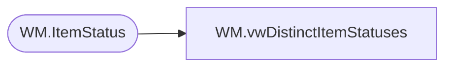

# WM.vwDistinctItemStatuses

**Database:** WebOrderProcessing  
**Server:** bearcluster01  

## Architecture Diagram



## Table Dependencies

| Referenced Table |
|---|
| WM.ItemStatus |

## View Code

```sql
CREATE VIEW [WM].[vwDistinctItemStatuses]
AS

  SELECT DISTINCT OrderItemID
                 ,[Status]
				 ,MAX([StatusDate]) AS 'StatusDate'
                 ,[QTY]
                 ,[Price]
                 ,[DiscountedPrice]
  FROM [WebOrderProcessing].[WM].[ItemStatus]
  WHERE CurrentStatus = 1
  GROUP BY OrderItemID
          ,[Status]
		  ,[QTY]
          ,[Price]
          ,[DiscountedPrice]
```

