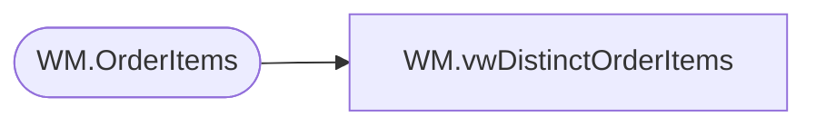

# WM.vwDistinctOrderItems

**Database:** WebOrderProcessing  
**Server:** bearcluster01  

## Architecture Diagram



## Table Dependencies

| Referenced Table |
|---|
| WM.OrderItems |

## View Code

```sql
CREATE VIEW [WM].[vwDistinctOrderItems]
AS

SELECT DISTINCT [OrderItemID]
      ,[sku]
      ,[qty]
      ,[ItemDescription]
      ,[Price]
      ,[DiscountedPrice]
      ,[PreviousQTY]
      ,[PreviousOriginalPrice]
      ,[PreviousDiscountedPrice]
      ,[GuestSatisfactionRefund]
      ,[GiftCardNumber]
      ,[Note]
      ,[RecordYourVoiceOrder]
      ,[EmbroideryCode]
      ,[DateofBirth]
      ,[FullName]
      ,[Height]
      ,[Weight]
      ,[FurColor]
      ,[EyeColor]
      ,[BelongsTo]
      ,[StuffedBy]
      ,[idNum]
      ,[tmpItemID]
      ,[ParentItem]
      ,[ItemId]
      ,[TrackingNumber]
      ,[TransactionID]
  FROM [WebOrderProcessing].[WM].[OrderItems]
```

