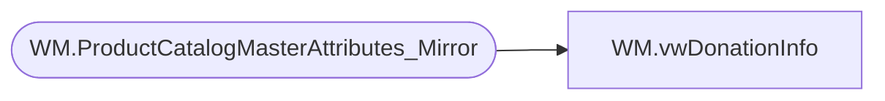

# WM.vwDonationInfo

**Database:** WebOrderProcessing  
**Server:** bearcluster01  

## Architecture Diagram



## Table Dependencies

| Referenced Table |
|---|
| WM.ProductCatalogMasterAttributes_Mirror |

## View Code

```sql
CREATE VIEW [WM].[vwDonationInfo]
AS
SELECT        Style_Code, ClassName
FROM            WM.ProductCatalogMasterAttributes_Mirror AS ProductCatalogMasterAttributes_1
WHERE        (ClassName IN ('Donations', 'UK-Donations')) AND (Style_Code NOT IN ('057700'))
```

