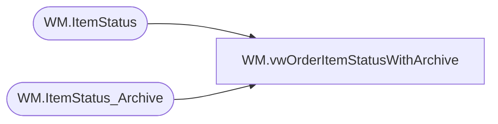

# WM.vwOrderItemStatusWithArchive

**Database:** WebOrderProcessing  
**Server:** bearcluster01  

## Architecture Diagram



## Table Dependencies

| Referenced Table |
|---|
| WM.ItemStatus |
| WM.ItemStatus_Archive |

## View Code

```sql
CREATE VIEW [WM].[vwOrderItemStatusWithArchive]
AS
SELECT        *
FROM            WM.ItemStatus 
UNION ALL
 SELECT        *
FROM            WM.ItemStatus_Archive
```

