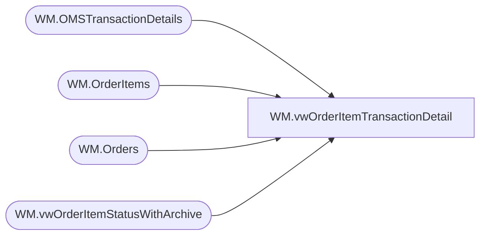

# WM.vwOrderItemTransactionDetail

**Database:** WebOrderProcessing  
**Server:** bearcluster01  

## Architecture Diagram



## Table Dependencies

| Referenced Table |
|---|
| WM.OMSTransactionDetails |
| WM.OrderItems |
| WM.Orders |
| WM.vwOrderItemStatusWithArchive |

## View Code

```sql
/****** Script for SelectTopNRows command from SSMS  ******/
CREATE VIEW [WM].[vwOrderItemTransactionDetail]
AS

WITH SubTotals as 
(
	SELECT o.OrderNumber,
		   SUM(istatus.DiscountedPrice) as SubTotal
	FROM [WebOrderProcessing].[WM].[vwOrderItemStatusWithArchive] istatus
	LEFT JOIN [WebOrderProcessing].[WM].[OrderItems] oi
		ON istatus.OrderItemID = oi.OrderItemID
	LEFT JOIN [WebOrderProcessing].[WM].[Orders] o
		ON oi.OrderId = o.OrderId
	where istatus.CurrentStatus = 1 
		AND istatus.Status = 'Shipped'
	GROUP BY o.OrderNumber
),
PaymentMethods AS
(
	SELECT o.OrderNumber,
		   MAX(otd.PaymentType) as PaymentMethod
	FROM [WebOrderProcessing].[WM].[vwOrderItemStatusWithArchive] istatus
	LEFT JOIN [WebOrderProcessing].[WM].[OrderItems] oi
		ON istatus.OrderItemID = oi.OrderItemID
	LEFT JOIN [WebOrderProcessing].[WM].[Orders] o
		ON oi.OrderId = o.OrderId
	INNER JOIN [WebOrderProcessing].[WM].[OMSTransactionDetails] otd
	ON oi.TransactionID = otd.TransactionID
	where istatus.CurrentStatus = 1 
		AND istatus.Status = 'Shipped'
	GROUP BY o.OrderNumber
)

SELECT DISTINCT(o.OrderNumber)
	  ,CAST(o.OrderDate as DATE) as OrderDate
	  ,oi.OrderItemID
	  ,pm.PaymentMethod
	  ,oi.[sku]
      ,oi.[qty]
      ,oi.[ItemDescription]
      ,istatus.[Price]
      ,istatus.[DiscountedPrice]
	  ,otd.Tax
	  ,st.SubTotal
	  ,CAST(ROUND(((otd.Tax / st.SubTotal) * istatus.DiscountedPrice),2) as Decimal(9,2)) as ItemLevelTax
  FROM [WebOrderProcessing].[WM].[OrderItems] oi
LEFT JOIN [WebOrderProcessing].[WM].[vwOrderItemStatusWithArchive] istatus
	ON oi.OrderItemId = istatus.OrderItemID AND istatus.CurrentStatus = 1 AND istatus.Status = 'Shipped'
LEFT JOIN [WebOrderProcessing].[WM].[Orders] o
	ON oi.OrderId = o.OrderId
LEFT JOIN [WebOrderProcessing].[WM].[OMSTransactionDetails] otd
	ON oi.TransactionID = otd.TransactionID
LEFT JOIN SubTotals st
	ON o.OrderNumber = st.OrderNumber
LEFT JOIN PaymentMethods pm
	ON o.OrderNumber = pm.OrderNumber
```

