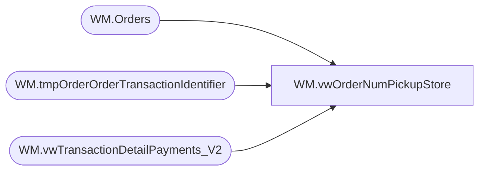

# WM.vwOrderNumPickupStore

**Database:** WebOrderProcessing  
**Server:** bearcluster01  

## Architecture Diagram



## Table Dependencies

| Referenced Table |
|---|
| WM.Orders |
| WM.tmpOrderOrderTransactionIdentifier |
| WM.vwTransactionDetailPayments_V2 |

## View Code

```sql
CREATE VIEW [WM].[vwOrderNumPickupStore]
AS
SELECT        MAX(o.OrderNum) AS OrderNumber, td.TransactionID, v.PickupStore, MAX(o.ShipmentNumber) AS ShipmentNumber, v.OrderTransactionIdentifier
FROM            WM.vwTransactionDetailPayments_V2 AS td INNER JOIN
                         WM.tmpOrderOrderTransactionIdentifier AS v ON td.TransactionID = v.TransactionID AND td.OrderTransactionIdentifier = v.OrderTransactionIdentifier INNER JOIN
                         WM.Orders AS o ON v.TransactionID = o.TransactionID AND v.PickupStore = o.PickupStore --AND o.OrderStatus IN ('Complete', 'Shipped', 'StorePickedForPickup')
GROUP BY td.TransactionID, v.PickupStore, v.OrderTransactionIdentifier
UNION
SELECT        MAX(o.OrderNum) AS OrderNumber, td.TransactionID, v.PickupStore, MAX(o.ShipmentNumber) AS ShipmentNumber, v.OrderTransactionIdentifier
FROM            WM.vwTransactionDetailPayments_V2 AS td INNER JOIN
                         WM.tmpOrderOrderTransactionIdentifier AS v ON td.TransactionID = v.TransactionID AND v.OrderTransactionIdentifier = -1 INNER JOIN
                         WM.Orders AS o ON v.TransactionID = o.TransactionID AND v.PickupStore = o.PickupStore --AND o.OrderStatus IN ('Complete', 'Shipped', 'StorePickedForPickup')
				WHERE OmsTransactionType = 'ShippingManualCredit'
GROUP BY td.TransactionID, v.PickupStore, v.OrderTransactionIdentifier
```

