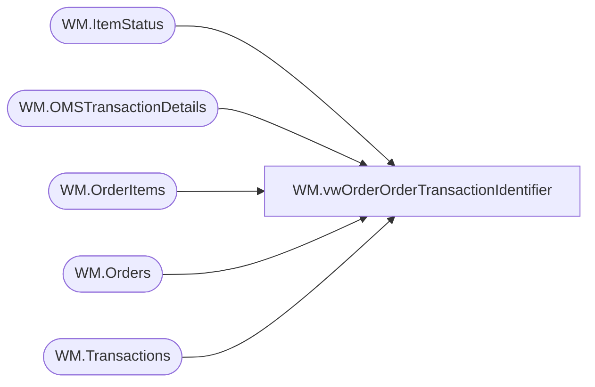

# WM.vwOrderOrderTransactionIdentifier

**Database:** WebOrderProcessing  
**Server:** bearcluster01  

## Architecture Diagram



## Table Dependencies

| Referenced Table |
|---|
| WM.ItemStatus |
| WM.OMSTransactionDetails |
| WM.OrderItems |
| WM.Orders |
| WM.Transactions |

## View Code

```sql
CREATE VIEW [WM].[vwOrderOrderTransactionIdentifier]
AS

  --SELECT TOP 100 PERCENT t.TransactionNum
  WITH GetShippedWMOrders (TransactionID, OrderId, OrderNumber, PickupStore, SourceSite, OrderTransactionIdentifier
  )
  AS
  (
  SELECT oi.TransactionID, o.OrderId, o.OrderNum, o.PickupStore, o.SourceSite, ist.OrderTransactionIdentifier
  FROM [WebOrderProcessing].[WM].[OrderItems] oi
  INNER JOIN [WebOrderProcessing].[WM].[Orders] o ON oi.OrderId = o.OrderId
  INNER JOIN [WebOrderProcessing].[WM].[ItemStatus] ist ON oi.OrderItemID = ist.OrderItemID AND ist.OrderID = o.OrderId --AND CurrentStatus = 1
  GROUP BY  oi.TransactionID, o.OrderId, o.OrderNum, o.PickupStore, o.SourceSite, ist.OrderTransactionIdentifier)
  SELECT *
  FROM GetShippedWMOrders
  UNION
  SELECT td.TransactionID, o.OrderId, o.OrderNum,CASE
		     WHEN PickupStore IS NULL AND LEFT(MAX(OrderNumber), 1) = 'W' THEN '0013'
			 WHEN PickupStore IS NULL AND LEFT(MAX(OrderNumber), 1) = '1' AND o.ShipToCountry = 'GBR' THEN '2013'
			 WHEN PickupStore IS NULL AND LEFT(MAX(OrderNumber), 1) = '1' THEN '0013'
			 WHEN PickupStore IS NULL AND LEFT(MAX(OrderNumber), 1) = '7' THEN '0013'
			 WHEN PickupStore IS NULL AND LEFT(MAX(OrderNumber), 1) = 'U' THEN '2013'
			 ELSE PickupStore
		   END AS 'PickupStore', o.SourceSite, td.OrderTransactionIdentifier
  FROM [WebOrderProcessing].[WM].[OMSTransactionDetails] td
  INNER JOIN [WebOrderProcessing].[WM].[Transactions] t ON td.TransactionID = T.TransactionID
  INNER JOIN [WebOrderProcessing].[WM].[Orders] o ON t.TransactionID = o.TransactionID
  INNER JOIN [WebOrderProcessing].[WM].[OrderItems] oi ON o.OrderId = oi.OrderID
  LEFT JOIN [WebOrderProcessing].WM.[ItemStatus] ist ON oi.OrderItemID = ist.OrderItemID AND ist.Status = 'IZ'
  --WHERE TransactionNum = 'U0684770'
  WHERE isSAProcessed = 0 AND PaymentTransactionType IN ('credit')
  AND CAST(TransactionDate AS DATE) >= '2020-07-14'
  --AND o.ShipmentNumber = 0
  --AND (td.[OrderTransactionIdentifier] - ist.OrderTransactionIdentifier) = 1
  GROUP BY td.TransactionID, o.OrderId, o.OrderNum, OrderNumber, SourceSite, PickupStore, o.ShipToCountry, td.OrderTransactionIdentifier, TransactionDate
```

