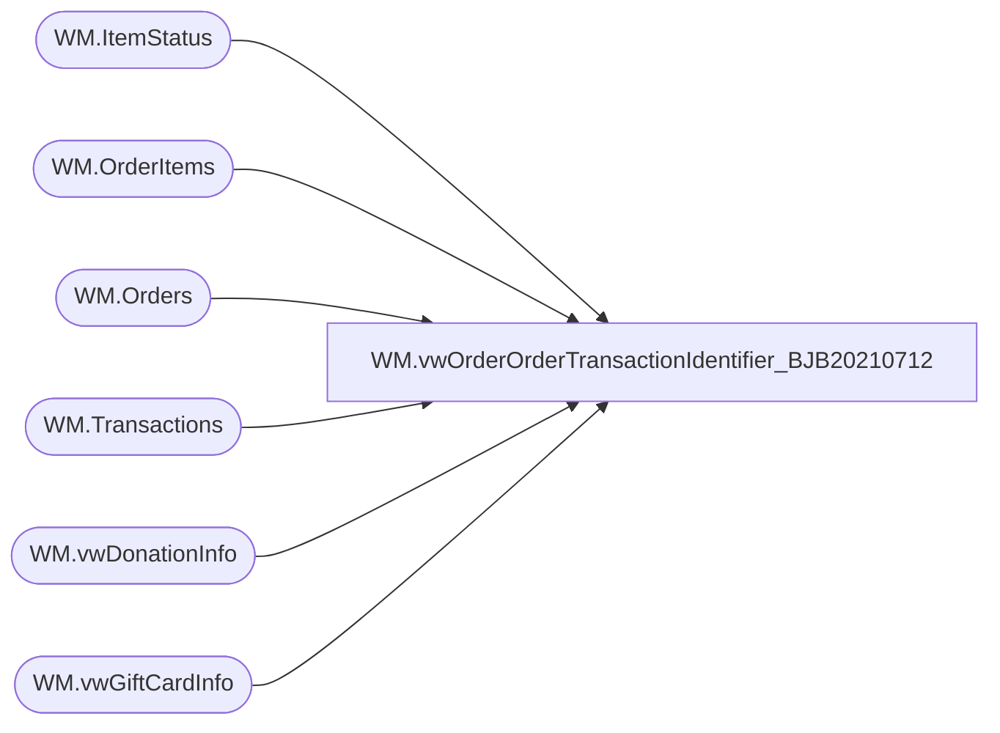

# WM.vwOrderOrderTransactionIdentifier_BJB20210712

**Database:** WebOrderProcessing  
**Server:** bearcluster01  

## Architecture Diagram



## Table Dependencies

| Referenced Table |
|---|
| WM.ItemStatus |
| WM.OrderItems |
| WM.Orders |
| WM.Transactions |
| WM.vwDonationInfo |
| WM.vwGiftCardInfo |

## View Code

```sql
CREATE VIEW [WM].[vwOrderOrderTransactionIdentifier_BJB20210712]
AS

  --SELECT TOP 100 PERCENT t.TransactionNum
  WITH GetShippedWMOrders (TransactionID, OrderId, OrderNumber, PickupStore, SourceSite, OrderTransactionIdentifier
  )
  AS
  (
  SELECT oi.TransactionID, MAX(o.OrderId), MAX(o.OrderNum), o.PickupStore, o.SourceSite, ist.OrderTransactionIdentifier
  --SELECT oi.TransactionID, o.OrderId, o.OrderNum, o.PickupStore, o.SourceSite, ist.OrderTransactionIdentifier
  FROM [WebOrderProcessing].[WM].[OrderItems] oi WITH(NOLOCK)
  INNER JOIN [WebOrderProcessing].[WM].[Orders] o WITH(NOLOCK) ON oi.OrderId = o.OrderId
  INNER JOIN [WebOrderProcessing].[WM].[ItemStatus] ist WITH(NOLOCK) ON oi.OrderItemID = ist.OrderItemID AND ist.OrderID = o.OrderId --AND CurrentStatus = 1
  WHERE oi.sku NOT IN (SELECT [Style_Code] FROM [WM].[vwGiftCardInfo])
  AND oi.sku NOT IN (SELECT [Style_Code] FROM WM.vwDonationInfo)
  AND o.OrderDate > DATEADD(MONTH, -6, GETDATE())
  GROUP BY  oi.TransactionID, o.PickupStore, o.SourceSite, ist.OrderTransactionIdentifier)
  --GROUP BY  oi.TransactionID, o.OrderId, o.OrderNum, o.PickupStore, o.SourceSite, ist.OrderTransactionIdentifier)
  , eGiftWMOrders (TransactionID, OrderId, OrderNumber, PickupStore, SourceSite, OrderTransactionIdentifier)
  AS
  (
  SELECT oi.TransactionID, MAX(o.OrderId), MAX(o.OrderNum), o.PickupStore, o.SourceSite, ist.OrderTransactionIdentifier
  FROM [WebOrderProcessing].[WM].[OrderItems] oi WITH(NOLOCK) 
  INNER JOIN [WebOrderProcessing].[WM].[Transactions] t WITH(NOLOCK) ON oi.TransactionID = t.TransactionID
  INNER JOIN [WebOrderProcessing].[WM].[Orders] o WITH(NOLOCK) ON t.TransactionID = o.TransactionID
  INNER JOIN [WebOrderProcessing].[WM].[ItemStatus] ist WITH(NOLOCK) ON oi.OrderItemID = ist.OrderItemID AND ist.Status NOT IN ('IR')--AND CurrentStatus = 1
  WHERE oi.sku IN (SELECT [Style_Code] FROM [WM].[vwGiftCardInfo]) AND OrderStatus IN ('Complete', 'Shipped', 'StorePickedForPickup')
  AND o.PickupStore IN (13, 2013)
  AND o.OrderDate > DATEADD(MONTH, -6, GETDATE())
  GROUP BY  oi.TransactionID, o.PickupStore, o.SourceSite, ist.OrderTransactionIdentifier)
  , eGiftReturnWMOrders (TransactionID, OrderId, OrderNumber, PickupStore, SourceSite, OrderTransactionIdentifier)
  AS
  (
  SELECT oi.TransactionID, MIN(o.OrderId), MIN(o.OrderNum), o.PickupStore, o.SourceSite, ist.OrderTransactionIdentifier
  FROM [WebOrderProcessing].[WM].[OrderItems] oi WITH(NOLOCK) 
  INNER JOIN [WebOrderProcessing].[WM].[Transactions] t WITH(NOLOCK) ON oi.TransactionID = t.TransactionID
  INNER JOIN [WebOrderProcessing].[WM].[Orders] o WITH(NOLOCK) ON t.TransactionID = o.TransactionID
  INNER JOIN [WebOrderProcessing].[WM].[ItemStatus] ist WITH(NOLOCK) ON oi.OrderItemID = ist.OrderItemID AND ist.Status IN ('IR')--AND CurrentStatus = 1
  WHERE oi.sku IN (SELECT [Style_Code] FROM [WM].[vwGiftCardInfo]) 
  AND OrderStatus IN ('Complete', 'Shipped', 'StorePickedForPickup')
  AND o.PickupStore IN (13, 2013)
  AND o.OrderDate > DATEADD(MONTH, -6, GETDATE())
  GROUP BY  oi.TransactionID, o.PickupStore, o.SourceSite, ist.OrderTransactionIdentifier)
  ,donationWMOrders (TransactionID, OrderId, OrderNumber, PickupStore, SourceSite, OrderTransactionIdentifier)
  AS
  (
  SELECT oi.TransactionID, MAX(o.OrderId), MAX(o.OrderNum), o.PickupStore, o.SourceSite, ist.OrderTransactionIdentifier
  FROM [WebOrderProcessing].[WM].[OrderItems] oi WITH(NOLOCK) 
  INNER JOIN [WebOrderProcessing].[WM].[Transactions] t WITH(NOLOCK) ON oi.TransactionID = t.TransactionID
  INNER JOIN [WebOrderProcessing].[WM].[Orders] o WITH(NOLOCK) ON t.TransactionID = o.TransactionID
  INNER JOIN [WebOrderProcessing].[WM].[ItemStatus] ist WITH(NOLOCK) ON oi.OrderItemID = ist.OrderItemID AND ist.Status NOT IN ('IR')--AND CurrentStatus = 1
  WHERE oi.sku IN (SELECT [Style_Code] FROM WM.vwDonationInfo) AND OrderStatus IN ('Complete', 'Shipped', 'StorePickedForPickup')
  AND o.PickupStore IN (13, 2013)
  AND o.OrderDate > DATEADD(MONTH, -6, GETDATE())
  GROUP BY  oi.TransactionID, o.PickupStore, o.SourceSite, ist.OrderTransactionIdentifier)
  , donationReturnWMOrders (TransactionID, OrderId, OrderNumber, PickupStore, SourceSite, OrderTransactionIdentifier)
  AS
  (
  SELECT oi.TransactionID, MIN(o.OrderId), MIN(o.OrderNum), o.PickupStore, o.SourceSite, ist.OrderTransactionIdentifier
  FROM [WebOrderProcessing].[WM].[OrderItems] oi
  INNER JOIN [WebOrderProcessing].[WM].[Transactions] t WITH(NOLOCK) ON oi.TransactionID = t.TransactionID
  INNER JOIN [WebOrderProcessing].[WM].[Orders] o WITH(NOLOCK) ON t.TransactionID = o.TransactionID
  INNER JOIN [WebOrderProcessing].[WM].[ItemStatus] ist WITH(NOLOCK) ON oi.OrderItemID = ist.OrderItemID AND ist.Status IN ('IR')--AND CurrentStatus = 1
  WHERE oi.sku IN (SELECT [Style_Code] FROM WM.vwDonationInfo) 
  AND OrderStatus IN ('Complete', 'Shipped', 'StorePickedForPickup')
  AND o.PickupStore IN (13, 2013)
  AND o.OrderDate > DATEADD(MONTH, -6, GETDATE())
  GROUP BY  oi.TransactionID, o.PickupStore, o.SourceSite, ist.OrderTransactionIdentifier)

  SELECT *
  FROM GetShippedWMOrders
  UNION 
  SELECT *
  FROM eGiftWMOrders
  UNION
  SELECT *
  FROM eGiftReturnWMOrders
  UNION
  SELECT *
  FROM donationWMOrders
  UNION
  SELECT *
  FROM donationReturnWMOrders
```

