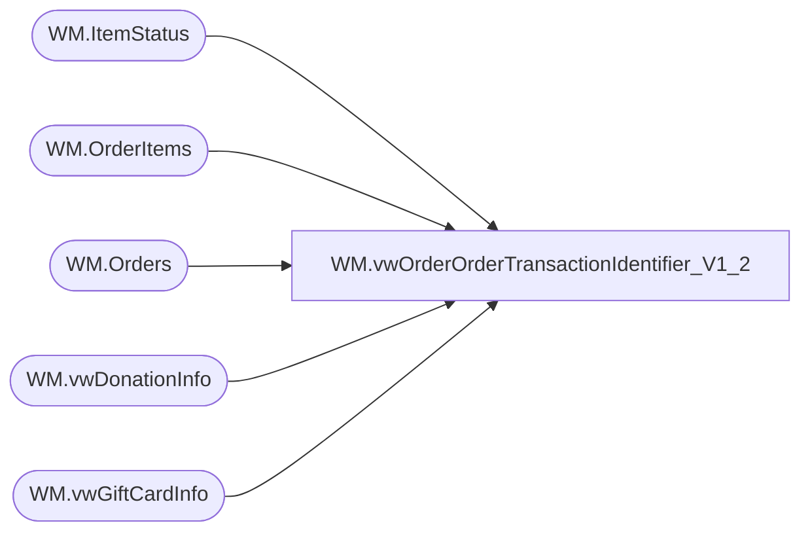

# WM.vwOrderOrderTransactionIdentifier_V1_2

**Database:** WebOrderProcessing  
**Server:** bearcluster01  

## Architecture Diagram



## Table Dependencies

| Referenced Table |
|---|
| WM.ItemStatus |
| WM.OrderItems |
| WM.Orders |
| WM.vwDonationInfo |
| WM.vwGiftCardInfo |

## View Code

```sql
CREATE VIEW [WM].[vwOrderOrderTransactionIdentifier_V1_2]
AS

  --SELECT TOP 100 PERCENT t.TransactionNum
  

  --SELECT TOP 100 PERCENT t.TransactionNum
  WITH GetShippedWMOrdersWorking (TransactionID, OrderId, OrderNum, PickupStore, SourceSite, OrderTransactionIdentifier, sku, [Status], OrderStatus
  )
  AS
  (
  SELECT oi.TransactionID, o.OrderId, o.OrderNum, o.PickupStore, o.SourceSite, ist.OrderTransactionIdentifier, oi.sku, ist.[Status], o.OrderStatus
  --SELECT oi.TransactionID, o.OrderId, o.OrderNum, o.PickupStore, o.SourceSite, ist.OrderTransactionIdentifier
  FROM [WebOrderProcessing].[WM].[OrderItems] oi
  INNER JOIN [WebOrderProcessing].[WM].[Orders] o ON oi.OrderId = o.OrderId
  INNER JOIN [WebOrderProcessing].[WM].[ItemStatus] ist ON oi.OrderItemID = ist.OrderItemID AND ist.OrderID = o.OrderId)
  ,GetShippedWMOrders (TransactionID, OrderId, OrderNumber, PickupStore, SourceSite, OrderTransactionIdentifier
  )
  AS
  (
  SELECT TransactionID, MAX(OrderId), MAX(OrderNum), PickupStore, SourceSite, OrderTransactionIdentifier
  --SELECT oi.TransactionID, o.OrderId, o.OrderNum, o.PickupStore, o.SourceSite, ist.OrderTransactionIdentifier
  FROM GetShippedWMOrdersWorking
  WHERE sku NOT IN (SELECT [Style_Code] FROM [WM].[vwGiftCardInfo])
  AND sku NOT IN (SELECT [Style_Code] FROM WM.vwDonationInfo)
  GROUP BY  TransactionID, PickupStore, SourceSite, OrderTransactionIdentifier)
  --GROUP BY  oi.TransactionID, o.OrderId, o.OrderNum, o.PickupStore, o.SourceSite, ist.OrderTransactionIdentifier)
  , eGiftWMOrders (TransactionID, OrderId, OrderNumber, PickupStore, SourceSite, OrderTransactionIdentifier)
  AS
  (
  SELECT TransactionID, MAX(OrderId), MAX(OrderNum), PickupStore, SourceSite, OrderTransactionIdentifier
  FROM GetShippedWMOrdersWorking 
  WHERE [Status] NOT IN ('IR') AND sku IN (SELECT [Style_Code] FROM [WM].[vwGiftCardInfo]) AND OrderStatus IN ('Complete', 'Shipped', 'StorePickedForPickup')
  AND PickupStore IN (13, 2013)
  GROUP BY  TransactionID, PickupStore, SourceSite, OrderTransactionIdentifier)
  , eGiftReturnWMOrders (TransactionID, OrderId, OrderNumber, PickupStore, SourceSite, OrderTransactionIdentifier)
  AS
  (
  SELECT TransactionID, MIN(OrderId), MIN(OrderNum), PickupStore, SourceSite, OrderTransactionIdentifier
  FROM GetShippedWMOrdersWorking--AND CurrentStatus = 1
  WHERE [Status] IN ('IR') AND sku IN (SELECT [Style_Code] FROM [WM].[vwGiftCardInfo]) 
  AND OrderStatus IN ('Complete', 'Shipped', 'StorePickedForPickup')
  AND PickupStore IN (13, 2013)
  GROUP BY  TransactionID, PickupStore, SourceSite, OrderTransactionIdentifier)
  ,donationWMOrders (TransactionID, OrderId, OrderNumber, PickupStore, SourceSite, OrderTransactionIdentifier)
  AS
  (
  SELECT TransactionID, MAX(OrderId), MAX(OrderNum), PickupStore, SourceSite, OrderTransactionIdentifier
  FROM GetShippedWMOrdersWorking
  WHERE [Status] NOT IN ('IR') AND sku IN (SELECT [Style_Code] FROM WM.vwDonationInfo) AND OrderStatus IN ('Complete', 'Shipped', 'StorePickedForPickup')
  AND PickupStore IN (13, 2013)
  GROUP BY  TransactionID, PickupStore, SourceSite, OrderTransactionIdentifier)
  , donationReturnWMOrders (TransactionID, OrderId, OrderNumber, PickupStore, SourceSite, OrderTransactionIdentifier)
  AS
  (
  SELECT TransactionID, MIN(OrderId), MIN(OrderNum), PickupStore, SourceSite, OrderTransactionIdentifier
  FROM GetShippedWMOrdersWorking --AND CurrentStatus = 1
  WHERE [Status] IN ('IR') AND sku IN (SELECT [Style_Code] FROM WM.vwDonationInfo) 
  AND OrderStatus IN ('Complete', 'Shipped', 'StorePickedForPickup')
  AND PickupStore IN (13, 2013)
  GROUP BY  TransactionID, PickupStore, SourceSite, OrderTransactionIdentifier)

  SELECT *
  FROM GetShippedWMOrders
  UNION 
  SELECT *
  FROM eGiftWMOrders
  UNION
  SELECT *
  FROM eGiftReturnWMOrders
  UNION
  SELECT *
  FROM donationWMOrders
  UNION
  SELECT *
  FROM donationReturnWMOrders
```

