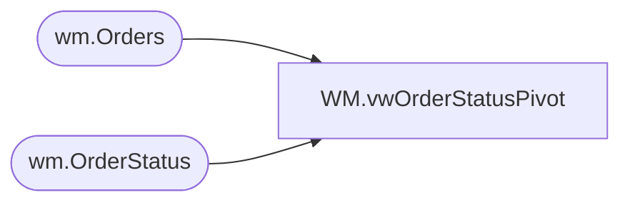

# WM.vwOrderStatusPivot

**Database:** WebOrderProcessing  
**Server:** bearcluster01  

## Architecture Diagram



## Table Dependencies

| Referenced Table |
|---|
| wm.Orders |
| wm.OrderStatus |

## View Code

```sql
CREATE view [WM].[vwOrderStatusPivot] 
as

with
MaxOrder as 
	(
		select 
			o.OrderNumber as WOPOrderNumber,
			max(o.OrderNum) as WOPWebOrderNumber
		from wm.Orders o with (nolock)
		where 1=1
		and o.OrderNum like '%[_]%' 
		group by 
			o.OrderNumber
	),
StatusPivot as
	(
		select
			OrderNumber,
			OrderNum,
			OrderID,
			Pending as PendingStatusDate,
			isnull(Waved,StoreWaved) as WavedStatusDate,
			isnull(Shipped,Complete) as ShippedCompletedStatusDate
		from 
			(
				select 
					o.OrderNumber,
					o.OrderNum as OrderNum,
					o.OrderID,
					os.Status,
					os.StatusDate
				from wm.Orders o with (nolock)
				join wm.OrderStatus os with (nolock) on o.OrderID=os.OrderID
				join MaxOrder mo on o.OrderNum=mo.WOPWebOrderNumber
				where o.OrderNum like '%[_]%'
				group by 
					o.OrderNumber,
					o.OrderNum,
					o.OrderID,
					os.Status,
					os.StatusDate
			) as OrderStatuses
		pivot
			(
				min(StatusDate)
				for Status in ([Pending], [Waved], [StoreWaved], [Shipped], [Complete])
			) as PivotedStatusDates
		--where isnull(isnull(Pending, Waved),StoreWaved) is not null
	)
select 
	sp.OrderNumber,
	sp.OrderNum,
	os.Status as CurrentStatus,
	sp.PendingStatusDate,
	sp.WavedStatusDate,
	sp.ShippedCompletedStatusDate
from StatusPivot sp
join wm.OrderStatus os with (nolock) 
	on sp.OrderID=os.OrderID
	and os.CurrentStatus=1
group by 
	sp.OrderNumber,
	sp.OrderNum,
	os.Status,
	sp.PendingStatusDate,
	sp.WavedStatusDate,
	sp.ShippedCompletedStatusDate
```

