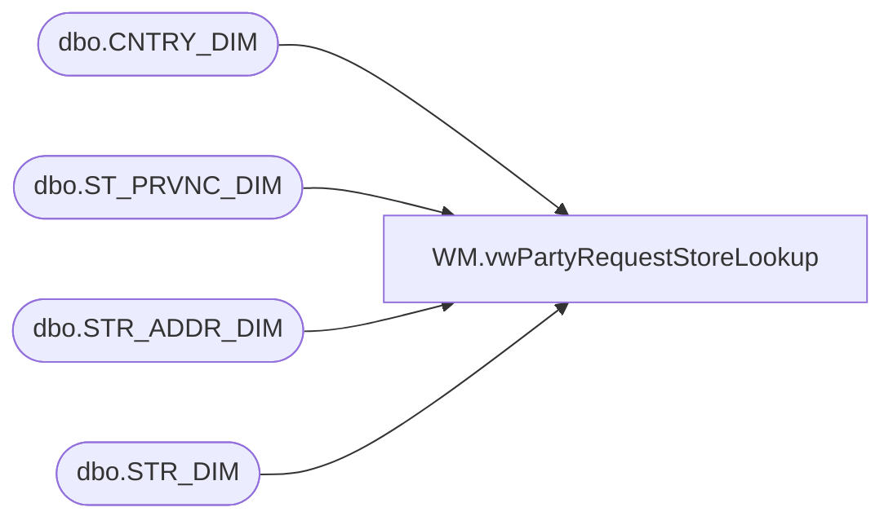

# WM.vwPartyRequestStoreLookup

**Database:** WebOrderProcessing  
**Server:** bearcluster01  

## Architecture Diagram



## Table Dependencies

| Referenced Table |
|---|
| dbo.CNTRY_DIM |
| dbo.ST_PRVNC_DIM |
| dbo.STR_ADDR_DIM |
| dbo.STR_DIM |

## View Code

```sql
CREATE VIEW [WM].[vwPartyRequestStoreLookup]
AS
SELECT s.STR_NUM 
     ,s.NM_FULL
     ,ad.LINE_1
	 ,ad.LINE_2
	 ,ad.CTY_NM
	 ,s.PHN_NBR
	 ,s.EMAIL
	 ,spd.NM_ABBRV AS 'ST_NM'
	 ,ad.[PSTL_CD]
	 ,cd.NM_ABBRV AS 'CNTRY_NM'
FROM KODIAK.BABWMstrData.dbo.STR_DIM s
LEFT JOIN KODIAK.BABWMstrData.dbo.STR_ADDR_DIM ad ON s.STR_ID = ad.STR_ID AND ad.CURR_ADDR = 1
LEFT JOIN KODIAK.BABWMstrData.dbo.ST_PRVNC_DIM spd ON ad.ST_PRVNC_ID = spd.ST_PRVNC_ID
LEFT JOIN KODIAK.BABWMstrData.dbo.CNTRY_DIM cd ON spd.CNTRY_ID = cd.CNTRY_ID
```

