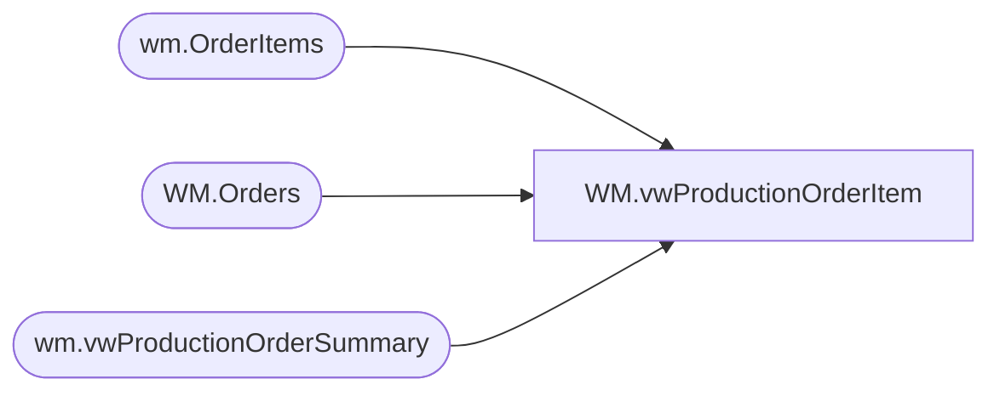

# WM.vwProductionOrderItem

**Database:** WebOrderProcessing  
**Server:** bearcluster01  

## Architecture Diagram



## Table Dependencies

| Referenced Table |
|---|
| wm.OrderItems |
| WM.Orders |
| wm.vwProductionOrderSummary |

## View Code

```sql
CREATE view [WM].[vwProductionOrderItem] 

as

------------------------------------------------------------------------------------------------------
--Dan Tweedie - 2017-10-24 - Created view (work in progress) to map to kodiak.[babwpms].dbo.vwRPT_ProductionOrderItem, used in email report
------------------------------------------------------------------------------------------------------

With
	IsAGift as
		(
			select distinct OrderID
			from WM.Orders with (nolock)
			where GiftSender is not null
		),
	IsBundle as
		(
			select concat(cast(OrderID as varchar),cast(OrderItemID as varchar)) as OrderItemID
			from wm.OrderItems with (nolock)
			where ParentItem is not NULL
			or ItemID in (select ParentItem from wm.OrderItems where ParentItem is not NULL)
		)
select 
	concat(cast(oi.OrderID as varchar),cast(oi.OrderItemID as varchar)) as ProductionOrderItemId, 
	cast(oi.ItemID as nvarchar(50)) as ProductionOrderItemWebCartOrderItemId, 
	oi.ParentItem as ProductionOrderItemParentWebCartOrderItemId, 
	oi.OrderID as ProductionOrderId, 
	cast(oi.SKU as nvarchar(32)) as ProductionOrderItemSku, 
	oi.SKU as StyleCode,
	cast(oi.ItemDescription as nvarchar(80)) as ProductionOrderItemName, 
	oi.qty as ProductionOrderItemQuantity, 
	oi.price as ProductionOrderItemUnitPrice, 
	(oi.price * oi.qty) as ProductionOrderItemExtendedPrice, 
	cast(oi.EyeColor as nvarchar(50)) as ProductionOrderItemFriendEyeColor, 
	cast(oi.FurColor as nvarchar(50)) as ProductionOrderItemFriendFurColor, 
	oi.Height as ProductionOrderItemFriendHeight, 
	oi.Weight as ProductionOrderItemFriendWeight, 
	cast(oi.FullName as nvarchar(50)) as ProductionOrderItemNameMeName, 
	oi.DateOfBirth as ProductionOrderItemNameMeBirthday, 
	case when isnull(g.OrderID, 0) = 0 then 0 else 1 end as ProductionOrderItemNameMeIsGift, 
	os.ProductionOrderShippingFirstName as ProductionOrderItemRecipientFirstName, 
	os.ProductionOrderShippingLastName as ProductionOrderItemRecipientLastName, 
	os.ProductionOrderShippingEmailAddress as ProductionOrderItemRecipientEmailAddress, 
	os.ProductionOrderShippingAddress1 as ProductionOrderItemRecipientAddress1, 
	os.ProductionOrderShippingAddress2 as ProductionOrderItemRecipientAddress2, 
	os.ProductionOrderShippingCity as ProductionOrderItemRecipientCity, 
	os.ProductionOrderShippingStateProvince as ProductionOrderItemRecipientStateProvince, 
	os.ProductionOrderShippingZipPostalCode as ProductionOrderItemRecipientZipPostalCode, 
	os.ProductionOrderShippingCountry as ProductionOrderItemRecipientCountry, 
	os.ProductionOrderBillingFirstName as ProductionOrderItemSenderFirstName, 
	os.ProductionOrderBillingLastName as ProductionOrderItemSenderLastName, 
	os.ProductionOrderBillingEmailAddress as ProductionOrderItemSenderEmailAddress, 
	os.ProductionOrderBillingAddress1 as ProductionOrderItemSenderAddress1, 
	os.ProductionOrderBillingAddress2 as ProductionOrderItemSenderAddress2, 
	os.ProductionOrderBillingCity as ProductionOrderItemSenderCity, 
	os.ProductionOrderBillingStateProvince as ProductionOrderItemSenderStateProvince, 
	os.ProductionOrderBillingZipPostalCode as ProductionOrderItemSenderZipPostalCode, 
	os.ProductionOrderBillingCountry as ProductionOrderItemSenderCountry, 
	oi.RecordYourVoiceOrder as ProductionOrderItemBuildASoundId, 
	case when oi.RecordYourVoiceOrder is not NULL then 1 else 0 end as ProductionOrderItemIsBuildASound,
	case when b.OrderItemID is not NULL then 1 else 0 end as ProductionOrderItemIsKit 
from wm.OrderItems oi with (nolock)
left join IsAGift g on oi.OrderID = g.OrderID
join wm.vwProductionOrderSummary os on oi.OrderID = os.ProductionOrderID
left join IsBundle b on concat(cast(oi.OrderID as varchar),cast(oi.OrderItemID as varchar)) = b.OrderItemID
where len(oi.SKU) = 6 --excludes kit sku
and oi.GiftCardNumber is NULL --excludes virtual giftcards??
```

