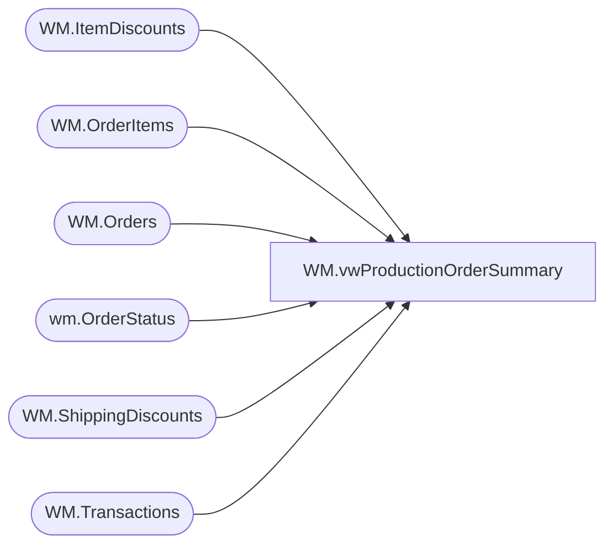

# WM.vwProductionOrderSummary

**Database:** WebOrderProcessing  
**Server:** bearcluster01  

## Architecture Diagram



## Table Dependencies

| Referenced Table |
|---|
| WM.ItemDiscounts |
| WM.OrderItems |
| WM.Orders |
| wm.OrderStatus |
| WM.ShippingDiscounts |
| WM.Transactions |

## View Code

```sql
CREATE view [WM].[vwProductionOrderSummary]
as

------------------------------------------------------------------------------------------------------------------------------------------
--Dan Tweedie - 2017-10-23 - Created view (work in progress) to map to kodiak.[babwpms].dbo.vwRPT_ProductionOrder, used in email report
------------------------------------------------------------------------------------------------------------------------------------------


WITH
	Transactions as
		(
			select
				TransactionID,
				sum(TaxAmount) TaxAmount
			from WM.Transactions with (nolock)
			group by 
				TransactionID
		),
	OrderItems as
		(
			select 
				OrderID,
				sum(Price) Price,
				sum(DiscountedPrice) DiscountedPrice,
				max(TrackingNumber) TrackingNumber
			from WM.OrderItems with (nolock)
			group by OrderID
		),
	ItemDiscounts as
		(
			select 
				OrderID,
				sum(DiscountAmount) ItemDiscount
			from WM.ItemDiscounts with (nolock)
			group by OrderID
		),
	Shipping as 
		(
			select
				OrderID,
				sum(ShippingAmount) as ShippingPrice
			from WM.Orders with (nolock) 
			group by OrderID
		),
	ShippingDiscounts as
		(
			select 
				OrderID,
				sum(DiscountAmount) ShippingDiscount
			from WM.ShippingDiscounts with (nolock)
			where DiscountAmount is not NULL
			group by OrderID
		),
	OrdersSummary as
		(
			select  
				replace(o.SourceSite, '-', '_') as WebSite,
				o.OrderID,
				o.OrderNum,
				o.OrderDate,
				os.Status as OrderStatus,
				os.StatusDate,
				case 
					when substring(o.OrderNum, 9,1) = '_'
						then 'YES'
					else 'NO'
				end as SendToWMS,
				case os.Status
					when 'New' then 1
					when 'Pending' then 2
					when 'Waved' then 3
					when 'Shipped' then 4
					when 'Complete' then 5
					when 'Cancelled' then 6
				end as StatusSortOrder,
				isnull(i.Price,0) as Price,
				isnull(i.Price,0) 
				+ isnull(s.ShippingPrice,0)
				- isnull(id.ItemDiscount,0)
				-isnull(sd.ShippingDiscount,0) 
				as SubTotal,
				isnull(t.TaxAmount,0) as TaxAmount,

				isnull(s.ShippingPrice,0) 
				- isnull(sd.ShippingDiscount,0)
				as ShippingTotal,

				isnull(id.ItemDiscount,0) as ItemDiscount,
				isnull(s.ShippingPrice,0) as ShippingPrice,
				isnull(sd.ShippingDiscount,0) as ShippingDiscount,
				O.SpecialInstructions, 
				O.GiftMessage,

				o.ShippingMethod,
				i.TrackingNumber,
				o.BillToState,
				o.BillToPostalCode,
				o.BillToCountry,
				o.ShipToState,
				o.ShipToPostalCode,
				o.ShipToCountry,
				o.OrderType,
				replace(o.SourceSite, '-', '_') as SourceSite,
				o.DatePrinted,
				os.OrderStatusID
			from Transactions t with (nolock)
			join WM.Orders o with (nolock) on t.TransactionID = o.TransactionID
			left join wm.OrderStatus os with (nolock) on o.OrderID = os.OrderID and os.CurrentStatus = 1
			left join OrderItems i with (nolock) on o.OrderID = i.OrderID
			left join Shipping s with (nolock) on o.OrderID = s.OrderID
			left join ItemDiscounts id with (nolock) on i.OrderID = id.OrderID
			left join ShippingDiscounts sd with (nolock) on s.OrderID = sd.OrderID
		)
select 
	os.OrderID as ProductionOrderId, 
	cast(os.OrderNum as varchar(32)) as ProductionOrderNumber,
	os.SubTotal as ProductionOrderSubTotal,
	os.ShippingTotal as ProductionOrderShippingAndHandling,
	NULL as ProductionOrderPromoCode, --view is expecting one record per OrderID, but our tables have multiple
	ItemDiscount
	+ ShippingDiscount
		as ProductionOrderPromoDiscount,  --view is expecting one record per OrderID, but our tables have multiple
	NULL as ProductionOrderPromoDescription, --view is expecting one record per OrderID, but our tables have multiple
	NULL as ProductionOrderBearBucksNumber, --view is expecting one record per OrderID, but our tables have multiple
	os.SubTotal
	+ os.TaxAmount
		as ProductionOrderTotal, 
	os.OrderDate as ProductionOrderDateTimeCreated, 
	NULL as ProductionOrderDeferredShipDate, 
	cast(os.ShippingMethod as nvarchar(50)) as ProductionOrderShippingMethod, 
	cast(os.TrackingNumber as varchar(50)) as ProductionOrderTrackingNumber,  
	cast(os.BillToState as nvarchar(50)) as ProductionOrderBillingStateProvince, 
	cast(os.BillToPostalCode as nvarchar(20)) as ProductionOrderBillingZipPostalCode, 
	cast(os.BillToCountry as nvarchar(50)) as ProductionOrderBillingCountry, 

	cast(os.ShipToState as nvarchar(50)) as ProductionOrderShippingStateProvince, 
	cast(os.ShipToPostalCode as nvarchar(20)) as ProductionOrderShippingZipPostalCode, 
	cast(os.ShipToCountry as nvarchar(50)) as ProductionOrderShippingCountry, 
 
	NULL as ProductionOrderIsWillCall, 
	NULL as ProductionOrderIsLoyaltyMember, 
	NULL as ProductionOrderLoyaltyNumber, 
	cast(case when os.OrderType = 'RU' then 1 else 0 end as bit) as ProductionOrderIsRush, 
	cast(os.OrderStatus as varchar(50)) as ProductionOrderWebOrderStatus, 
	cast(os.SourceSite as varchar(32)) as ProductionOrderCatalogName, 
	NULL as ProductionOrderNumberOfPackages, 
	cast(os.OrderID as int) as ProductionOrderWebCartOrderId, 
	0 as ProductionOrderWebCartUpdateMsgSent, 
	cast(os.SourceSite as nvarchar(20)) as ProductionOrderSiteCode, 
	NULL as ProductionOrderBearBuilderId, 
	NULL as ProductionOrderBuyStuffStamps, 
	os.ShippingTotal as ProductionOrderActuallShippingCost, 
	cast(case when substring(os.OrderNum, 9,1) = '_' then 1 else 0 end as bit) as ProductionOrderHasShippableProducts, 
	NULL as ProductionOrderWH_version, 
	NULL as ProductionOrderReceiptCode, 
	cast('BEARCLUSTER01' as nvarchar(50)) as ProductionOrderServerName,
	os.OrderStatusID,
	os.StatusDate
from OrdersSummary os (nolock)
```

