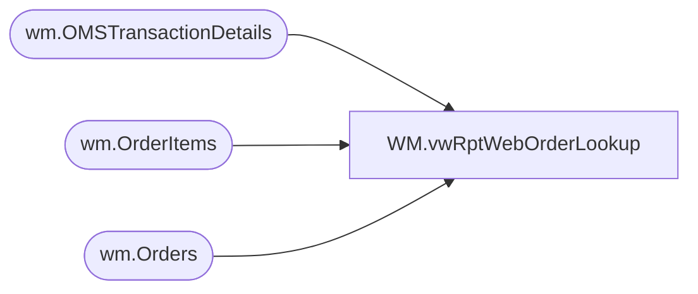

# WM.vwRptWebOrderLookup

**Database:** WebOrderProcessing  
**Server:** bearcluster01  

## Architecture Diagram



## Table Dependencies

| Referenced Table |
|---|
| wm.OMSTransactionDetails |
| wm.OrderItems |
| wm.Orders |

## View Code

```sql
CREATE view [WM].[vwRptWebOrderLookup]

as 

WITH SubTotals as 
(
	SELECT o.OrderNumber,
		   SUM(oi.DiscountedPrice) as SubTotal
	FROM wm.Orders o with (nolock)
	join wm.OrderItems oi with (nolock) on o.OrderID=oi.OrderID
	GROUP BY o.OrderNumber
),
PaymentMethods AS
(
	SELECT o.OrderNumber,
		   MAX(otd.PaymentType) as PaymentMethod
	FROM wm.Orders o with (nolock)
	join wm.OrderItems oi with (nolock) on o.OrderID=oi.OrderID
	join wm.OMSTransactionDetails otd with (nolock) on oi.TransactionID=otd.TransactionID
	GROUP BY o.OrderNumber
),
OrderDetails AS
(
	SELECT DISTINCT(o.OrderNumber)
		  ,o.OrderDate
		  ,oi.OrderItemID
		  ,pm.PaymentMethod
		  ,oi.[sku]
		  ,oi.[qty]
		  ,oi.[ItemDescription]
		  ,oi.[Price]
		  ,oi.[DiscountedPrice]
		  ,otd.Tax
		  ,st.SubTotal
		  ,CASE
			WHEN (otd.Tax = 0) THEN 0.00
			WHEN (st.SubTotal = 0) THEN 0.00
			ELSE CAST(ROUND(((otd.Tax / st.SubTotal) * oi.DiscountedPrice),2) as Decimal(9,2))
		   END AS ItemLevelTax
	  FROM wm.Orders o with (nolock)
	  join wm.OrderItems oi with (nolock) on o.OrderID=oi.OrderID
	  join wm.OMSTransactionDetails otd with (nolock) 
		on oi.TransactionID=otd.TransactionID
		and right(o.OrderNum,1) = otd.ShipmentNumber		
	  join SubTotals st	with (nolock) ON o.OrderNumber = st.OrderNumber
	  join PaymentMethods pm with (nolock)  ON o.OrderNumber = pm.OrderNumber
	  UNION
	  SELECT DISTINCT(o.OrderNumber)
		  ,o.OrderDate
		  ,oi.OrderItemID
		  ,pm.PaymentMethod
		  ,oi.[sku]
		  ,oi.[qty]
		  ,oi.[ItemDescription]
		  ,oi.[Price]
		  ,oi.[DiscountedPrice]
		  ,otd.Tax
		  ,st.SubTotal
		  ,CASE
			WHEN (otd.Tax = 0) THEN 0.00
			WHEN (st.SubTotal = 0) THEN 0.00
			ELSE CAST(ROUND(((otd.Tax / st.SubTotal) * oi.DiscountedPrice),2) as Decimal(9,2))
		   END AS ItemLevelTax
	  FROM wm.Orders o with (nolock)
	  join wm.OrderItems oi with (nolock) on o.OrderID=oi.OrderID
	  join wm.OMSTransactionDetails otd with (nolock) 
		on oi.TransactionID=otd.TransactionID		
	  join SubTotals st	with (nolock) ON o.OrderNumber = st.OrderNumber
	  join PaymentMethods pm with (nolock) ON o.OrderNumber = pm.OrderNumber
)
SELECT        OrderNumber, OrderDate, sku, qty, ItemDescription, Price, DiscountedPrice, Tax, SubTotal, ItemLevelTax, DiscountedPrice + ItemLevelTax AS TenderPlusTax, PaymentMethod
FROM OrderDetails
--WHERE OrderNumber = 'W3909643'
```

