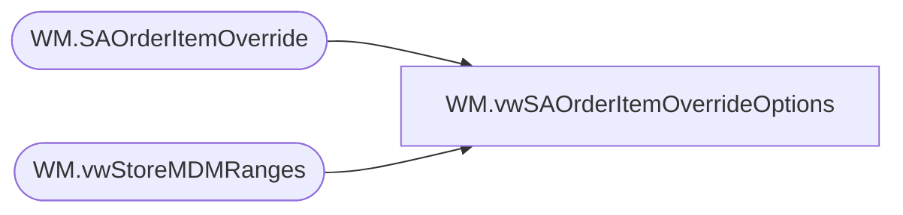

# WM.vwSAOrderItemOverrideOptions

**Database:** WebOrderProcessing  
**Server:** bearcluster01  

## Architecture Diagram



## Table Dependencies

| Referenced Table |
|---|
| WM.SAOrderItemOverride |
| WM.vwStoreMDMRanges |

## View Code

```sql
CREATE VIEW [WM].[vwSAOrderItemOverrideOptions]
AS
WITH CountryOverride ([StoreMDMRangeID]
      ,[CNTRY_ID]
      ,[RGN_ID]
      ,[BEARITORY_ID]
      ,[STR_ID]
      ,[DisplayValue]
	  ,[SAOrderItemOverrideId]
	  ,[OriginalSku]
	  ,[OverrideSku]
	  ,[OverrideDescription]
	  ,[OverrideStartDate]
	  ,[OverrideEndDate]
	  ,[OverrideRangeId]
	  ,[RangeId])
  AS
  (
  SELECT [StoreMDMRangeID]
      ,[CNTRY_ID]
      ,[RGN_ID]
      ,[BEARITORY_ID]
      ,[STR_ID]
      ,[DisplayValue]
	  ,o.[SAOrderItemOverrideId]
	  ,o.[OriginalSku]
	  ,o.[OverrideSku]
	  ,o.[OverrideDescription]
	  ,o.[OverrideStartDate]
	  ,o.[OverrideEndDate]
	  ,o.[OverrideRangeId]
	  ,o.[RangeId]
  FROM [WebOrderProcessing].[WM].[vwStoreMDMRanges] v1
  INNER JOIN [WebOrderProcessing].[WM].[SAOrderItemOverride] o ON v1.CNTRY_ID = o.RangeId
  WHERE (GETDATE() BETWEEN OverrideStartDate AND OverrideEndDate) AND v1.DisplayValue NOT IN ('13', '2013')
  ), RegionOverride ([StoreMDMRangeID]
      ,[CNTRY_ID]
      ,[RGN_ID]
      ,[BEARITORY_ID]
      ,[STR_ID]
      ,[DisplayValue]
	  ,[SAOrderItemOverrideId]
	  ,[OriginalSku]
	  ,[OverrideSku]
	  ,[OverrideDescription]
	  ,[OverrideStartDate]
	  ,[OverrideEndDate]
	  ,[OverrideRangeId]
	  ,[RangeId])
  AS
  (
  SELECT [StoreMDMRangeID]
      ,[CNTRY_ID]
      ,[RGN_ID]
      ,[BEARITORY_ID]
      ,[STR_ID]
      ,[DisplayValue]
	  ,o.[SAOrderItemOverrideId]
	  ,o.[OriginalSku]
	  ,o.[OverrideSku]
	  ,o.[OverrideDescription]
	  ,o.[OverrideStartDate]
	  ,o.[OverrideEndDate]
	  ,o.[OverrideRangeId]
	  ,o.[RangeId]
  FROM [WebOrderProcessing].[WM].[vwStoreMDMRanges] v1
  INNER JOIN [WebOrderProcessing].[WM].[SAOrderItemOverride] o ON v1.RGN_ID = o.RangeId
  WHERE (GETDATE() BETWEEN OverrideStartDate AND OverrideEndDate) AND v1.DisplayValue NOT IN ('13', '2013')
  ), DistrictOverride ([StoreMDMRangeID]
      ,[CNTRY_ID]
      ,[RGN_ID]
      ,[BEARITORY_ID]
      ,[STR_ID]
      ,[DisplayValue]
	  ,[SAOrderItemOverrideId]
	  ,[OriginalSku]
	  ,[OverrideSku]
	  ,[OverrideDescription]
	  ,[OverrideStartDate]
	  ,[OverrideEndDate]
	  ,[OverrideRangeId]
	  ,[RangeId])
  AS
  (
  SELECT [StoreMDMRangeID]
      ,[CNTRY_ID]
      ,[RGN_ID]
      ,[BEARITORY_ID]
      ,[STR_ID]
      ,[DisplayValue]
	  ,o.[SAOrderItemOverrideId]
	  ,o.[OriginalSku]
	  ,o.[OverrideSku]
	  ,o.[OverrideDescription]
	  ,o.[OverrideStartDate]
	  ,o.[OverrideEndDate]
	  ,o.[OverrideRangeId]
	  ,o.[RangeId]
  FROM [WebOrderProcessing].[WM].[vwStoreMDMRanges] v1
  INNER JOIN [WebOrderProcessing].[WM].[SAOrderItemOverride] o ON v1.BEARITORY_ID = o.RangeId
  WHERE (GETDATE() BETWEEN OverrideStartDate AND OverrideEndDate) AND v1.DisplayValue NOT IN ('13', '2013')
  ), StoreOverride ([StoreMDMRangeID]
      ,[CNTRY_ID]
      ,[RGN_ID]
      ,[BEARITORY_ID]
      ,[STR_ID]
      ,[DisplayValue]
	  ,[SAOrderItemOverrideId]
	  ,[OriginalSku]
	  ,[OverrideSku]
	  ,[OverrideDescription]
	  ,[OverrideStartDate]
	  ,[OverrideEndDate]
	  ,[OverrideRangeId]
	  ,[RangeId])
  AS
  (
  SELECT [StoreMDMRangeID]
      ,[CNTRY_ID]
      ,[RGN_ID]
      ,[BEARITORY_ID]
      ,[STR_ID]
      ,[DisplayValue]
	  ,o.[SAOrderItemOverrideId]
	  ,o.[OriginalSku]
	  ,o.[OverrideSku]
	  ,o.[OverrideDescription]
	  ,o.[OverrideStartDate]
	  ,o.[OverrideEndDate]
	  ,o.[OverrideRangeId]
	  ,o.[RangeId]
  FROM [WebOrderProcessing].[WM].[vwStoreMDMRanges] v1
  INNER JOIN [WebOrderProcessing].[WM].[SAOrderItemOverride] o ON v1.STR_ID = o.RangeId
  WHERE (GETDATE() BETWEEN OverrideStartDate AND OverrideEndDate) AND v1.DisplayValue NOT IN ('13', '2013')
  ), summary ([StoreMDMRangeID]
      ,[CNTRY_ID]
      ,[RGN_ID]
      ,[BEARITORY_ID]
      ,[STR_ID]
      ,[DisplayValue]
	  ,[SAOrderItemOverrideId]
	  ,[OriginalSku]
	  ,[OverrideSku]
	  ,[OverrideDescription]
	  ,[OverrideStartDate]
	  ,[OverrideEndDate]
	  ,[OverrideRangeId]
	  ,[RangeId])
  AS 
  (
  SELECT *
  FROM CountryOverride
  UNION
  SELECT *
  FROM RegionOverride
  UNION
  SELECT *
  FROM DistrictOverride
  UNION 
  SELECT *
  FROM StoreOverride
  )
  SELECT [StoreMDMRangeID] AS 'StoreMDMRangeID'
      ,[CNTRY_ID]
      ,[RGN_ID]
      ,[BEARITORY_ID]
      ,[STR_ID]
      ,[DisplayValue]
	  ,[SAOrderItemOverrideId]
	  ,[OriginalSku]
	  ,[OverrideSku]
	  ,[OverrideDescription]
	  ,[OverrideStartDate]
	  ,[OverrideEndDate]
	  ,[OverrideRangeId]
	  ,[RangeId]
  FROM summary
```

