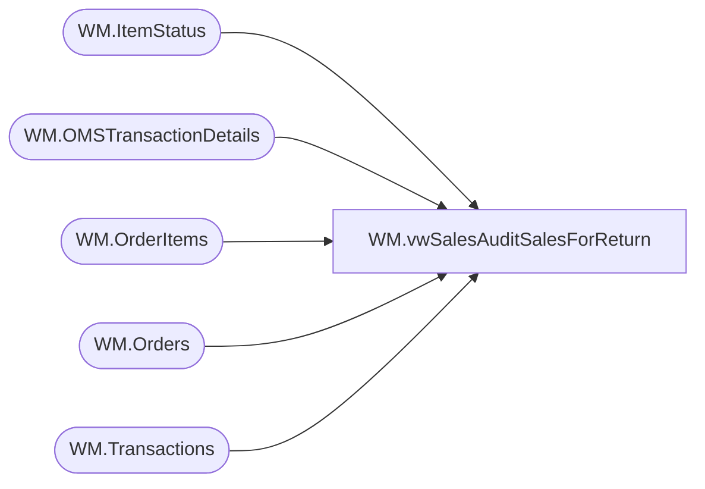

# WM.vwSalesAuditSalesForReturn

**Database:** WebOrderProcessing  
**Server:** bearcluster01  

## Architecture Diagram



## Table Dependencies

| Referenced Table |
|---|
| WM.ItemStatus |
| WM.OMSTransactionDetails |
| WM.OrderItems |
| WM.Orders |
| WM.Transactions |

## View Code

```sql
CREATE VIEW [WM].[vwSalesAuditSalesForReturn]
AS

    WITH NewItemStatus ([OrderItemID]
      ,[Status]
      ,[StatusDate]
      ,[CurrentStatus]
      ,[OrderID]
      ,[OrderTransactionIdentifier]
  )
  AS
  (
  SELECT DISTINCT [OrderItemID]
      ,[Status]
      ,[StatusDate]
      ,[CurrentStatus]
      ,[OrderID]
      ,[OrderTransactionIdentifier]
  FROM [WebOrderProcessing].[WM].[ItemStatus]
  WHERE [Status] NOT IN ('IV', 'IR')
  )
  SELECT oi.OrderItemID
        ,t.TransactionNum + '_' + CAST(td.[OrderTransactionIdentifier] AS VARCHAR) AS 'OrderNumber'
	    ,[sku]
        ,[qty]
        ,[Price]
	    ,[DiscountedPrice]
	    ,0 AS 'PreviousQTY'
	    ,0 AS 'PreviousOriginalPrice'
	    ,0 AS 'PreviousDiscountedPrice'
        ,[GuestSatisfactionRefund]
        ,[GiftCardNumber]
        ,[Note]
        ,[EmbroideryCode]
        ,[FullName]
        ,[Height]
        ,[Weight]
        ,[FurColor]
        ,[EyeColor]
        ,[BelongsTo]
        ,[StuffedBy]
        ,[idNum]
        ,[ParentItem]
  FROM [WebOrderProcessing].[WM].[OMSTransactionDetails] td
  LEFT JOIN [WebOrderProcessing].[WM].[Transactions] t ON td.TransactionID = t.TransactionID
  LEFT JOIN [WebOrderProcessing].[WM].[Orders] o ON t.TransactionID = o.TransactionID
  LEFT JOIN [WebOrderProcessing].[WM].[OrderItems] oi ON o.OrderId = oi.OrderId
  LEFT JOIN [NewItemStatus] ist ON oi.OrderItemID = ist.OrderItemID AND td.OrderTransactionIdentifier = ist.OrderTransactionIdentifier
  WHERE PaymentTransactionType = 'sales'
```

