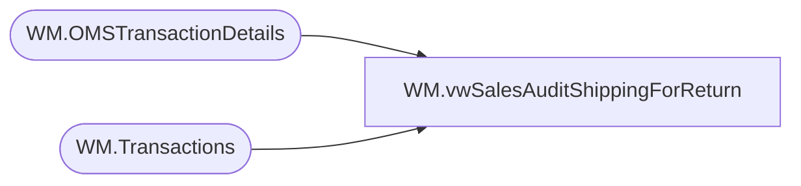

# WM.vwSalesAuditShippingForReturn

**Database:** WebOrderProcessing  
**Server:** bearcluster01  

## Architecture Diagram



## Table Dependencies

| Referenced Table |
|---|
| WM.OMSTransactionDetails |
| WM.Transactions |

## View Code

```sql
CREATE VIEW [WM].[vwSalesAuditShippingForReturn]
AS

  WITH WMOrdersWithPrevTrans (
	TransactionID
   ,OrderTransactionIdentifier
   ,PreviousOrderTransactionIdentifier
  )
  AS
  (
  SELECT td.[TransactionID]
		,td.OrderTransactionIdentifier
		,MAX(ptd.OrderTransactionIdentifier) AS 'PreviousOrderTransactionIdentifier'
  FROM [WebOrderProcessing].[WM].[OMSTransactionDetails] td
  LEFT JOIN [WebOrderProcessing].[WM].[OMSTransactionDetails] ptd ON td.TransactionID = ptd.TransactionID AND ptd.OrderTransactionIdentifier < td.OrderTransactionIdentifier
  LEFT JOIN [WebOrderProcessing].[WM].[Transactions]	t ON td.TransactionID = t.TransactionID
  WHERE ptd.OrderTransactionIdentifier IS NOT NULL
  --WHERE TransactionNum = '00041209' AND ptd.PaymentTransactionType NOT IN ('sales')
  GROUP BY td.[TransactionID], td.OrderTransactionIdentifier)
  SELECT cte.TransactionID
        ,td.Shipping
		,ptd.Shipping AS 'PreviousShipping'
		,cte.OrderTransactionIdentifier
  FROM WMOrdersWithPrevTrans cte
  LEFT JOIN [WebOrderProcessing].[WM].[OMSTransactionDetails]  td ON td.TransactionID = cte.TransactionID AND td.OrderTransactionIdentifier = cte.OrderTransactionIdentifier
  LEFT JOIN [WebOrderProcessing].[WM].[OMSTransactionDetails]  ptd ON ptd.TransactionID = cte.TransactionID AND ptd.OrderTransactionIdentifier = cte.PreviousOrderTransactionIdentifier
```

