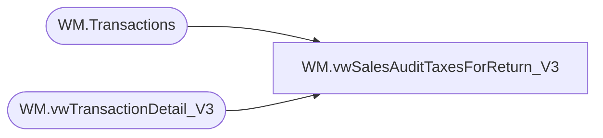

# WM.vwSalesAuditTaxesForReturn_V3

**Database:** WebOrderProcessing  
**Server:** bearcluster01  

## Architecture Diagram



## Table Dependencies

| Referenced Table |
|---|
| WM.Transactions |
| WM.vwTransactionDetail_V3 |

## View Code

```sql
CREATE VIEW [WM].[vwSalesAuditTaxesForReturn_V3]
AS

  WITH WMOrdersWithPrevTrans (
	TransactionID
   ,OrderTransactionIdentifier
   ,PreviousOrderTransactionIdentifier
  )
  AS
  (
  SELECT td.[TransactionID]
		,td.TansactionDetailID AS 'OrderTransactionIdentifier'
		,MAX(ptd.TansactionDetailID) AS 'PreviousOrderTransactionIdentifier'
  FROM [WebOrderProcessing].[WM].[vwTransactionDetail_V3] td
  LEFT JOIN [WebOrderProcessing].[WM].[vwTransactionDetail_V3] ptd ON td.TransactionID = ptd.TransactionID AND ptd.TansactionDetailID < td.TansactionDetailID
  --LEFT JOIN [WebOrderProcessing].[WM].[Transactions]	t ON td.TransactionID = t.TransactionID
  WHERE ptd.TansactionDetailID IS NOT NULL AND td.PaymentTransactionType = 'return'
  --WHERE TransactionNum = '00041209' AND ptd.PaymentTransactionType NOT IN ('sales')
  GROUP BY td.[TransactionID], td.TansactionDetailID)
  SELECT t.TransactionNum AS 'OrderNumber'
	    ,td.[Tax] AS 'TaxAmount'
		,ptd.[Tax] AS 'PreviousTaxAmount'
        ,[TaxJurisdiction]
        ,[TaxAuthority]
        ,[TaxType]
		,td.[CurrencyMultiplier]
		,td.[PaymentTransactionType]
		,t.TransactionID
		,td.[TansactionDetailID] AS 'OrderTransactionIdentifier'
		,ptd.[TansactionDetailID] AS 'PreviousOrderTransactionIdentifier'
  FROM WMOrdersWithPrevTrans cte
  LEFT JOIN [WebOrderProcessing].[WM].[vwTransactionDetail_V3]  td ON td.TransactionID = cte.TransactionID AND td.TansactionDetailID = cte.OrderTransactionIdentifier
  LEFT JOIN [WebOrderProcessing].[WM].[vwTransactionDetail_V3]  ptd ON ptd.TransactionID = cte.TransactionID AND ptd.TansactionDetailID = cte.PreviousOrderTransactionIdentifier
  LEFT JOIN [WebOrderProcessing].[WM].[Transactions] t ON td.TransactionID = t.TransactionID
   --WHERE TaxJurisdiction NOT IN ('GB', 'IR') 
  
  

 -- SELECT t.TransactionNum + '_' + CAST(td.[OrderTransactionIdentifier] AS VARCHAR) AS 'OrderNumber'
	--    ,[Tax] AS 'TaxAmount'
 --       ,[TaxJurisdiction]
 --       ,[TaxAuthority]
 --       ,[TaxType]
	--	,[CurrencyMultiplier]
	--	,[PaymentTransactionType]
	--	,t.TransactionID
	--	,[OrderTransactionIdentifier]
 -- FROM [WebOrderProcessing].[WM].[OMSTransactionDetails] td
```

