# WM.vwStoreMDMRanges

**Database:** WebOrderProcessing  
**Server:** bearcluster01  

## Architecture Diagram

```mermaid
flowchart LR
    VIEW["WM.vwStoreMDMRanges"]
    dbo_BEARITORY_DIM(["dbo.BEARITORY_DIM"]) --> VIEW
    dbo_CNTRY_DIM(["dbo.CNTRY_DIM"]) --> VIEW
    dbo_RGN_CNTRY_DIM(["dbo.RGN_CNTRY_DIM"]) --> VIEW
    dbo_STR_DIM(["dbo.STR_DIM"]) --> VIEW
```



## Table Dependencies

| Referenced Table |
|---|
| dbo.BEARITORY_DIM |
| dbo.CNTRY_DIM |
| dbo.RGN_CNTRY_DIM |
| dbo.STR_DIM |

## View Code

```sql
CREATE VIEW [WM].[vwStoreMDMRanges]
AS
SELECT        5 AS 'StoreMDMRangeID', CNTRY_ID AS 'CNTRY_ID', -1 AS 'RGN_ID', -1 AS 'BEARITORY_ID', -1 AS 'STR_ID', NM_ABBRV AS 'DisplayValue'
FROM            [Kodiak].[BABWMstrData].[dbo].[CNTRY_DIM]
UNION
SELECT        4 AS 'StoreMDMRangeID', CNTRY_ID AS 'CNTRY_ID', RGN_ID AS 'RGN_ID', -1 AS 'BEARITORY_ID', -1 AS 'STR_ID', NM AS 'DisplayValue'
FROM            [Kodiak].[BABWMstrData].[dbo].[RGN_CNTRY_DIM]
UNION
SELECT        3 AS 'StoreMDMRangeID', ISNULL(CNTRY_ID, -1) AS 'CNTRY_ID', b.RGN_ID AS 'RGN_ID', BEARITORY_ID AS 'BEARITORY_ID', -1 AS 'STR_ID', b.NM AS 'DisplayValue'
FROM            [Kodiak].[BABWMstrData].[dbo].[BEARITORY_DIM] b LEFT JOIN
                         [Kodiak].[BABWMstrData].[dbo].[RGN_CNTRY_DIM] r ON b.RGN_ID = r.RGN_ID
UNION
SELECT        2 AS 'StoreMDMRangeID', CNTRY_ID AS 'CNTRY_ID', RGN_ID AS 'RGN_ID', BEARITORY_ID AS 'BEARITORY_ID', STR_ID AS 'STR_ID', CAST(STR_NUM AS VARCHAR(4)) AS 'DisplayValue'
FROM            [Kodiak].[BABWMstrData].[dbo].[STR_DIM]
```

