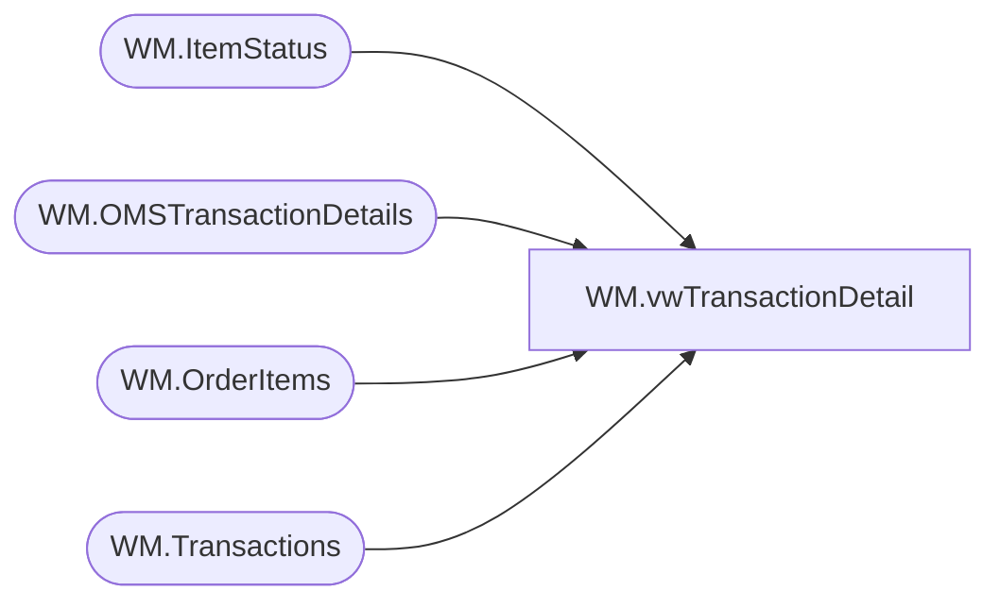

# WM.vwTransactionDetail

**Database:** WebOrderProcessing  
**Server:** bearcluster01  

## Architecture Diagram



## Table Dependencies

| Referenced Table |
|---|
| WM.ItemStatus |
| WM.OMSTransactionDetails |
| WM.OrderItems |
| WM.Transactions |

## View Code

```sql
CREATE VIEW [WM].[vwTransactionDetail]
AS

  --SELECT TOP 100 PERCENT t.TransactionNum
  WITH OrderItemsCount([TransactionID]
					   ,OrderTransactionIdentifier
					   ,[OrderItemCount])
  AS (SELECT [TransactionID]
		    ,ist.OrderTransactionIdentifier
		    ,COUNT(TransactionID) AS 'OrderItemCount'
  FROM [WebOrderProcessing].[WM].[OrderItems] oi
  INNER JOIN [WebOrderProcessing].[WM].[ItemStatus] ist ON oi.OrderItemID = ist.OrderItemID
  GROUP BY [TransactionID], ist.OrderTransactionIdentifier
  --UNION
  --SELECT [TransactionID]
		--    ,ist.OrderTransactionIdentifier
		--    ,COUNT(TransactionID) AS 'OrderItemCount'
  --FROM [WebOrderProcessing].[WM].[OrderItems] oi
  --INNER JOIN [WebOrderProcessing].[WM].[ItemStatus_Archive] ist ON oi.OrderItemID = ist.OrderItemID
  ----WHERE CurrentStatus = 1
  --GROUP BY [TransactionID], ist.OrderTransactionIdentifier
  )
  ,TransactionDetail(TansactionDetailID
                    ,TransactionNum
                    ,OrderNumber
                    ,[TransactionID]
                    ,[ShipmentNumber]
                    ,[OrderTransactionIdentifier]
                    ,[TransactionDate]
                    ,[SubTotal]
                    ,[Shipping]
                    ,[ProcessingFee]
                    ,[Tax]
                    ,[TotalCharges]
                    ,[PaymentTransactionType]
                    ,[PaymentType]
                    ,[TransactionAmount]
                    ,[OrderDiscount]
                    ,[ItemDiscount]
                    ,[InvoiceAmount]
                    ,[InvoiceBillTo]
                    ,[InvoiceNumber]
                    ,[InvoiceDate]
                    ,[Processor]
                    ,[CurrencyMultiplier]
                    ,[OmsTransactionType]
                    ,[PaymentGeneric1]
                    ,[PaymentGeneric2]
                    ,[PaymentGeneric3]
                    ,[PaymentGeneric4]
                    ,[PaymentGeneric5]
                    ,[TransactionGeneric1]
                    ,[TransactionGeneric2]
                    ,[TransactionGeneric3]
                    ,[TransactionGeneric4]
                    ,[TransactionGeneric5]
	                ,[BillToFName]
                    ,[BillToLName]
                    ,[BillToAddress1]
                    ,[BillToAddress2]
                    ,[BillToCity]
                    ,[BillToState]
                    ,[BillToPostalCode]
                    ,[BillToCountry]
                    ,[BillToEmail]
                    ,[BillToPhone]
                    ,[ShipToFName]
                    ,[ShipToLName]
                    ,[ShipToAddress1]
                    ,[ShipToAddress2]
                    ,[ShipToCity]
                    ,[ShipToState]
                    ,[ShipToPostalCode]
                    ,[ShipToCountry]
                    ,[ShipToEmail]
                    ,[ShipToPhone]
	                ,[OrderCustom1]
                    ,[OrderCustom2]
                    ,[OrderCustom3]
                    ,[OrderCustom4]
                    ,[OrderCustom5]
	                ,[isSAProcessed])
  AS(SELECT DISTINCT TansactionDetailID
      ,t.TransactionNum
      ,t.TransactionNum + '_' + CAST(td.[OrderTransactionIdentifier] AS VARCHAR) AS 'OrderNumber'
      ,td.[TransactionID]
      ,td.[ShipmentNumber]
      ,td.[OrderTransactionIdentifier]
      ,[TransactionDate]
      ,[SubTotal]
      ,[Shipping]
      ,[ProcessingFee]
      ,[Tax]
      ,[TotalCharges]
      ,[PaymentTransactionType]
      ,[PaymentType]
      ,[TransactionAmount]
      ,[OrderDiscount]
      ,[ItemDiscount]
      ,[InvoiceAmount]
      ,[InvoiceBillTo]
      ,[InvoiceNumber]
      ,[InvoiceDate]
      ,[Processor]
      ,[CurrencyMultiplier]
      ,[OmsTransactionType]
      ,[PaymentGeneric1]
      ,[PaymentGeneric2]
      ,[PaymentGeneric3]
      ,[PaymentGeneric4]
      ,[PaymentGeneric5]
      ,[TransactionGeneric1]
      ,[TransactionGeneric2]
      ,[TransactionGeneric3]
      ,[TransactionGeneric4]
      ,[TransactionGeneric5]
	  ,[BillToFName]
      ,[BillToLName]
      ,[BillToAddress1]
      ,[BillToAddress2]
      ,[BillToCity]
      ,[BillToState]
      ,[BillToPostalCode]
      ,[BillToCountry]
      ,[BillToEmail]
      ,[BillToPhone]
      ,[ShipToFName]
      ,[ShipToLName]
      ,[ShipToAddress1]
      ,[ShipToAddress2]
      ,[ShipToCity]
      ,[ShipToState]
      ,[ShipToPostalCode]
      ,[ShipToCountry]
      ,[ShipToEmail]
      ,[ShipToPhone]
	  ,[OrderCustom1]
      ,[OrderCustom2]
      ,[OrderCustom3]
      ,[OrderCustom4]
      ,[OrderCustom5]
	  ,[isSAProcessed]
  FROM [WebOrderProcessing].[WM].[OMSTransactionDetails] td
  LEFT JOIN [WebOrderProcessing].[WM].[Transactions] t ON td.TransactionID = t.TransactionID
  WHERE TransactionNum NOT LIKE '7_______'
  AND isSAProcessed = 0
  )
  , TransactionDetailWithItemCount(TansactionDetailID
                    ,TransactionNum
                    ,OrderNumber
                    ,[TransactionID]
                    ,[ShipmentNumber]
                    ,[OrderTransactionIdentifier]
                    ,[TransactionDate]
                    ,[SubTotal]
                    ,[Shipping]
                    ,[ProcessingFee]
                    ,[Tax]
                    ,[TotalCharges]
                    ,[PaymentTransactionType]
                    ,[PaymentType]
                    ,[TransactionAmount]
                    ,[OrderDiscount]
                    ,[ItemDiscount]
                    ,[InvoiceAmount]
                    ,[InvoiceBillTo]
                    ,[InvoiceNumber]
                    ,[InvoiceDate]
                    ,[Processor]
                    ,[CurrencyMultiplier]
                    ,[OmsTransactionType]
                    ,[PaymentGeneric1]
                    ,[PaymentGeneric2]
                    ,[PaymentGeneric3]
                    ,[PaymentGeneric4]
                    ,[PaymentGeneric5]
                    ,[TransactionGeneric1]
                    ,[TransactionGeneric2]
                    ,[TransactionGeneric3]
                    ,[TransactionGeneric4]
                    ,[TransactionGeneric5]
	                ,[BillToFName]
                    ,[BillToLName]
                    ,[BillToAddress1]
                    ,[BillToAddress2]
                    ,[BillToCity]
                    ,[BillToState]
                    ,[BillToPostalCode]
                    ,[BillToCountry]
                    ,[BillToEmail]
                    ,[BillToPhone]
                    ,[ShipToFName]
                    ,[ShipToLName]
                    ,[ShipToAddress1]
                    ,[ShipToAddress2]
                    ,[ShipToCity]
                    ,[ShipToState]
                    ,[ShipToPostalCode]
                    ,[ShipToCountry]
                    ,[ShipToEmail]
                    ,[ShipToPhone]
	                ,[OrderCustom1]
                    ,[OrderCustom2]
                    ,[OrderCustom3]
                    ,[OrderCustom4]
                    ,[OrderCustom5]
	                ,[isSAProcessed]
					,[OrderItemCount]
					)
  AS(SELECT td.*, ISNULL(oic.OrderItemCount, 0)
  FROM TransactionDetail td
  LEFT JOIN OrderItemsCount oic ON td.TransactionID = oic.TransactionID AND td.OrderTransactionIdentifier = oic.OrderTransactionIdentifier
  )
  SELECT TOP 100 PERCENT * 
  FROM TransactionDetailWithItemCount
  WHERE (OrderItemCount > 0 AND PaymentTransactionType IN ('sales', 'return')) OR PaymentTransactionType IN ('credit')
  ORDER BY TransactionDate
```

