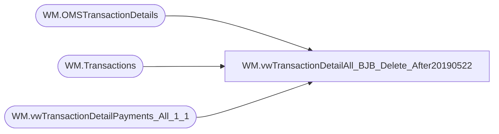

# WM.vwTransactionDetailAll_BJB_Delete_After20190522

**Database:** WebOrderProcessing  
**Server:** bearcluster01  

## Architecture Diagram



## Table Dependencies

| Referenced Table |
|---|
| WM.OMSTransactionDetails |
| WM.Transactions |
| WM.vwTransactionDetailPayments_All_1_1 |

## View Code

```sql
CREATE VIEW [WM].[vwTransactionDetailAll_BJB_Delete_After20190522]
AS

  WITH TransactionShipment (TransactionNum, ShipmentNumber)
  AS
  (SELECT t.[TransactionNum]
      ,[ShipmentNumber]
  FROM [WebOrderProcessing].[WM].[OMSTransactionDetails] td
  LEFT JOIN [WebOrderProcessing].[WM].[Transactions] t ON td.TransactionID = t.TransactionID
  WHERE ShipmentNumber IS NOT NULL
  GROUP BY TransactionNum, ShipmentNumber
  ),
  TransactionDetailAll([TansactionDetailID]
      ,[TransactionNum]
      ,[OrderNumber]
      ,[TransactionID]
      ,[TransactionDate]
      ,[SubTotal]
      ,[Shipping]
      ,[ProcessingFee]
      ,[Tax]
      ,[TotalCharges]
      ,[PaymentTransactionType]
      ,[TransactionAmount]
      ,[OrderDiscount]
      ,[ItemDiscount]
      ,[InvoiceAmount]
      ,[InvoiceBillTo]
      ,[InvoiceNumber]
      ,[InvoiceDate]
      ,[CurrencyMultiplier]
      ,[BillToFName]
      ,[BillToLName]
      ,[BillToAddress1]
      ,[BillToAddress2]
      ,[BillToCity]
      ,[BillToState]
      ,[BillToPostalCode]
      ,[BillToCountry]
      ,[BillToEmail]
      ,[BillToPhone]
      ,[ShipToFName]
      ,[ShipToLName]
      ,[ShipToAddress1]
      ,[ShipToAddress2]
      ,[ShipToCity]
      ,[ShipToState]
      ,[ShipToPostalCode]
      ,[ShipToCountry]
      ,[ShipToEmail]
      ,[ShipToPhone]
      ,[OrderCustom1]
      ,[OrderCustom2]
      ,[OrderCustom3]
      ,[OrderCustom4]
      ,[OrderCustom5]
      ,[isSAProcessed]
      ,[OrderItemCount])
	AS
	(SELECT MAX([TansactionDetailID]) AS 'TansactionDetailID'
      ,[TransactionNum]
      ,[OrderNumber]
      ,[TransactionID]
      ,MAX([TransactionDate]) AS 'TransactionDate'
      ,MAX([SubTotal]) AS 'SubTotal'
      ,MAX([Shipping]) AS 'Shipping'
      ,MAX([ProcessingFee]) AS 'ProcessingFee'
      ,Max([Tax]) AS 'Tax'
      ,MAX([TotalCharges]) AS 'TotalCharges'
      ,[PaymentTransactionType]
      ,SUM([TransactionAmount]) AS 'TransactionAmount'
      ,MAX([OrderDiscount]) AS 'OrderDiscount'
      ,MAX([ItemDiscount]) AS 'ItemDiscount'
      ,MAX([InvoiceAmount]) AS 'InvoiceAmount'
      ,[InvoiceBillTo]
      ,[InvoiceNumber]
      ,[InvoiceDate]
      ,[CurrencyMultiplier]
      ,[BillToFName]
      ,[BillToLName]
      ,[BillToAddress1]
      ,[BillToAddress2]
      ,[BillToCity]
      ,[BillToState]
      ,[BillToPostalCode]
      ,[BillToCountry]
      ,[BillToEmail]
      ,[BillToPhone]
      ,[ShipToFName]
      ,[ShipToLName]
      ,[ShipToAddress1]
      ,[ShipToAddress2]
      ,[ShipToCity]
      ,[ShipToState]
      ,[ShipToPostalCode]
      ,[ShipToCountry]
      ,[ShipToEmail]
      ,[ShipToPhone]
      ,[OrderCustom1]
      ,[OrderCustom2]
      ,[OrderCustom3]
      ,[OrderCustom4]
      ,[OrderCustom5]
      ,[isSAProcessed]
      ,[OrderItemCount]
  FROM [WebOrderProcessing].[WM].[vwTransactionDetailPayments_All_1_1]
  GROUP BY [TransactionNum]
      ,[OrderNumber]
      ,[TransactionID]
      --,[SubTotal]
      --,[Shipping]
      --,[ProcessingFee]
      --,[Tax]
      --,[TotalCharges]
      ,[PaymentTransactionType]
      --,[OrderDiscount]
      --,[ItemDiscount]
      --,[InvoiceAmount]
      ,[InvoiceBillTo]
      ,[InvoiceNumber]
      ,[InvoiceDate]
      ,[CurrencyMultiplier]
      ,[BillToFName]
      ,[BillToLName]
      ,[BillToAddress1]
      ,[BillToAddress2]
      ,[BillToCity]
      ,[BillToState]
      ,[BillToPostalCode]
      ,[BillToCountry]
      ,[BillToEmail]
      ,[BillToPhone]
      ,[ShipToFName]
      ,[ShipToLName]
      ,[ShipToAddress1]
      ,[ShipToAddress2]
      ,[ShipToCity]
      ,[ShipToState]
      ,[ShipToPostalCode]
      ,[ShipToCountry]
      ,[ShipToEmail]
      ,[ShipToPhone]
      ,[OrderCustom1]
      ,[OrderCustom2]
      ,[OrderCustom3]
      ,[OrderCustom4]
      ,[OrderCustom5]
      ,[isSAProcessed]
      ,[OrderItemCount]
	  )
	 SELECT DISTINCT TOP 100 PERCENT tda.TransactionNum
      ,tda.OrderNumber
	  ,isnull((tda.TransactionNum + '_' + CAST(ts.ShipmentNumber AS varchar)),tda.TransactionNum) AS 'WMOrderNumber'
      ,tda.[TransactionID]
      ,ts.[ShipmentNumber]
      --,tda.[OrderTransactionIdentifier]
      ,[TransactionDate]
      ,[SubTotal]
      ,[Shipping]
      ,[ProcessingFee]
      ,[Tax]
      ,[TotalCharges]
      ,[PaymentTransactionType]
      --,[PaymentType]
      ,[TransactionAmount]
      ,[OrderDiscount]
      ,[ItemDiscount]
      ,[InvoiceAmount]
      ,[InvoiceBillTo]
      ,[InvoiceNumber]
      ,[InvoiceDate]
      --,[Processor]
      ,[CurrencyMultiplier]
      --,[OmsTransactionType]
      --,[PaymentGeneric1]
      --,[PaymentGeneric2]
      --,[PaymentGeneric3]
      --,[PaymentGeneric4]
      --,[PaymentGeneric5]
      --,[TransactionGeneric1]
      --,[TransactionGeneric2]
      --,[TransactionGeneric3]
      --,[TransactionGeneric4]
      --,[TransactionGeneric5]
	  ,[BillToFName]
      ,[BillToLName]
      ,[BillToAddress1]
      ,[BillToAddress2]
      ,[BillToCity]
      ,[BillToState]
      ,[BillToPostalCode]
      ,[BillToCountry]
      ,[BillToEmail]
      ,[BillToPhone]
      ,[ShipToFName]
      ,[ShipToLName]
      ,[ShipToAddress1]
      ,[ShipToAddress2]
      ,[ShipToCity]
      ,[ShipToState]
      ,[ShipToPostalCode]
      ,[ShipToCountry]
      ,[ShipToEmail]
      ,[ShipToPhone]
	  ,[OrderCustom1]
      ,[OrderCustom2]
      ,[OrderCustom3]
      ,[OrderCustom4]
      ,[OrderCustom5]
	  ,[isSAProcessed]
	  FROM TransactionShipment ts
	  CROSS JOIN TransactionDetailAll tda 
	  WHERE ts.TransactionNum = tda.TransactionNum
	  ORDER BY TransactionDate

  --SELECT DISTINCT TOP 100 PERCENT t.TransactionNum
  --    ,t.TransactionNum + '_' + CAST(td.[OrderTransactionIdentifier] AS VARCHAR) AS 'OrderNumber'
	 -- ,isnull((t.TransactionNum + '_' + CAST(td.ShipmentNumber AS varchar)),t.TransactionNum) AS 'WMOrderNumber'
  --    ,td.[TransactionID]
  --    ,td.[ShipmentNumber]
  --    ,td.[OrderTransactionIdentifier]
  --    ,[TransactionDate]
  --    ,[SubTotal]
  --    ,[Shipping]
  --    ,[ProcessingFee]
  --    ,[Tax]
  --    ,[TotalCharges]
  --    ,[PaymentTransactionType]
  --    ,[PaymentType]
  --    ,[TransactionAmount]
  --    ,[OrderDiscount]
  --    ,[ItemDiscount]
  --    ,[InvoiceAmount]
  --    ,[InvoiceBillTo]
  --    ,[InvoiceNumber]
  --    ,[InvoiceDate]
  --    ,[Processor]
  --    ,[CurrencyMultiplier]
  --    ,[OmsTransactionType]
  --    ,[PaymentGeneric1]
  --    ,[PaymentGeneric2]
  --    ,[PaymentGeneric3]
  --    ,[PaymentGeneric4]
  --    ,[PaymentGeneric5]
  --    ,[TransactionGeneric1]
  --    ,[TransactionGeneric2]
  --    ,[TransactionGeneric3]
  --    ,[TransactionGeneric4]
  --    ,[TransactionGeneric5]
	 -- ,[BillToFName]
  --    ,[BillToLName]
  --    ,[BillToAddress1]
  --    ,[BillToAddress2]
  --    ,[BillToCity]
  --    ,[BillToState]
  --    ,[BillToPostalCode]
  --    ,[BillToCountry]
  --    ,[BillToEmail]
  --    ,[BillToPhone]
  --    ,[ShipToFName]
  --    ,[ShipToLName]
  --    ,[ShipToAddress1]
  --    ,[ShipToAddress2]
  --    ,[ShipToCity]
  --    ,[ShipToState]
  --    ,[ShipToPostalCode]
  --    ,[ShipToCountry]
  --    ,[ShipToEmail]
  --    ,[ShipToPhone]
	 -- ,[OrderCustom1]
  --    ,[OrderCustom2]
  --    ,[OrderCustom3]
  --    ,[OrderCustom4]
  --    ,[OrderCustom5]
	 -- ,[isSAProcessed]
  --FROM [WebOrderProcessing].[WM].[OMSTransactionDetails] td
  --LEFT JOIN [WebOrderProcessing].[WM].[Transactions] t ON td.TransactionID = t.TransactionID
  ----LEFT JOIN [WebOrderProcessing].[WM].[Orders] o ON t.TransactionID = o.TransactionID
  ----INNER JOIN [WebOrderProcessing].[WM].[ItemStatus] ist ON o.OrderId = ist.OrderID AND td.OrderTransactionIdentifier = ist.OrderTransactionIdentifier
  ----WHERE isSAProcessed = 0 AND PaymentType NOT IN ('Cash') 
  ----AND TransactionNum = '00022308'-- AND OrderTransactionIdentifier = 3
  --ORDER BY TransactionDate

  --SELECT TOP 100 PERCENT t.TransactionNum
  --    ,t.TransactionNum + '_' + CAST(td.[OrderTransactionIdentifier] AS VARCHAR) AS 'OrderNumber'
  --    ,td.[TransactionID]
  --    ,td.[ShipmentNumber]
  --    ,td.[OrderTransactionIdentifier]
  --    ,[TransactionDate]
  --    ,[SubTotal]
  --    ,[Shipping]
  --    ,[ProcessingFee]
  --    ,[Tax]
  --    ,[TotalCharges]
  --    ,[PaymentTransactionType]
  --    ,[PaymentType]
  --    ,[TransactionAmount]
  --    ,[OrderDiscount]
  --    ,[ItemDiscount]
  --    ,[InvoiceAmount]
  --    ,[InvoiceBillTo]
  --    ,[InvoiceNumber]
  --    ,[InvoiceDate]
  --    ,[Processor]
  --    ,[CurrencyMultiplier]
  --    ,[OmsTransactionType]
  --    ,[PaymentGeneric1]
  --    ,[PaymentGeneric2]
  --    ,[PaymentGeneric3]
  --    ,[PaymentGeneric4]
  --    ,[PaymentGeneric5]
  --    ,[TransactionGeneric1]
  --    ,[TransactionGeneric2]
  --    ,[TransactionGeneric3]
  --    ,[TransactionGeneric4]
  --    ,[TransactionGeneric5]
	 -- ,[isSAProcessed]
  --FROM [WebOrderProcessing].[WM].[OMSTransactionDetails] td
  --LEFT JOIN [WebOrderProcessing].[WM].[Transactions] t ON td.TransactionID = t.TransactionID
```

