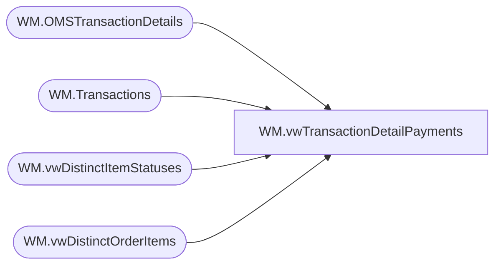

# WM.vwTransactionDetailPayments

**Database:** WebOrderProcessing  
**Server:** bearcluster01  

## Architecture Diagram



## Table Dependencies

| Referenced Table |
|---|
| WM.OMSTransactionDetails |
| WM.Transactions |
| WM.vwDistinctItemStatuses |
| WM.vwDistinctOrderItems |

## View Code

```sql
CREATE VIEW [WM].[vwTransactionDetailPayments]
AS

    WITH OrderItemsCount([TransactionID]
	    		   --,[OrderTransactionIdentifier]
				   ,[OrderItemCount])
  AS (SELECT [TransactionID]
		    --,MAX(ist.OrderTransactionIdentifier)
		    ,COUNT(TransactionID) AS 'OrderItemCount'
  FROM [WebOrderProcessing].[WM].[vwDistinctOrderItems] oi
  INNER JOIN [WebOrderProcessing].[WM].[vwDistinctItemStatuses] ist ON oi.OrderItemID = ist.OrderItemID
  --WHERE TransactionID = 275660
  GROUP BY [TransactionID])
  ,TransactionDetail(TansactionDetailID
                    ,TransactionNum
                    ,OrderNumber
                    ,[TransactionID]
                    ,[OrderTransactionIdentifier]
                    ,[TransactionDate]
                    ,[SubTotal]
                    ,[Shipping]
                    ,[ProcessingFee]
                    ,[Tax]
                    ,[TotalCharges]
                    ,[PaymentTransactionType]
                    ,[PaymentType]
                    ,[TransactionAmount]
                    ,[OrderDiscount]
                    ,[ItemDiscount]
                    ,[InvoiceAmount]
                    ,[InvoiceBillTo]
                    ,[InvoiceNumber]
                    ,[InvoiceDate]
                    ,[Processor]
                    ,[CurrencyMultiplier]
                    ,[PaymentGeneric1]
                    ,[PaymentGeneric2]
                    ,[PaymentGeneric3]
                    ,[PaymentGeneric4]
                    ,[PaymentGeneric5]
                    ,[TransactionGeneric1]
                    ,[TransactionGeneric2]
                    ,[TransactionGeneric3]
                    ,[TransactionGeneric4]
                    ,[TransactionGeneric5]
	                ,[BillToFName]
                    ,[BillToLName]
                    ,[BillToAddress1]
                    ,[BillToAddress2]
                    ,[BillToCity]
                    ,[BillToState]
                    ,[BillToPostalCode]
                    ,[BillToCountry]
                    ,[BillToEmail]
                    ,[BillToPhone]
                    ,[ShipToFName]
                    ,[ShipToLName]
                    ,[ShipToAddress1]
                    ,[ShipToAddress2]
                    ,[ShipToCity]
                    ,[ShipToState]
                    ,[ShipToPostalCode]
                    ,[ShipToCountry]
                    ,[ShipToEmail]
                    ,[ShipToPhone]
	                ,[OrderCustom1]
                    ,[OrderCustom2]
                    ,[OrderCustom3]
                    ,[OrderCustom4]
                    ,[OrderCustom5]
	                ,[isSAProcessed])
  AS(SELECT MAX(TansactionDetailID)
      ,t.TransactionNum
      ,t.TransactionNum AS 'OrderNumber'
      ,td.[TransactionID]
      ,MAX(td.[OrderTransactionIdentifier]) AS 'OrderTransactionIdentifier'
      ,[TransactionDate]
      ,SUM([SubTotal]*[CurrencyMultiplier]) AS 'SubTotal'
      ,SUM([Shipping]*[CurrencyMultiplier]) AS 'Shipping'
      ,SUM([ProcessingFee]*[CurrencyMultiplier]) AS 'ProcessingFee'
      ,SUM([Tax]*[CurrencyMultiplier]) AS 'Tax'
      ,SUM([TotalCharges]*[CurrencyMultiplier]) AS 'TotalCharges'
      ,MAX([PaymentTransactionType]) AS 'PaymentTransactionType'
      ,[PaymentType]
      ,SUM([TransactionAmount]*[CurrencyMultiplier]) AS 'TransactionAmount'
      ,SUM([OrderDiscount]*[CurrencyMultiplier]) AS 'OrderDiscount'
      ,SUM([ItemDiscount]*[CurrencyMultiplier]) AS 'ItemDiscount'
      ,SUM([InvoiceAmount]*[CurrencyMultiplier]) AS 'InvoiceAmount'
      ,[InvoiceBillTo]
      ,[InvoiceNumber]
      ,[InvoiceDate]
      ,[Processor]
      ,MAX([CurrencyMultiplier]) AS 'CurrencyMultiplier'
      ,[PaymentGeneric1]
      ,[PaymentGeneric2]
      ,[PaymentGeneric3]
      ,[PaymentGeneric4]
      ,[PaymentGeneric5]
      ,[TransactionGeneric1]
      ,[TransactionGeneric2]
      ,[TransactionGeneric3]
      ,[TransactionGeneric4]
      ,[TransactionGeneric5]
	  ,[BillToFName]
      ,[BillToLName]
      ,[BillToAddress1]
      ,[BillToAddress2]
      ,[BillToCity]
      ,[BillToState]
      ,[BillToPostalCode]
      ,[BillToCountry]
      ,[BillToEmail]
      ,[BillToPhone]
      ,[ShipToFName]
      ,[ShipToLName]
      ,[ShipToAddress1]
      ,[ShipToAddress2]
      ,[ShipToCity]
      ,[ShipToState]
      ,[ShipToPostalCode]
      ,[ShipToCountry]
      ,[ShipToEmail]
      ,[ShipToPhone]
	  ,[OrderCustom1]
      ,[OrderCustom2]
      ,[OrderCustom3]
      ,[OrderCustom4]
      ,[OrderCustom5]
	  ,[isSAProcessed]
  FROM [WebOrderProcessing].[WM].[OMSTransactionDetails] td
  LEFT JOIN [WebOrderProcessing].[WM].[Transactions] t WITH(NOLOCK) ON td.TransactionID = t.TransactionID
  WHERE TransactionNum NOT LIKE '7_______'
  AND isSAProcessed = 0 
  --AND TransactionNum = 'U0104112'
  --AND TransactionDate BETWEEN '2018-02-01 00:00:00' AND '2018-02-02 00:00:00'
  GROUP BY t.TransactionNum, td.[TransactionID], [TransactionDate]
      --, [PaymentTransactionType]
	  , [PaymentType], [InvoiceBillTo], [InvoiceNumber], [InvoiceDate], [Processor]
	  --, [CurrencyMultiplier]
	  --,[OmsTransactionType]
	  ,[PaymentGeneric1]
      ,[PaymentGeneric2], [PaymentGeneric3], [PaymentGeneric4], [PaymentGeneric5], [TransactionGeneric1], [TransactionGeneric2], [TransactionGeneric3], [TransactionGeneric4], [TransactionGeneric5]
	  ,[BillToFName], [BillToLName], [BillToAddress1], [BillToAddress2], [BillToCity], [BillToState], [BillToPostalCode], [BillToCountry], [BillToEmail], [BillToPhone], [ShipToFName], [ShipToLName]
      ,[ShipToAddress1], [ShipToAddress2], [ShipToCity], [ShipToState], [ShipToPostalCode], [ShipToCountry], [ShipToEmail], [ShipToPhone], [OrderCustom1], [OrderCustom2], [OrderCustom3]
      ,[OrderCustom4], [OrderCustom5], [isSAProcessed]
  )
  , TransactionDetailWithItemCount(TansactionDetailID
                    ,prevTansactionDetailID
                    ,TransactionNum
                    ,OrderNumber
                    ,[TransactionID]
                    ,OrderTransactionIdentifier
					,curOrderTransactionIdentifier
					,[DateDiff]
                    ,[TransactionDate]
					,prevTransactionDate
                    ,[SubTotal]
                    ,[Shipping]
                    ,[ProcessingFee]
                    ,[Tax]
                    ,[TotalCharges]
                    ,[PaymentTransactionType]
                    ,[PaymentType]
                    ,[TransactionAmount]
                    ,[OrderDiscount]
                    ,[ItemDiscount]
                    ,[InvoiceAmount]
                    ,[InvoiceBillTo]
                    ,[InvoiceNumber]
                    ,[InvoiceDate]
                    ,[Processor]
                    ,[CurrencyMultiplier]
                    ,[PaymentGeneric1]
                    ,[PaymentGeneric2]
                    ,[PaymentGeneric3]
                    ,[PaymentGeneric4]
                    ,[PaymentGeneric5]
                    ,[TransactionGeneric1]
                    ,[TransactionGeneric2]
                    ,[TransactionGeneric3]
                    ,[TransactionGeneric4]
                    ,[TransactionGeneric5]
	                ,[BillToFName]
                    ,[BillToLName]
                    ,[BillToAddress1]
                    ,[BillToAddress2]
                    ,[BillToCity]
                    ,[BillToState]
                    ,[BillToPostalCode]
                    ,[BillToCountry]
                    ,[BillToEmail]
                    ,[BillToPhone]
                    ,[ShipToFName]
                    ,[ShipToLName]
                    ,[ShipToAddress1]
                    ,[ShipToAddress2]
                    ,[ShipToCity]
                    ,[ShipToState]
                    ,[ShipToPostalCode]
                    ,[ShipToCountry]
                    ,[ShipToEmail]
                    ,[ShipToPhone]
	                ,[OrderCustom1]
                    ,[OrderCustom2]
                    ,[OrderCustom3]
                    ,[OrderCustom4]
                    ,[OrderCustom5]
	                ,[isSAProcessed]
					,[OrderItemCount]
					)
  AS(SELECT td.TansactionDetailID
           ,ctd.TansactionDetailID
                    ,td.TransactionNum
                    ,td.OrderNumber
                    ,td.[TransactionID]
                    ,td.[OrderTransactionIdentifier]
					,ctd.OrderTransactionIdentifier AS 'curOrderTransactionIdentifier'
					,(DATEDIFF(ms, ctd.TransactionDate, td.TransactionDate) / 1000) AS 'DateDiff'
                    ,td.[TransactionDate]
					,ctd.[TransactionDate]
                    ,td.[SubTotal]
                    ,td.[Shipping]
                    ,td.[ProcessingFee]
                    ,td.[Tax]
                    ,td.[TotalCharges]
                    ,td.[PaymentTransactionType]
                    ,td.[PaymentType]
                    ,td.[TransactionAmount]
                    ,td.[OrderDiscount]
                    ,td.[ItemDiscount]
                    ,td.[InvoiceAmount]
                    ,td.[InvoiceBillTo]
                    ,td.[InvoiceNumber]
                    ,td.[InvoiceDate]
                    ,td.[Processor]
                    ,td.[CurrencyMultiplier]
                    ,td.[PaymentGeneric1]
                    ,td.[PaymentGeneric2]
                    ,td.[PaymentGeneric3]
                    ,td.[PaymentGeneric4]
                    ,td.[PaymentGeneric5]
                    ,td.[TransactionGeneric1]
                    ,td.[TransactionGeneric2]
                    ,td.[TransactionGeneric3]
                    ,td.[TransactionGeneric4]
                    ,td.[TransactionGeneric5]
	                ,td.[BillToFName]
                    ,td.[BillToLName]
                    ,td.[BillToAddress1]
                    ,td.[BillToAddress2]
                    ,td.[BillToCity]
                    ,td.[BillToState]
                    ,td.[BillToPostalCode]
                    ,td.[BillToCountry]
                    ,td.[BillToEmail]
                    ,td.[BillToPhone]
                    ,td.[ShipToFName]
                    ,td.[ShipToLName]
                    ,td.[ShipToAddress1]
                    ,td.[ShipToAddress2]
                    ,td.[ShipToCity]
                    ,td.[ShipToState]
                    ,td.[ShipToPostalCode]
                    ,td.[ShipToCountry]
                    ,td.[ShipToEmail]
                    ,td.[ShipToPhone]
	                ,td.[OrderCustom1]
                    ,td.[OrderCustom2]
                    ,td.[OrderCustom3]
                    ,td.[OrderCustom4]
                    ,td.[OrderCustom5]
	                ,td.[isSAProcessed]
					, ISNULL(oic.OrderItemCount, 0)
  FROM TransactionDetail td
  LEFT JOIN TransactionDetail ctd ON td.TransactionNum = ctd.TransactionNum and td.OrderTransactionIdentifier < ctd.OrderTransactionIdentifier
  LEFT JOIN OrderItemsCount oic ON td.TransactionID = oic.TransactionID
  )
  ,TransactionDetailWithItemCountDeDupd(TansactionDetailID
                    ,TransactionNum
                    ,OrderNumber
                    ,[TransactionID]
					,[OrderTransactionIdentifier]
					,curOrderTransactionIdentifier
					,[DateDiff]
                    ,[TransactionDate]
                    ,[SubTotal]
                    ,[Shipping]
                    ,[ProcessingFee]
                    ,[Tax]
                    ,[TotalCharges]
                    ,[PaymentTransactionType]
                    ,[PaymentType]
                    ,[TransactionAmount]
                    ,[OrderDiscount]
                    ,[ItemDiscount]
                    ,[InvoiceAmount]
                    ,[InvoiceBillTo]
                    ,[InvoiceNumber]
                    ,[InvoiceDate]
                    ,[Processor]
                    ,[CurrencyMultiplier]
                    ,[PaymentGeneric1]
                    ,[PaymentGeneric2]
                    ,[PaymentGeneric3]
                    ,[PaymentGeneric4]
                    ,[PaymentGeneric5]
                    ,[TransactionGeneric1]
                    ,[TransactionGeneric2]
                    ,[TransactionGeneric3]
                    ,[TransactionGeneric4]
                    ,[TransactionGeneric5]
	                ,[BillToFName]
                    ,[BillToLName]
                    ,[BillToAddress1]
                    ,[BillToAddress2]
                    ,[BillToCity]
                    ,[BillToState]
                    ,[BillToPostalCode]
                    ,[BillToCountry]
                    ,[BillToEmail]
                    ,[BillToPhone]
                    ,[ShipToFName]
                    ,[ShipToLName]
                    ,[ShipToAddress1]
                    ,[ShipToAddress2]
                    ,[ShipToCity]
                    ,[ShipToState]
                    ,[ShipToPostalCode]
                    ,[ShipToCountry]
                    ,[ShipToEmail]
                    ,[ShipToPhone]
	                ,[OrderCustom1]
                    ,[OrderCustom2]
                    ,[OrderCustom3]
                    ,[OrderCustom4]
                    ,[OrderCustom5]
	                ,[isSAProcessed]
					,OrderItemCount
)AS(SELECT TansactionDetailID
                    ,TransactionNum
                    ,[OrderNumber]
                    ,[TransactionID]
                    ,[OrderTransactionIdentifier]
					,MAX([curOrderTransactionIdentifier])
					,[DateDiff]
                    ,[TransactionDate]
                    ,[SubTotal]
                    ,[Shipping]
                    ,[ProcessingFee]
                    ,[Tax]
                    ,[TotalCharges]
                    ,[PaymentTransactionType]
                    ,[PaymentType]
                    ,[TransactionAmount]
                    ,[OrderDiscount]
                    ,[ItemDiscount]
                    ,[InvoiceAmount]
                    ,[InvoiceBillTo]
                    ,[InvoiceNumber]
                    ,[InvoiceDate]
                    ,[Processor]
                    ,[CurrencyMultiplier]
                    ,[PaymentGeneric1]
                    ,[PaymentGeneric2]
                    ,[PaymentGeneric3]
                    ,[PaymentGeneric4]
                    ,[PaymentGeneric5]
                    ,[TransactionGeneric1]
                    ,[TransactionGeneric2]
                    ,[TransactionGeneric3]
                    ,[TransactionGeneric4]
                    ,[TransactionGeneric5]
	                ,[BillToFName]
                    ,[BillToLName]
                    ,[BillToAddress1]
                    ,[BillToAddress2]
                    ,[BillToCity]
                    ,[BillToState]
                    ,[BillToPostalCode]
                    ,[BillToCountry]
                    ,[BillToEmail]
                    ,[BillToPhone]
                    ,[ShipToFName]
                    ,[ShipToLName]
                    ,[ShipToAddress1]
                    ,[ShipToAddress2]
                    ,[ShipToCity]
                    ,[ShipToState]
                    ,[ShipToPostalCode]
                    ,[ShipToCountry]
                    ,[ShipToEmail]
                    ,[ShipToPhone]
	                ,[OrderCustom1]
                    ,[OrderCustom2]
                    ,[OrderCustom3]
                    ,[OrderCustom4]
                    ,[OrderCustom5]
	                ,[isSAProcessed]
					,[OrderItemCount]
  FROM TransactionDetailWithItemCount
  WHERE (OrderItemCount > 0 AND PaymentTransactionType IN ('sales', 'return')) OR PaymentTransactionType IN ('credit')
  GROUP BY TansactionDetailID
                    ,TransactionNum
                    ,OrderNumber
                    ,[TransactionID]
					,[OrderTransactionIdentifier]
					,[DateDiff]
					,[TransactionDate]
                    ,[SubTotal]
                    ,[Shipping]
                    ,[ProcessingFee]
                    ,[Tax]
                    ,[TotalCharges]
                    ,[PaymentTransactionType]
                    ,[PaymentType]
                    ,[TransactionAmount]
                    ,[OrderDiscount]
                    ,[ItemDiscount]
                    ,[InvoiceAmount]
                    ,[InvoiceBillTo]
                    ,[InvoiceNumber]
                    ,[InvoiceDate]
                    ,[Processor]
                    ,[CurrencyMultiplier]
                    ,[PaymentGeneric1]
                    ,[PaymentGeneric2]
                    ,[PaymentGeneric3]
                    ,[PaymentGeneric4]
                    ,[PaymentGeneric5]
                    ,[TransactionGeneric1]
                    ,[TransactionGeneric2]
                    ,[TransactionGeneric3]
                    ,[TransactionGeneric4]
                    ,[TransactionGeneric5]
	                ,[BillToFName]
                    ,[BillToLName]
                    ,[BillToAddress1]
                    ,[BillToAddress2]
                    ,[BillToCity]
                    ,[BillToState]
                    ,[BillToPostalCode]
                    ,[BillToCountry]
                    ,[BillToEmail]
                    ,[BillToPhone]
                    ,[ShipToFName]
                    ,[ShipToLName]
                    ,[ShipToAddress1]
                    ,[ShipToAddress2]
                    ,[ShipToCity]
                    ,[ShipToState]
                    ,[ShipToPostalCode]
                    ,[ShipToCountry]
                    ,[ShipToEmail]
                    ,[ShipToPhone]
	                ,[OrderCustom1]
                    ,[OrderCustom2]
                    ,[OrderCustom3]
                    ,[OrderCustom4]
                    ,[OrderCustom5]
	                ,[isSAProcessed]
					,OrderItemCount)

  SELECT DISTINCT TOP 100 PERCENT TansactionDetailID
                    ,TransactionNum
                    ,CASE
					  WHEN curOrderTransactionIdentifier IS NULL THEN [OrderNumber] + '_' + CAST([OrderTransactionIdentifier] AS VARCHAR)
					  WHEN curOrderTransactionIdentifier IS NOT NULL AND [DateDiff] BETWEEN -1 AND 1 THEN [OrderNumber] + '_' + CAST([curOrderTransactionIdentifier] AS VARCHAR)
					  ELSE [OrderNumber] + '_' + CAST([OrderTransactionIdentifier] AS VARCHAR)
					 END AS 'OrderNumber'
                    ,[TransactionID]
                    ,[OrderTransactionIdentifier]
                    ,[TransactionDate]
                    ,CASE 
					  WHEN [SubTotal] < 0 THEN [SubTotal] * -1
					  ELSE [SubTotal]
					 END AS 'SubTotal'
                    ,CASE 
					  WHEN [Shipping] < 0 THEN [Shipping] * -1
					  ELSE [Shipping]
					 END AS 'Shipping'
                    ,CASE 
					  WHEN [ProcessingFee] < 0 THEN [ProcessingFee] * -1
					  ELSE [ProcessingFee]
					 END AS 'ProcessingFee'
                    ,CASE 
					  WHEN [Tax] < 0 THEN [Tax] * -1
					  ELSE [Tax]
					 END AS 'Tax'
                    ,CASE 
					  WHEN [TotalCharges] < 0 THEN [TotalCharges] * -1
					  ELSE [TotalCharges]
					 END AS 'TotalCharges'
                    ,[PaymentTransactionType]
                    ,[PaymentType]
                    ,CASE
					  WHEN [TransactionAmount] < 0 THEN [TransactionAmount] * -1
					  ELSE [TransactionAmount]
					 END AS 'TransactionAmount'
                    ,CASE
					  WHEN [OrderDiscount] < 0 THEN [OrderDiscount] * -1
					  ELSE [OrderDiscount]
					 END AS 'OrderDiscount'
                    ,CASE
					  WHEN [ItemDiscount] < 0 THEN [ItemDiscount] * -1
					  ELSE [ItemDiscount]
					 END AS 'ItemDiscount'
                    ,CASE 
					  WHEN [InvoiceAmount] < 0 THEN [InvoiceAmount] * -1
					  ELSE [InvoiceAmount]
					 END AS 'InvoiceAmount'
                    ,[InvoiceBillTo]
                    ,[InvoiceNumber]
                    ,[InvoiceDate]
                    ,[Processor]
                    ,[CurrencyMultiplier]
                    ,[PaymentGeneric1]
                    ,[PaymentGeneric2]
                    ,[PaymentGeneric3]
                    ,[PaymentGeneric4]
                    ,[PaymentGeneric5]
                    ,[TransactionGeneric1]
                    ,[TransactionGeneric2]
                    ,[TransactionGeneric3]
                    ,[TransactionGeneric4]
                    ,[TransactionGeneric5]
	                ,[BillToFName]
                    ,[BillToLName]
                    ,[BillToAddress1]
                    ,[BillToAddress2]
                    ,[BillToCity]
                    ,[BillToState]
                    ,[BillToPostalCode]
                    ,[BillToCountry]
                    ,[BillToEmail]
                    ,[BillToPhone]
                    ,[ShipToFName]
                    ,[ShipToLName]
                    ,[ShipToAddress1]
                    ,[ShipToAddress2]
                    ,[ShipToCity]
                    ,[ShipToState]
                    ,[ShipToPostalCode]
                    ,[ShipToCountry]
                    ,[ShipToEmail]
                    ,[ShipToPhone]
	                ,[OrderCustom1]
                    ,[OrderCustom2]
                    ,[OrderCustom3]
                    ,[OrderCustom4]
                    ,[OrderCustom5]
	                ,[isSAProcessed]
					,[OrderItemCount] 
  FROM TransactionDetailWithItemCountDeDupd
  WHERE (OrderItemCount > 0 AND PaymentTransactionType IN ('sales', 'return')) OR PaymentTransactionType IN ('credit')
  ORDER BY TransactionDate, OrderNumber
```

