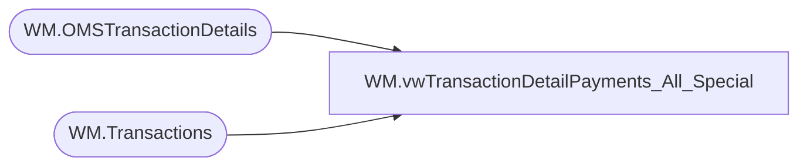

# WM.vwTransactionDetailPayments_All_Special

**Database:** WebOrderProcessing  
**Server:** bearcluster01  

## Architecture Diagram



## Table Dependencies

| Referenced Table |
|---|
| WM.OMSTransactionDetails |
| WM.Transactions |

## View Code

```sql
CREATE VIEW [WM].[vwTransactionDetailPayments_All_Special]
AS

  WITH TransactionDetail(OrderNumber
					,[TransactionAmount]
                    ,[PaymentType]
					,CardNumber
                    ,[TransactionDate])
  AS(SELECT t.TransactionNum
      ,SUM([TransactionAmount]) [TransactionAmount]
      ,[PaymentType]
      ,[PaymentGeneric2]
	  ,CAST([TransactionDate] AS DATE) [TransactionDate]
  FROM [WebOrderProcessing].[WM].[OMSTransactionDetails] td WITH(NOLOCK)
  LEFT JOIN [WebOrderProcessing].[WM].[Transactions] t WITH(NOLOCK) ON td.TransactionID = t.TransactionID
  WHERE TransactionNum NOT LIKE '7_______'
  AND PaymentTransactionType IN ('sales', 'return', 'credit') AND TransactionDate BETWEEN '2021-12-03 00:00:00' AND '2021-12-07 00:00:00'
  AND [PaymentGeneric2] IS NOT NULL
  GROUP BY t.TransactionNum, CAST([TransactionDate] AS DATE), [PaymentType], [PaymentGeneric2]
  )
  SELECT TOP 100 PERCENT *
  FROM TransactionDetail
  ORDER BY TransactionDate, OrderNumber
```

