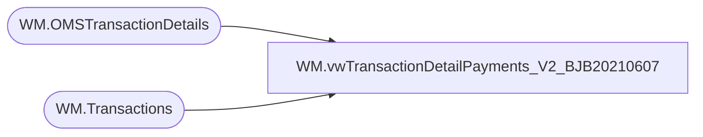

# WM.vwTransactionDetailPayments_V2_BJB20210607

**Database:** WebOrderProcessing  
**Server:** bearcluster01  

## Architecture Diagram



## Table Dependencies

| Referenced Table |
|---|
| WM.OMSTransactionDetails |
| WM.Transactions |

## View Code

```sql
CREATE VIEW [WM].[vwTransactionDetailPayments_V2_BJB20210607]
AS

  WITH TransactionDetail(TansactionDetailID
                    ,TransactionNum
     --               ,OrderNumber
					--,PickupStore
					--,SourceSite
                    ,[TransactionID]
					,[ShipmentNumber]
                    ,[OrderTransactionIdentifier]
                    ,[TransactionDate]
                    ,[SubTotal]
                    ,[Shipping]
                    ,[ProcessingFee]
                    ,[Tax]
                    ,[TotalCharges]
                    ,[PaymentTransactionType]
                    ,[PaymentType]
                    ,[TransactionAmount]
                    ,[OrderDiscount]
                    ,[ItemDiscount]
                    ,[InvoiceAmount]
                    ,[InvoiceBillTo]
                    ,[InvoiceNumber]
                    ,[InvoiceDate]
                    ,[Processor]
                    ,[CurrencyMultiplier]
                    ,[PaymentGeneric1]
                    ,[PaymentGeneric2]
                    ,[PaymentGeneric3]
                    ,[PaymentGeneric4]
                    ,[PaymentGeneric5]
                    ,[TransactionGeneric1]
                    ,[TransactionGeneric2]
                    ,[TransactionGeneric3]
                    ,[TransactionGeneric4]
                    ,[TransactionGeneric5]
	                ,[BillToFName]
                    ,[BillToLName]
                    ,[BillToAddress1]
                    ,[BillToAddress2]
                    ,[BillToCity]
                    ,[BillToState]
                    ,[BillToPostalCode]
                    ,[BillToCountry]
                    ,[BillToEmail]
                    ,[BillToPhone]
                    ,[ShipToFName]
                    ,[ShipToLName]
                    ,[ShipToAddress1]
                    ,[ShipToAddress2]
                    ,[ShipToCity]
                    ,[ShipToState]
                    ,[ShipToPostalCode]
                    ,[ShipToCountry]
                    ,[ShipToEmail]
                    ,[ShipToPhone]
	                ,[OrderCustom1]
                    ,[OrderCustom2]
                    ,[OrderCustom3]
                    ,[OrderCustom4]
                    ,[OrderCustom5]
	                ,[isSAProcessed])
  AS(SELECT TansactionDetailID
      ,t.TransactionNum
      --,t.TransactionNum AS 'OrderNumber'
	  --,v.OrderNumber
	  --,v.PickupStore
	  --,v.SourceSite
      ,td.[TransactionID]
	  ,ISNULL(td.[ShipmentNumber], 0) AS 'ShipmentNumber'
      ,td.[OrderTransactionIdentifier]
      ,[TransactionDate]
      --,[SubTotal]*[CurrencyMultiplier] AS 'SubTotal'
      --,[Shipping]*[CurrencyMultiplier] AS 'Shipping'
      --,[ProcessingFee]*[CurrencyMultiplier] AS 'ProcessingFee'
      --,[Tax]*[CurrencyMultiplier] AS 'Tax'
      --,[TotalCharges]*[CurrencyMultiplier] AS 'TotalCharges'
	  ,[SubTotal]
      ,[Shipping]
      ,[ProcessingFee]
      ,[Tax]
      ,[TotalCharges]
      ,[PaymentTransactionType] 
      ,[PaymentType]
      --,[TransactionAmount]*[CurrencyMultiplier] AS 'TransactionAmount'
      --,[OrderDiscount]*[CurrencyMultiplier] AS 'OrderDiscount'
      --,[ItemDiscount]*[CurrencyMultiplier] AS 'ItemDiscount'
      --,[InvoiceAmount]*[CurrencyMultiplier] AS 'InvoiceAmount'
	  ,[TransactionAmount]
      ,[OrderDiscount]
      ,[ItemDiscount]
      ,[InvoiceAmount]
      ,[InvoiceBillTo]
      ,[InvoiceNumber]
      ,[InvoiceDate]
      ,[Processor]
      ,[CurrencyMultiplier] AS 'CurrencyMultiplier'
      ,[PaymentGeneric1]
      ,[PaymentGeneric2]
      ,[PaymentGeneric3]
      ,[PaymentGeneric4]
      ,[PaymentGeneric5]
      ,[TransactionGeneric1]
      ,[TransactionGeneric2]
      ,[TransactionGeneric3]
      ,[TransactionGeneric4]
      ,[TransactionGeneric5]
	  ,[BillToFName]
      ,[BillToLName]
      ,[BillToAddress1]
      ,[BillToAddress2]
      ,[BillToCity]
      ,[BillToState]
      ,[BillToPostalCode]
      ,[BillToCountry]
      ,[BillToEmail]
      ,[BillToPhone]
      ,[ShipToFName]
      ,[ShipToLName]
      ,[ShipToAddress1]
      ,[ShipToAddress2]
      ,[ShipToCity]
      ,[ShipToState]
      ,[ShipToPostalCode]
      ,[ShipToCountry]
      ,[ShipToEmail]
      ,[ShipToPhone]
	  ,[OrderCustom1]
      ,[OrderCustom2]
      ,[OrderCustom3]
      ,[OrderCustom4]
      ,[OrderCustom5]
	  ,[isSAProcessed]
  FROM [WebOrderProcessing].[WM].[OMSTransactionDetails] td
  LEFT JOIN [WebOrderProcessing].[WM].[Transactions] t ON td.TransactionID = t.TransactionID
  --INNER JOIN [WebOrderProcessing].[WM].[vwOrderOrderTransactionIdentifier] v ON td.TransactionId = v.TransactionId AND td.OrderTransactionIdentifier = v.OrderTransactionIdentifier
  WHERE TransactionNum NOT LIKE '7_______'
  AND PaymentTransactionType IN ('sales', 'return', 'credit')
  AND isSAProcessed = 0 
  --AND td.TransactionID = 2621864
  --AND TransactionNum = 'U0104112'
  --AND TransactionDate BETWEEN '2018-02-01 00:00:00' AND '2018-02-02 00:00:00'
  --GROUP BY t.TransactionNum, td.[TransactionID], [OrderTransactionIdentifier], [TransactionDate]
  --    --, [PaymentTransactionType]
	 -- , [PaymentType], [InvoiceBillTo], [InvoiceNumber], [InvoiceDate], [Processor]
	 -- --, [CurrencyMultiplier]
	 -- --,[OmsTransactionType]
	 -- ,[PaymentGeneric1]
  --    ,[PaymentGeneric2], [PaymentGeneric3], [PaymentGeneric4], [PaymentGeneric5], [TransactionGeneric1], [TransactionGeneric2], [TransactionGeneric3], [TransactionGeneric4], [TransactionGeneric5]
	 -- ,[BillToFName], [BillToLName], [BillToAddress1], [BillToAddress2], [BillToCity], [BillToState], [BillToPostalCode], [BillToCountry], [BillToEmail], [BillToPhone], [ShipToFName], [ShipToLName]
  --    ,[ShipToAddress1], [ShipToAddress2], [ShipToCity], [ShipToState], [ShipToPostalCode], [ShipToCountry], [ShipToEmail], [ShipToPhone], [OrderCustom1], [OrderCustom2], [OrderCustom3]
  --    ,[OrderCustom4], [OrderCustom5], [isSAProcessed]
  --ORDER BY 1 DESC
  )
  SELECT TOP 100 PERCENT *
  --INTO #tmpC
  FROM TransactionDetail
  ORDER BY TransactionDate, TransactionNum
```

