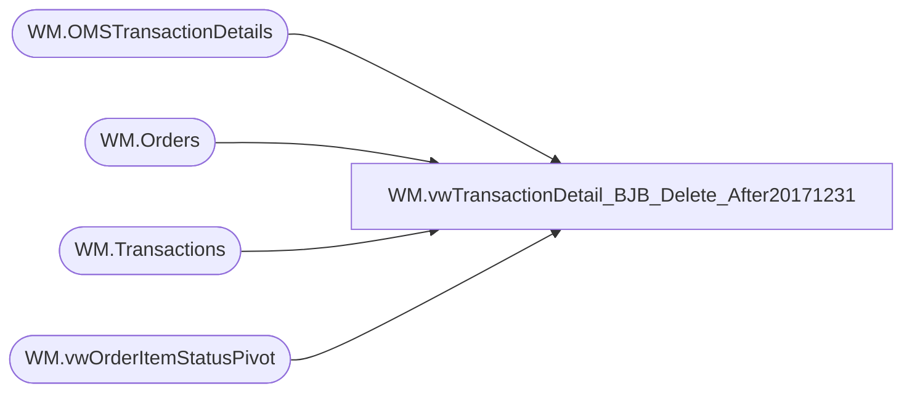

# WM.vwTransactionDetail_BJB_Delete_After20171231

**Database:** WebOrderProcessing  
**Server:** bearcluster01  

## Architecture Diagram



## Table Dependencies

| Referenced Table |
|---|
| WM.OMSTransactionDetails |
| WM.Orders |
| WM.Transactions |
| WM.vwOrderItemStatusPivot |

## View Code

```sql
CREATE VIEW [WM].[vwTransactionDetail_BJB_Delete_After20171231]
AS

  SELECT TOP (100) PERCENT t.TransactionNum
        ,t.TransactionNum + '_' + CAST([OrderTransactionIdentifier] AS VARCHAR) AS 'OrderNumber'
        ,td.TransactionID
        ,td.[ShipmentNumber]
        ,[OrderTransactionIdentifier]
        ,[TransactionDate]
        ,[SubTotal]
        ,[Shipping]
        ,[ProcessingFee]
        ,[Tax]
        ,[TotalCharges]
        ,[PaymentTransactionType]
        ,[PaymentType]
        ,[TransactionAmount]
        ,[OrderDiscount]
        ,[ItemDiscount]
        ,[InvoiceAmount]
        ,[InvoiceBillTo]
        ,[InvoiceNumber]
        ,[InvoiceDate]
        ,[Processor]
        ,[CurrencyMultiplier]
        ,[OmsTransactionType]
        ,[PaymentGeneric1]
        ,[PaymentGeneric2]
        ,[PaymentGeneric3]
        ,[PaymentGeneric4]
        ,[PaymentGeneric5]
        ,[TransactionGeneric1]
        ,[TransactionGeneric2]
        ,[TransactionGeneric3]
        ,[TransactionGeneric4]
        ,[TransactionGeneric5]
        ,SUM([hasIZGIFT]) AS 'hasIZGIFT'
        ,SUM([hasIWVP]) AS 'hasIWVP'
        ,SUM([hasPending]) AS 'hasPending'
        ,SUM([hasIN]) AS 'hasIN'
        ,SUM([hasIV]) AS 'hasIV'
        ,SUM([hasIZE]) AS 'hasIZE'
        ,SUM([hasShipped]) AS 'hasShipped'
        ,SUM([hasWaved]) AS 'hasWaved'
        ,SUM([hasIR]) AS 'hasIR'
        ,SUM([hasISRP]) AS 'hasISRP'
        ,SUM([hasIZDT]) AS 'hasIZDT'
		,SUM([hasSAComplete]) AS 'hasSAComplete'
        ,SUM([hasRYVTransferred]) AS 'hasRYVTransferred'
  FROM [WebOrderProcessing].[WM].[vwOrderItemStatusPivot] p
  LEFT JOIN [WebOrderProcessing].[WM].[Orders] o ON p.OrderId = o.OrderId
  LEFT JOIN [WebOrderProcessing].[WM].[OMSTransactionDetails] td ON o.TransactionID = td.TransactionID
  LEFT JOIN [WebOrderProcessing].[WM].[Transactions] t ON td.TransactionID = t.TransactionID
  WHERE (hasShipped = 1 OR hasIR = 1) 
		AND td.TransactionID IS NOT NULL 
		AND t.TransactionNum NOT IN ('00006609', '00005754')
		AND hasIZDT = 0 --Exclude Donations for now
  --WHERE (hasShipped = 1 OR hasIR = 1 or hasIZDT = 1) AND td.TransactionID IS NOT NULL
  GROUP BY t.TransactionNum
        ,td.TransactionID
        ,td.[ShipmentNumber]
        ,[OrderTransactionIdentifier]
        ,[TransactionDate]
        ,[SubTotal]
        ,[Shipping]
        ,[ProcessingFee]
        ,[Tax]
        ,[TotalCharges]
        ,[PaymentTransactionType]
        ,[PaymentType]
        ,[TransactionAmount]
        ,[OrderDiscount]
        ,[ItemDiscount]
        ,[InvoiceAmount]
        ,[InvoiceBillTo]
        ,[InvoiceNumber]
        ,[InvoiceDate]
        ,[Processor]
        ,[CurrencyMultiplier]
        ,[OmsTransactionType]
        ,[PaymentGeneric1]
        ,[PaymentGeneric2]
        ,[PaymentGeneric3]
        ,[PaymentGeneric4]
        ,[PaymentGeneric5]
        ,[TransactionGeneric1]
        ,[TransactionGeneric2]
        ,[TransactionGeneric3]
        ,[TransactionGeneric4]
        ,[TransactionGeneric5]
		ORDER BY TransactionDate
```

