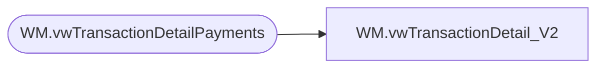

# WM.vwTransactionDetail_V2

**Database:** WebOrderProcessing  
**Server:** bearcluster01  

## Architecture Diagram



## Table Dependencies

| Referenced Table |
|---|
| WM.vwTransactionDetailPayments |

## View Code

```sql
CREATE VIEW [WM].[vwTransactionDetail_V2]
AS

  SELECT MAX([TansactionDetailID]) AS 'TansactionDetailID'
      ,[TransactionNum]
      ,[OrderNumber]
      ,[TransactionID]
      ,MAX([TransactionDate]) AS 'TransactionDate'
      ,MAX([SubTotal]) AS 'SubTotal'
      ,MAX([Shipping]) AS 'Shipping'
      ,MAX([ProcessingFee]) AS 'ProcessingFee'
      ,Max([Tax]) AS 'Tax'
      ,MAX([TotalCharges]) AS 'TotalCharges'
      ,[PaymentTransactionType]
      ,SUM([TransactionAmount]) AS 'TransactionAmount'
      ,MAX([OrderDiscount]) AS 'OrderDiscount'
      ,MAX([ItemDiscount]) AS 'ItemDiscount'
      ,MAX([InvoiceAmount]) AS 'InvoiceAmount'
      ,[InvoiceBillTo]
      ,[InvoiceNumber]
      ,[InvoiceDate]
      ,[CurrencyMultiplier]
      ,[BillToFName]
      ,[BillToLName]
      ,[BillToAddress1]
      ,[BillToAddress2]
      ,[BillToCity]
      ,[BillToState]
      ,[BillToPostalCode]
      ,[BillToCountry]
      ,[BillToEmail]
      ,[BillToPhone]
      ,[ShipToFName]
      ,[ShipToLName]
      ,[ShipToAddress1]
      ,[ShipToAddress2]
      ,[ShipToCity]
      ,[ShipToState]
      ,[ShipToPostalCode]
      ,[ShipToCountry]
      ,[ShipToEmail]
      ,[ShipToPhone]
      ,[OrderCustom1]
      ,[OrderCustom2]
      ,[OrderCustom3]
      ,[OrderCustom4]
      ,[OrderCustom5]
      ,[isSAProcessed]
      ,[OrderItemCount]
  FROM [WebOrderProcessing].[WM].[vwTransactionDetailPayments]
  GROUP BY [TransactionNum]
      ,[OrderNumber]
      ,[TransactionID]
      --,[SubTotal]
      --,[Shipping]
      --,[ProcessingFee]
      --,[Tax]
      --,[TotalCharges]
      ,[PaymentTransactionType]
      --,[OrderDiscount]
      --,[ItemDiscount]
      --,[InvoiceAmount]
      ,[InvoiceBillTo]
      ,[InvoiceNumber]
      ,[InvoiceDate]
      ,[CurrencyMultiplier]
      ,[BillToFName]
      ,[BillToLName]
      ,[BillToAddress1]
      ,[BillToAddress2]
      ,[BillToCity]
      ,[BillToState]
      ,[BillToPostalCode]
      ,[BillToCountry]
      ,[BillToEmail]
      ,[BillToPhone]
      ,[ShipToFName]
      ,[ShipToLName]
      ,[ShipToAddress1]
      ,[ShipToAddress2]
      ,[ShipToCity]
      ,[ShipToState]
      ,[ShipToPostalCode]
      ,[ShipToCountry]
      ,[ShipToEmail]
      ,[ShipToPhone]
      ,[OrderCustom1]
      ,[OrderCustom2]
      ,[OrderCustom3]
      ,[OrderCustom4]
      ,[OrderCustom5]
      ,[isSAProcessed]
      ,[OrderItemCount]
```

