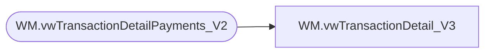

# WM.vwTransactionDetail_V3

**Database:** WebOrderProcessing  
**Server:** bearcluster01  

## Architecture Diagram



## Table Dependencies

| Referenced Table |
|---|
| WM.vwTransactionDetailPayments_V2 |

## View Code

```sql
CREATE VIEW [WM].[vwTransactionDetail_V3]
AS

  SELECT MAX([TansactionDetailID]) AS 'TansactionDetailID'
      --,[TransactionNum]
      ,MAX(OrderNumber) AS 'OrderNumber'
	  ,[PickupStore]
	  ,MAX([SourceSite]) AS 'SourceSite'
      ,[TransactionID]
	  --,[OrderTransactionIdentifier]
      ,MAX([TransactionDate]) AS 'TransactionDate'
      ,MAX([SubTotal]) AS 'SubTotal'
      ,MAX([Shipping]) AS 'Shipping'
      ,MAX([ProcessingFee]) AS 'ProcessingFee'
      ,Max([Tax]) AS 'Tax'
      ,MAX([TotalCharges]) AS 'TotalCharges'
      ,MAX([PaymentTransactionType]) AS 'PaymentTransactionType'
      ,SUM([TransactionAmount]) AS 'TransactionAmount'
      ,MAX([OrderDiscount]) AS 'OrderDiscount'
      ,MAX([ItemDiscount]) AS 'ItemDiscount'
      ,MAX([InvoiceAmount]) AS 'InvoiceAmount'
      ,MAX([InvoiceBillTo]) AS 'InvoiceBillTo'
      ,MAX([InvoiceNumber]) AS 'InvoiceNumber'
      ,MAX([InvoiceDate]) AS 'InvoiceDate'
      ,MAX([CurrencyMultiplier]) AS 'CurrencyMultiplier'
      ,MAX([BillToFName]) AS 'BillToFName'
      ,MAX([BillToLName]) AS 'BillToLName'
      ,MAX([BillToAddress1]) AS 'BillToAddress1'
      ,MAX([BillToAddress2]) AS 'BillToAddress2'
      ,MAX([BillToCity]) AS 'BillToCity'
      ,MAX([BillToState]) AS 'BillToState'
      ,MAX([BillToPostalCode]) AS 'BillToPostalCode'
      ,MAX([BillToCountry]) AS 'BillToCountry'
      ,MAX([BillToEmail]) AS 'BillToEmail'
      ,MAX([BillToPhone]) AS 'BillToPhone'
      ,MAX([ShipToFName]) AS 'ShipToFName'
      ,MAX([ShipToLName]) AS 'ShipToLName'
      ,MAX([ShipToAddress1]) AS 'ShipToAddress1'
      ,MAX([ShipToAddress2]) AS 'ShipToAddress2'
      ,MAX([ShipToCity]) AS 'ShipToCity'
      ,MAX([ShipToState]) AS 'ShipToState'
      ,MAX([ShipToPostalCode]) AS 'ShipToPostalCode'
      ,MAX([ShipToCountry]) AS 'ShipToCountry'
      ,MAX([ShipToEmail]) AS 'ShipToEmail'
      ,MAX([ShipToPhone]) AS 'ShipToPhone'
      ,MAX([OrderCustom1]) AS 'OrderCustom1'
      ,MAX([OrderCustom2]) AS 'OrderCustom2'
      ,MAX([OrderCustom3]) AS 'OrderCustom3'
      ,MAX([OrderCustom4]) AS 'OrderCustom4'
      ,MAX([OrderCustom5]) AS 'OrderCustom5'
      ,[isSAProcessed]
      --,[OrderItemCount]
  FROM [WebOrderProcessing].[WM].[vwTransactionDetailPayments_V2]
  GROUP BY TransactionID, PickupStore, isSAProcessed
  --GROUP BY [TransactionNum]
  --    ,[OrderNumber]
  --    ,[TransactionID]
	 -- ,[OrderTransactionIdentifier]
  --    --,[SubTotal]
  --    --,[Shipping]
  --    --,[ProcessingFee]
  --    --,[Tax]
  --    --,[TotalCharges]
  --    ,[PaymentTransactionType]
  --    --,[OrderDiscount]
  --    --,[ItemDiscount]
  --    --,[InvoiceAmount]
  --    ,[InvoiceBillTo]
  --    ,[InvoiceNumber]
  --    ,[InvoiceDate]
  --    ,[CurrencyMultiplier]
  --    ,[BillToFName]
  --    ,[BillToLName]
  --    ,[BillToAddress1]
  --    ,[BillToAddress2]
  --    ,[BillToCity]
  --    ,[BillToState]
  --    ,[BillToPostalCode]
  --    ,[BillToCountry]
  --    ,[BillToEmail]
  --    ,[BillToPhone]
  --    ,[ShipToFName]
  --    ,[ShipToLName]
  --    ,[ShipToAddress1]
  --    ,[ShipToAddress2]
  --    ,[ShipToCity]
  --    ,[ShipToState]
  --    ,[ShipToPostalCode]
  --    ,[ShipToCountry]
  --    ,[ShipToEmail]
  --    ,[ShipToPhone]
  --    ,[OrderCustom1]
  --    ,[OrderCustom2]
  --    ,[OrderCustom3]
  --    ,[OrderCustom4]
  --    ,[OrderCustom5]
  --    ,[isSAProcessed]
  --    --,[OrderItemCount]
```

