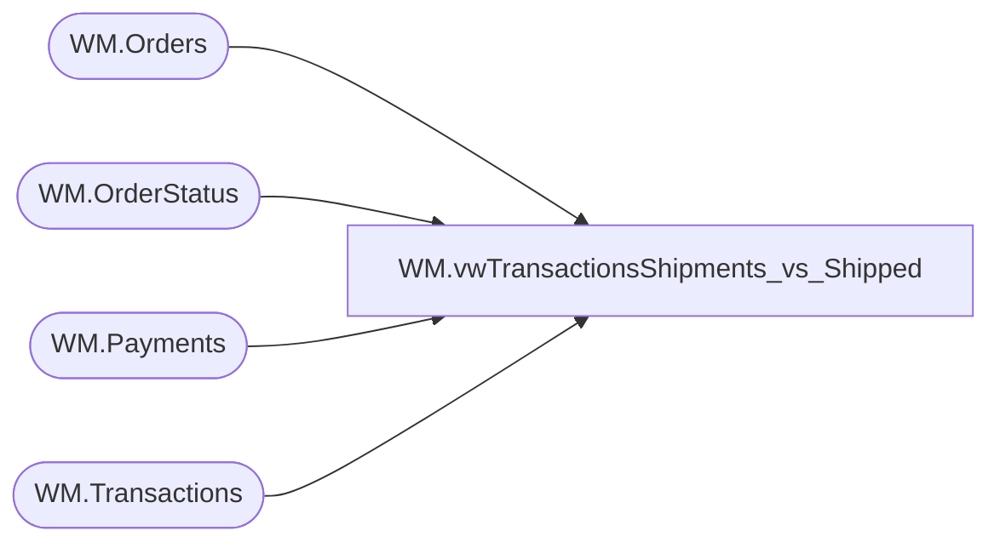

# WM.vwTransactionsShipments_vs_Shipped

**Database:** WebOrderProcessing  
**Server:** bearcluster01  

## Architecture Diagram



## Table Dependencies

| Referenced Table |
|---|
| WM.Orders |
| WM.OrderStatus |
| WM.Payments |
| WM.Transactions |

## View Code

```sql
CREATE VIEW [WM].[vwTransactionsShipments_vs_Shipped]
AS
SELECT t.[TransactionID]
      ,[TransactionNum]
      ,COUNT(o.TransactionID) AS 'ShipmentsCount'
	  ,innerQry.ShippedCount
  FROM [WebOrderProcessing].[WM].[Transactions] t
  LEFT JOIN [WebOrderProcessing].[WM].[Orders] o ON t.TransactionID = o.TransactionID
  LEFT JOIN (SELECT o.TransactionID
                   ,COUNT(o.TransactionID) AS 'ShippedCount'
             FROM [WebOrderProcessing].[WM].[Orders] o
             LEFT JOIN [WebOrderProcessing].[WM].OrderStatus os ON o.OrderId = os.OrderId  AND os.CurrentStatus = 1
	         LEFT JOIN [WebOrderProcessing].[WM].Payments p ON o.TransactionID = p.TransactionID
             WHERE os.[Status] = 'Shipped' AND CardType IS NOT NULL
	         GROUP BY o.TransactionID) AS innerQry ON t.TransactionID = innerQry.TransactionID
  GROUP BY o.TransactionID, t.TransactionID, [TransactionNum], [ClientID], [TransactionDateTime], [TaxAmount], [TaxJurisdiction], [TaxAuthority], [TaxType], ShippedCount
```

