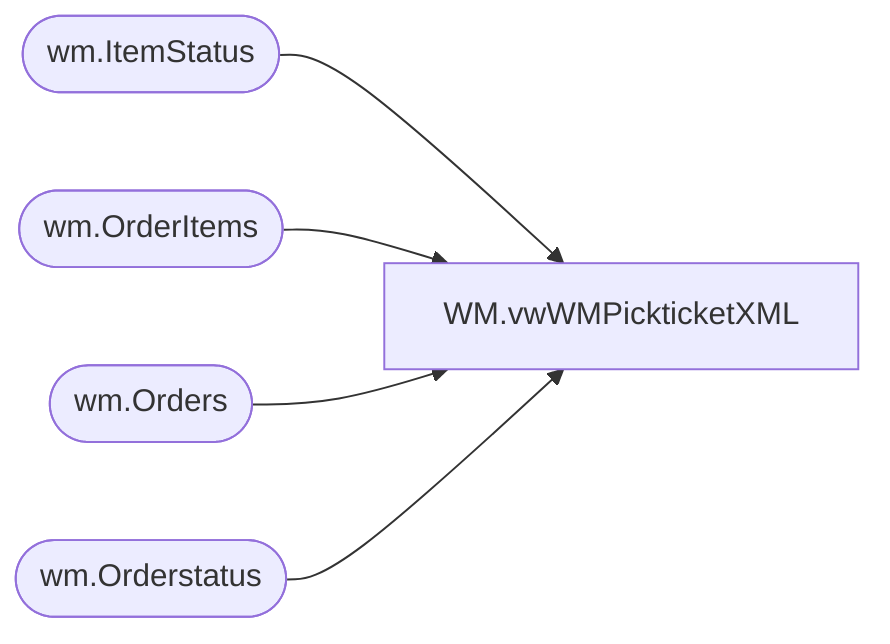

# WM.vwWMPickticketXML

**Database:** WebOrderProcessing  
**Server:** bearcluster01  

## Architecture Diagram



## Table Dependencies

| Referenced Table |
|---|
| wm.ItemStatus |
| wm.OrderItems |
| wm.Orders |
| wm.Orderstatus |

## View Code

```sql
-------------------------------------------------------------------------------------------------
---vwWMPickticketXML - Outputs pickticket xml for WM
----Dan Tweedie 20171006 - Updated view to enforce STND shipvia and 3 character shiptoSTate
--		DanT - 2017-11-20	- Altered view to force ship-via to be FCL if it is SMP and OrderType = GO
-------------------------------------------------------------------------------------------------


	


CREATE VIEW [WM].[vwWMPickticketXML]
AS

with  ordersWithCancels as (select distinct o.TransactionID from wm.Orders O  inner join 
                                           wm.Orderstatus s on o.Orderid = s.OrderID and s.currentstatus = 1
								  inner join wm.ItemStatus S2 on O.orderid = s2.OrderID and s2.currentstatus = 1	
								  	   where s2.status = 'IV' and s.status = 'Complete' and Isnull(pickticketflag,0) = 0
									   and sourcesite = 'BABW-US'),

XMLStage (XML) as
	(SELECT        (SELECT        '001' AS Company, '001' AS Division, OrderNum AS PktCtlNbr, '980' AS Warehouse, 
							--case 
							--	when left(OrderNum,1) = '1' 
							--		then 'RU'
							--	else OrderType 
							--end AS OrderType,
							OrderType,
                                                        (SELECT        left((ISNULL(ShipToFName,'') + ' ' + ISNULL(ShipToLName,'')),35) AS ShipToName, ShipToAddress1 AS ShipToAddr1, ShipToAddress2 AS ShipToAddr2, ShipToCity, 
														case 
															when len(ShipToState) > 3 OR ShipToState is NULL
																then 'xx'
																else ShipToState
															end as ShipToState,
														ShipToPostalCode ShipToZip, 
                                                                                    ShipToCountry, left((BillToFName + ' ' + BillToLName),35) AS SoldToName, BillToAddress1 AS SoldToAddr1, BillToAddress2 AS SoldToAddr2, BillToCity SoldToCity, 
															case when len(BillToState) > 3
																	then NULL
																else BillToState
															end as SoldToState,
                                                                                    BillToPostalCode SoldToZip, 
																					--left(BillTophone,15) TelephoneNumber,  
																					left(replace(replace(SUBSTRING(BillTophone, PATINDEX('%[0-9]%', BillTophone), LEN(BillTophone)), ' ', ''),'-',''), 15) TelephoneNumber, 
																					BillToCountry SoldToCountry, 
															--case when ShippingMethod in ('International')
															--	then 'STND'
															--	else ShippingMethod
															--end	AS ShipVia, 
															case when ShippingMethod in ('International')
																then 'STND'
																else 
																	case when OrderType = 'GO' and ShippingMethod = 'SMP'
																			then 'FCL'
																	else ShippingMethod
																end
															end	AS ShipVia, 
																					GetDate() AS ShipDateTime, 51 AS PrintCode, 10 AS StatusCode,
                                                                                     0 AS CollectFreight
                                                          FROM            wm.Orders
                                                          WHERE        orderID = o1.OrderID FOR xml path(''), type) AS PickticketHeaderFields,
                                                        (SELECT        Row_Number() OVER (Partition BY OrderID
                                                          ORDER BY orderID, OrderItemID) - 1 AS PktLineNbr,
                                                        (SELECT        sku AS Style
                                                          FROM            wm.OrderItems 
                                                          WHERE        orderItemID = OI1.OrderItemID and OrderID = OI1.OrderID FOR xml Path('SKUDefinition'), type) AS SKU,
                                                        (SELECT        'F' AS InventoryType, '*' AS CountryOfOrigin FOR xml path(''), type) AS SubSKUFields,
                                                        (SELECT        QTY AS OrigPktQty, 'WEB' AS CartonType, 'XXL' AS CartonSize, 'WEB' AS InventoryAllocationType, 1 AS WaveProcessingType
                                                          FROM            wm.OrderItems
                                                          WHERE        orderItemID = OI1.OrderItemID  FOR xml path(''), type) AS PickticketDetailFields
                          FROM            wm.OrderItems OI1
                          WHERE        OrderID = O1.OrderID and Len(sku) < 8 FOR xml Path('PickticketDetail'), type) AS ListOfPickticketDetails
FROM            wm.orders O1  inner join wm.Orderstatus s on O1.OrderID = s.OrderID and currentstatus = 1 
                              left join Orderswithcancels oc on o1.TransactionID = oc.TransactionID
where ISNULL(PickTicketFlag,0) = 0 and SourceSite = 'BABW-US'  and Status = 'Pending'  and 
      charindex('_',orderNum,1) > 0 and OC.TransactionID is null
FOR xml path('Pickticket'), root('PickticketBridge')) AS COL1)
select 
	Cast(XML as xml) as XMLData
	--[XML] as XMLData
from XMLStage


----DANT BACKED UP 20171006
--with XMLStage (XML) as
--	(SELECT        (SELECT        '001' AS Company, '001' AS Division, OrderNum AS PktCtlNbr, '980' AS Warehouse, OrderType AS OrderType,
--                                                        (SELECT        ShipToFName + ' ' + ShipToLName AS ShipToName, ShipToAddress1 AS ShipToAddr1, ShipToAddress2 AS ShipToAddr2, ShipToCity, ShipToState, ShipToPostalCode ShipToZip, 
--                                                                                    ShipToCountry, BillToFName + ' ' + BillToLName AS SoldToName, BillToAddress1 AS SoldToAddr1, BillToAddress2 AS SoldToAddr2, BillToCity SoldToCity, BillToState SoldToState, 
--                                                                                    BillToPostalCode SoldToZip, BillTophone TelephoneNumber, BillToCountry SoldToCountry, ShippingMethod AS ShipVia, GetDate() AS ShipDateTime, 51 AS PrintCode, 10 AS StatusCode,
--                                                                                     0 AS CollectFreight
--                                                          FROM            wm.Orders
--                                                          WHERE        orderID = o1.OrderID FOR xml path(''), type) AS PickticketHeaderFields,
--                                                        (SELECT        Row_Number() OVER (Partition BY OrderID
--                                                          ORDER BY orderID, OrderItemID) - 1 AS PktLineNbr,
--                                                        (SELECT        sku AS Style
--                                                          FROM            wm.OrderItems 
--                                                          WHERE        orderItemID = OI1.OrderItemID and OrderID = OI1.OrderID FOR xml Path('SKUDefinition'), type) AS SKU,
--                                                        (SELECT        'F' AS InventoryType, '*' AS CountryOfOrigin FOR xml path(''), type) AS SubSKUFields,
--                                                        (SELECT        QTY AS OrigPktQty, 'WEB' AS CartonType, 'XXL' AS CartonSize, 'WEB' AS InventoryAllocationType, 1 AS WaveProcessingType
--                                                          FROM            wm.OrderItems
--                                                          WHERE        orderItemID = OI1.OrderItemID  FOR xml path(''), type) AS PickticketDetailFields
--                          FROM            wm.OrderItems OI1
--                          WHERE        OrderID = O1.OrderID and Len(sku) < 8 FOR xml Path('PickticketDetail'), type) AS ListOfPickticketDetails
--FROM            wm.orders O1  inner join wm.Orderstatus s on O1.OrderID = s.OrderID and currentstatus = 1 
--where ISNULL(PickTicketFlag,0) = 0 and SourceSite = 'BABW-US'  and OrderStatus = 'Pending'  and charindex('_',orderNum,1) > 0
--FOR xml path('Pickticket'), root('PickticketBridge')) AS COL1)
--select 
--	Cast(XML as xml) as XMLData
--	--[XML] as XMLData
--from XMLStage
```

