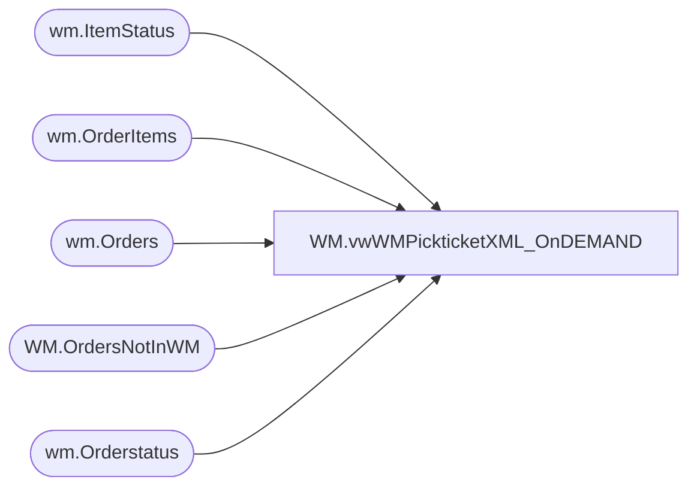

# WM.vwWMPickticketXML_OnDEMAND

**Database:** WebOrderProcessing  
**Server:** bearcluster01  

## Architecture Diagram



## Table Dependencies

| Referenced Table |
|---|
| wm.ItemStatus |
| wm.OrderItems |
| wm.Orders |
| WM.OrdersNotInWM |
| wm.Orderstatus |

## View Code

```sql
-------------------------------------------------------------------------------------------------
---[vwWMPickticketXML_OnDEMAND] - Outputs pickticket xml for WM
----Dan Tweedie 20171006 - Updated view to enforce STND shipvia and 3 character shiptoSTate
-------------------------------------------------------------------------------------------------


CREATE VIEW [WM].[vwWMPickticketXML_OnDEMAND]
AS

with 
ordersWithCancels as
	(
		select 
			distinct o.TransactionID 
		from wm.Orders O  
		inner join wm.Orderstatus s on o.Orderid = s.OrderID and s.currentstatus = 1
		inner join wm.ItemStatus S2 on O.orderid = s2.OrderID and s2.currentstatus = 1      
		where s2.status = 'IV' and s.status = 'Complete' and Isnull(pickticketflag,0) = 0
		and sourcesite = 'BABW-US'
	),
Orders as
	(
		select 
			OrderNum
		from 
			wm.Orders with (nolock)
		where 
			OrderNum in 
				(--single quoted commas separated list of order numbers--
				
					select OrderNumber from WM.OrdersNotInWM ---table is loaded from ssis validation 
				)
			and OrderID in (select OrderID from wm.OrderItems where len(sku) = 6)
			and OrderID not in 
				(
					select o.OrderID
					from wm.Orders o
					join wm.OrderStatus os 
						on o.OrderID = os.OrderID 
						and os.CurrentStatus = 1
					group by o.OrderID 
					having count(*) > 1
				) 
			and TransactionID not in (select TransactionID from ordersWithCancels)
	),
XMLStage (XML) as
	(SELECT        (SELECT        '001' AS Company, '001' AS Division, OrderNum AS PktCtlNbr, '980' AS Warehouse,  
							OrderType,
                                                        (SELECT        left(ISNULL(ShipToFName,'') + ' ' + ISNULL(ShipToLName,''),35) AS ShipToName, ShipToAddress1 AS ShipToAddr1, ShipToAddress2 AS ShipToAddr2, ShipToCity, 
														case 
															when len(ShipToState) > 3 OR ShipToState is NULL
																then 'xx'
																else ShipToState
															end as ShipToState,
																												
														ShipToPostalCode ShipToZip, 
                                                                                    ShipToCountry, left((BillToFName + ' ' + BillToLName),35) AS SoldToName, BillToAddress1 AS SoldToAddr1, BillToAddress2 AS SoldToAddr2, BillToCity SoldToCity, 
															case when len(BillToState) > 3
																	then NULL
																else BillToState
															end as SoldToState,
                                                                                    BillToPostalCode SoldToZip, 
																					--left(BillTophone,15) TelephoneNumber, 
																					left(replace(replace(SUBSTRING(BillTophone, PATINDEX('%[0-9]%', BillTophone), LEN(BillTophone)), ' ', ''),'-',''), 15) TelephoneNumber, 
																					BillToCountry SoldToCountry, 
															case when ShippingMethod in ('International')
																then 'STND'
																else 
																	case when OrderType = 'GO' and ShippingMethod = 'SMP'
																			then 'FCL'
																	else ShippingMethod
																end
															end	AS ShipVia, 
																					GetDate() AS ShipDateTime, 51 AS PrintCode, 10 AS StatusCode,
                                                                                     0 AS CollectFreight
                                                          FROM            wm.Orders with (nolock)
                                                          WHERE        orderID = o1.OrderID FOR xml path(''), type) AS PickticketHeaderFields,
                                                        (SELECT        Row_Number() OVER (Partition BY OrderID
                                                          ORDER BY orderID, OrderItemID) - 1 AS PktLineNbr,
                                                        (SELECT        sku AS Style
                                                          FROM            wm.OrderItems with (nolock)
                                                          WHERE        orderItemID = OI1.OrderItemID and OrderID = OI1.OrderID FOR xml Path('SKUDefinition'), type) AS SKU,
                                                        (SELECT        'F' AS InventoryType, '*' AS CountryOfOrigin FOR xml path(''), type) AS SubSKUFields,
                                                        (SELECT        QTY AS OrigPktQty, 'WEB' AS CartonType, 'XXL' AS CartonSize, 'WEB' AS InventoryAllocationType, 1 AS WaveProcessingType
                                                          FROM            wm.OrderItems with (nolock)
                                                          WHERE        orderItemID = OI1.OrderItemID  FOR xml path(''), type) AS PickticketDetailFields
                          FROM            wm.OrderItems OI1 with (nolock)
                          WHERE        OrderID = O1.OrderID and Len(sku) < 8 FOR xml Path('PickticketDetail'), type) AS ListOfPickticketDetails
FROM            wm.orders O1  with (nolock) 
inner join wm.Orderstatus s with (nolock) on O1.OrderID = s.OrderID and currentstatus = 1 
where OrderNum in (select OrderNum from Orders)
FOR xml path('Pickticket'), root('PickticketBridge')) AS COL1)
select 
	Cast(XML as xml) as XMLData
from XMLStage
```

