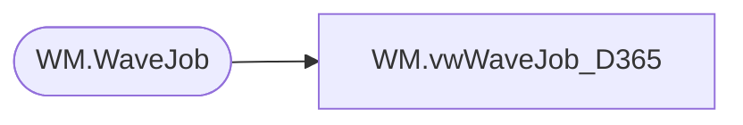

# WM.vwWaveJob_D365

**Database:** WebOrderProcessing  
**Server:** bearcluster01  

## Architecture Diagram



## Table Dependencies

| Referenced Table |
|---|
| WM.WaveJob |

## View Code

```sql
CREATE VIEW [WM].[vwWaveJob_D365]
AS
SELECT        WaveID
             ,'WAV' + RIGHT('000000000' + WaveNum, 9) AS WaveNum
FROM WM.WaveJob
WM,vwWebOrdersWithoutShipmentOrders,create view WM.vwWebOrdersWithoutShipmentOrders

as

with 
OrdersWithShipments as
	(
		select OrderNum 
		from wm.Orders with (nolock) 
		where substring(OrderNum , 9,1) = '_' 
	),
OrdersWithoutShipments as
	(
		select o.OrderNum
		from wm.Orders o with (nolock)
		left join OrdersWithShipments os on o.OrderNum = os.OrderNum
		where substring(o.OrderNum , 9,1) <> '_'
		and os.OrderNum is null 
	)
select *
from OrdersWithoutShipments
```

