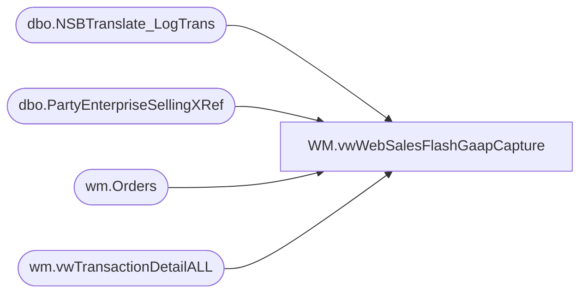

# WM.vwWebSalesFlashGaapCapture

**Database:** WebOrderProcessing  
**Server:** bearcluster01  

## Architecture Diagram



## Table Dependencies

| Referenced Table |
|---|
| dbo.NSBTranslate_LogTrans |
| dbo.PartyEnterpriseSellingXRef |
| wm.Orders |
| wm.vwTransactionDetailALL |

## View Code

```sql
CREATE view [WM].[vwWebSalesFlashGaapCapture] 
as

------------------------------------------------------------------------------------------------------------------------------------------------------------------------------------
--	Dan TWeedie	2018-12-21	Used for Accounting, data is pumped into papamart.dwstaging.Accounting.Sales_GAAP_RawFromStoreServer_Staging to compare against Sales Audt
------------------------------------------------------------------------------------------------------------------------------------------------------------------------------------


with 
SettledOrders as 
	(
		select 
			sOrderNumber OrderNumber
		from BABWeCommerce.dbo.NSBTranslate_LogTrans with (nolock)
		where 1=1 
		and datediff(dd, dTimeStamp, getdate()) <= 120
		group by sOrderNumber
	),
SourceSite as
	(
		select 
			o.TransactionID,
			case when right(o.SourceSite,2) = 'US' then '0013' else '2013' end as LocationCode,
			case when right(o.SourceSite,2) = 'US' then 'US Web' else 'UK Web' end as LocationName,
			case when right(o.SourceSite,2) = 'US' then 13 else 2013 end as StoreNumber
		from wm.Orders o with (nolock)
		where 1=1
		and exists (select so.OrderNumber from SettledOrders so where left(so.OrderNumber,8) = left(o.OrderNum,8))
		group by 
			o.TransactionID, 
			o.SourceSite,
			cast(left(o.EnterpriseSellingID, 19) as varchar(19))
	),
RefNums as
	(
		select 
			o.TransactionID, 
			cast(left(o.EnterpriseSellingID, 19) as varchar(19)) as ESReferenceNo
		from wm.Orders o with(nolock) 
		where 1=1
		and datediff(dd, o.OrderDate, getdate()) <= 120
		and o.EnterpriseSellingID is not NULL
		group by 
			o.TransactionID, 
			cast(left(o.EnterpriseSellingID, 19) as varchar(19))
	),
PartyExclude as
	(
		select rf.TransactionID
		from babwpartyPlanner.dbo.PartyEnterpriseSellingXRef p with (nolock)
		join RefNums rf on left(p.EnterpriseSellingID,19) = rf.ESReferenceNo
	),
SettledSales as
	(
		select 
			vw.TransactionID,
			vw.WMOrderNumber,
			vw.TransactionDate,
			sum(vw.TotalCharges*vw.CurrencyMultiplier) TotalCharges
		from wm.vwTransactionDetailALL vw
		where 1=1
		and substring(vw.WMOrderNumber, 9,1) = '_'
		and vw.isSAProcessed = 1
		and vw.BillToEmail <> 'guest.services@buildabear.com'
		and exists (select so.OrderNumber from SettledOrders so where left(so.OrderNumber,8) = left(vw.WMOrderNumber,8)) 
		group by 
			vw.TransactionID,
			vw.WMOrderNumber,
			vw.TransactionDate
	)
select 
	ss.LocationCode,
	ss.LocationName,
	ss.TransactionID as RetailTransactionID,
	ss.StoreNumber,
	52 as WorkstationNumber,
	ss.TransactionID as RetailTransactionNumber,
	52 as OperatorNumber,
	'Sale' as RetailTransactionTypeCode,
	NULL as ItemNumber,
	NULL as VoidFlag,
	sss.TransactionDate as TransactionDateTime,
	sss.TotalCharges as NetSales,
	sss.TransactionDate as EntryDate,
	'Web Cart' as Source,
	cast(sss.WMOrderNumber as varchar(50)) as WebOrderNumber,
	cast(sss.TransactionDate as date) as TransDate
from SourceSite ss
join SettledSales sss on ss.TransactionID=sss.TransactionID
where not exists (select pe.TransactionID from PartyExclude pe where pe.TransactionID = ss.TransactionID)
```

