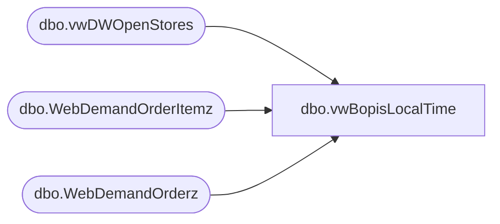

# dbo.vwBopisLocalTime

**Database:** WebOrderProcessing  
**Server:** bearcluster01  

## Architecture Diagram



## Table Dependencies

| Referenced Table |
|---|
| dbo.vwDWOpenStores |
| dbo.WebDemandOrderItemz |
| dbo.WebDemandOrderz |

## View Code

```sql
CREATE view [dbo].[vwBopisLocalTime]

as

-- 2024-12-03 Replaced all instances of o.LastUpdateDateUTC with oi.ShippedDateUTC as Deck Charges Customer at Shipping Event
select 
	o.OrderNumber, 
	oi.ShippedDateUTC,
	dateadd(hh, s.GMT_Offset, oi.ShippedDateUTC) LastUpdateDateLocal, 
	concat(left(convert(varchar, oi.ShippedDateUTC, 108), 3)
				, case when right(convert(varchar, oi.ShippedDateUTC, 108), 2) < 30 
					then '00' else '30' end
			) as UTCTimeSlot,
	concat(left(convert(varchar, dateadd(hh, s.GMT_Offset, oi.ShippedDateUTC), 108), 3)
				, case when right(convert(varchar, dateadd(hh, s.GMT_Offset, oi.ShippedDateUTC), 108), 2) < 30 
					then '00' else '30' end
			) as LocalTimeSlot,
	case when cast(oi.WarehouseCode as int) < 2000 then 1000 + cast(oi.WarehouseCode as int) else cast(oi.WarehouseCode as int) end as StoreCode,
	oi.DeliveryType
from WebDemandOrderz o 
join WebDemandOrderItemz oi on o.OrderNumber=oi.OrderNumber   
join kodiak.BABWMstrData.dbo.vwDWOpenStores s 
	on cast(oi.WarehouseCode as int)=s.StoreID
	and s.StoreID not in (13,2013)
where oi.ItemStatus in 
	(
		'Store Shipped',
		--'Gift Card Devalued',
		'Return',
		--'Pending Sound',
		--'Cancel Pickup',
		'Shipped',
		'Picked Up',
		--'Gift Card Processed',
		--'Donation Processed',
		'Delivered'
		--'Cancel Pickup - No Credit',
		--'Resend e-Gift Card Email',
		--'Cancel Record Your Voice',
		--'Cancelled',
	)
group by 
	o.OrderNumber, 
	oi.ShippedDateUTC,
	 dateadd(hh, s.GMT_Offset, oi.ShippedDateUTC),
	 concat(left(convert(varchar, oi.ShippedDateUTC, 108), 3)
				, case when right(convert(varchar, oi.ShippedDateUTC, 108), 2) < 30 
					then '00' else '30' end
			) ,
	 concat(left(convert(varchar, dateadd(hh, s.GMT_Offset, oi.ShippedDateUTC), 108), 3)
				, case when right(convert(varchar, dateadd(hh, s.GMT_Offset, oi.ShippedDateUTC), 108), 2) < 30 
					then '00' else '30' end
			),
	cast(oi.WarehouseCode as int),
	oi.DeliveryType
```

